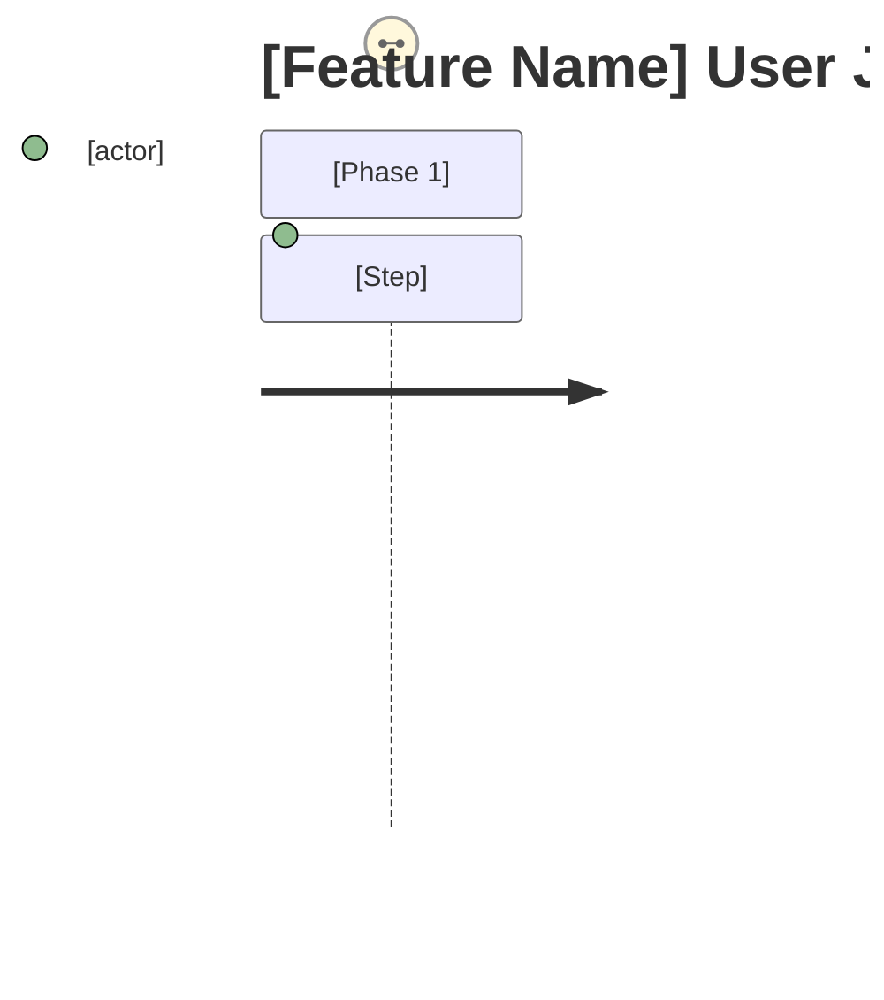

# PRD: [Feature Name]

## Overview

### One-line Summary
[Describe this feature in one line]

### Background
[Why is this feature needed? What problem does it solve?]

## User Stories

### Primary Users
[Define the main target users]

### User Stories
```
As a [user type]
I want to [goal/desire]
So that [expected value/benefit]
```

### Use Cases
1. [Specific usage scenario 1]
2. [Specific usage scenario 2]
3. [Specific usage scenario 3]

### User Journey Diagram (When Needed)

[Include when prose does not make the material user flow clear; otherwise remove this subsection.]

[Map the end-to-end user experience from trigger event to goal completion]

### Scope Boundary Diagram (When Needed)

[Include when prose does not make the material in-scope/out-of-scope relationship clear; otherwise remove this subsection.]
```mermaid
C4Context
    Boundary(scope, "In Scope") {
        [Components in scope]
    }
    Boundary(out, "Out of Scope") {
        [Components out of scope]
    }
```
[Clarify what is and is not included in this feature]

## Functional Requirements

### MVP

The smallest coherent behavior or journey that delivers the value stated above. Every requirement here survived removal: taking it out breaks the value or a required legal, contractual, security, or compatibility obligation.

- [ ] Requirement 1: [Detailed description]
  - AC-001: [Acceptance criteria - Given/When/Then format or measurable standard]
  - AC-002: [Acceptance criteria]
  - Removal result: [What breaks without it — the value or the named obligation]
- [ ] Requirement 2: [Detailed description]
  - AC-003: [Acceptance criteria]
  - Removal result: [What breaks without it]

### Future

Capabilities removed from MVP because value and required obligations still hold without them.

`Origin` distinguishes an exclusion the user authored (`user`) from one the requirement analysis judged (`analysis`). Record `None — user confirmed there are none` when the user considered exclusions and found none.

- Item 1: [Description] — [reason it left MVP] — Origin: user | analysis

### Out of Scope

Capabilities not planned for this product direction. `Origin` follows the same rule as Future above.

- Item 1: [Description and reason for exclusion] — Origin: user | analysis

## Non-Functional Requirements

### Performance
- Response Time: [Target value]
- Throughput: [Target value]
- Concurrency: [Target value]

### Reliability
- Availability: [Target value]
- Error Rate: [Target value]

### Security
- [Security requirements details]

### Scalability
- [Considerations for future scaling]

### Accessibility (when feature includes UI)
- Compliance standard: [Default: WCAG 2.1 AA (use organization standard if available)]
- Target assistive technologies: [Screen reader, keyboard operation, voice control, etc.]
- Platform requirements: [e.g., app store review requirements]
- Known constraints: [e.g., external library limitations]

## Success Criteria

**Outcome**: [the one observable result this feature must produce — every metric below measures progress toward it]

### Quantitative Metrics
1. [Metric name]: [numeric target] measured by [method] within [timeframe]
2. [Metric name]: [numeric target] measured by [method] within [timeframe]
3. [Metric name]: [numeric target] measured by [method] within [timeframe]

### Qualitative Metrics
1. [User experience metric 1]
2. [User experience metric 2]

### UI Quality Metrics (when feature includes UI)
1. [Key operation completion rate / error recovery rate / retry success rate]
2. [Accessibility audit target score]

## Technical Considerations

### Dependencies
- [Dependencies on existing systems]
- [Dependencies on external services]

### Constraints
- [Technical constraints]
- [Resource constraints]

### Assumptions
- [Prerequisite requiring validation 1]
- [Prerequisite requiring validation 2]

### Risks and Mitigation
| Risk | Impact | Probability | Mitigation |
|------|--------|-------------|------------|
| [Risk 1] | High/Medium/Low | High/Medium/Low | [Countermeasure] |
| [Risk 2] | High/Medium/Low | High/Medium/Low | [Countermeasure] |

## Undetermined Items

- [ ] [Question 1]: [Description of options or impacts]
- [ ] [Question 2]: [Description of options or impacts]

*Discuss with user until this section is empty, then delete after confirmation*

## Appendix

### References
- [Related document 1]
- [Related document 2]

### Glossary
- **Term 1**: [Definition]
- **Term 2**: [Definition]
