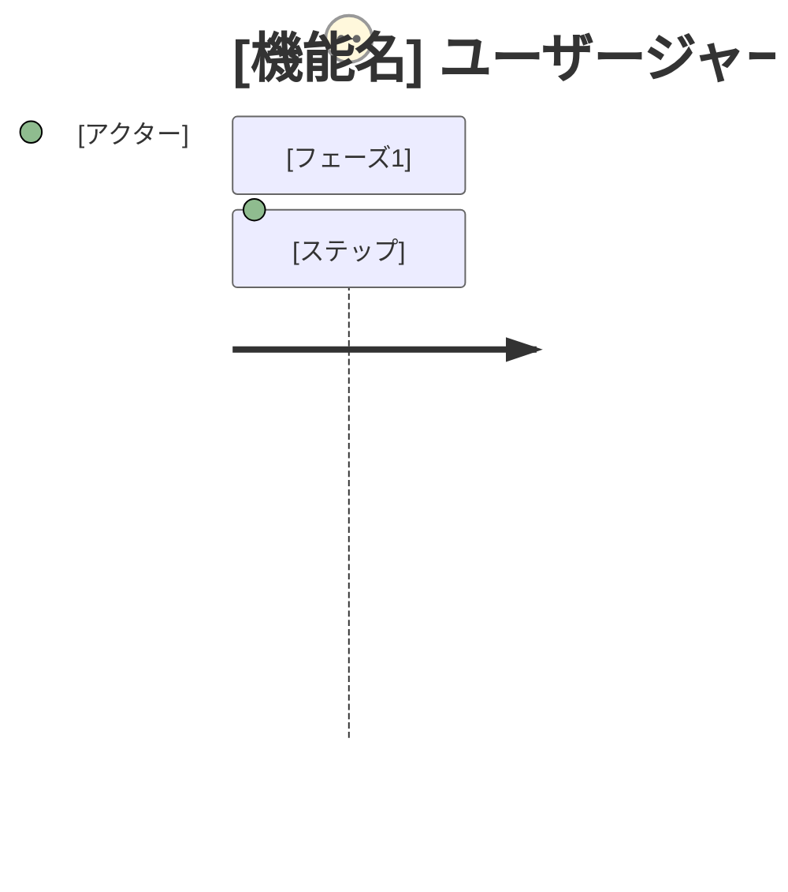

# PRD: [機能名]

## 概要

### 一言まとめ
[この機能を一言で説明]

### 背景
[なぜこの機能が必要か？どのような問題を解決するか？]

## ユーザーストーリー

### 主要ユーザー
[主なターゲットユーザーを定義]

### ユーザーストーリー
```
[ユーザー種別]として
[目標/願望]をしたい
なぜなら[期待する価値/メリット]だから
```

### ユースケース
1. [具体的な利用シナリオ1]
2. [具体的な利用シナリオ2]
3. [具体的な利用シナリオ3]

### ユーザージャーニー図

[トリガーイベントから目標達成までのエンドツーエンドのユーザー体験をマッピング]

### スコープ境界図
```mermaid
C4Context
    Boundary(scope, "スコープ内") {
        [スコープ内のコンポーネント]
    }
    Boundary(out, "スコープ外") {
        [スコープ外のコンポーネント]
    }
```
[この機能に含まれるものと含まれないものを明確化]

## 機能要件

### MVP

上記の価値を届ける、最小のまとまった振る舞い・ジャーニー。ここに残る要件はすべて除外検証を通っている — 取り除くと価値、または必要な法務・契約・セキュリティ・互換性の義務が成立しなくなる。

- [ ] 要件1: [詳細説明]
  - AC-001: [受入条件 - Given/When/Then形式または測定可能な基準]
  - AC-002: [受入条件]
  - 除外した場合: [これがないと成立しなくなるもの — 価値、または該当する義務]
- [ ] 要件2: [詳細説明]
  - AC-003: [受入条件]
  - 除外した場合: [これがないと成立しなくなるもの]

### Future

取り除いても価値と必要な義務が成立するため、MVPから外した機能・能力。

`Origin` は、ユーザーが挙げた除外（`user`）と要件分析が判断した除外（`analysis`）を区別する。ユーザーが除外を検討した結果そうしたものがなかった場合は`None — 除外すべきものはないとユーザーが確認`と記載する。

- 項目1: [説明] — [MVPから外した理由] — Origin: user | analysis

### Out of Scope

今回のプロダクト方針として計画しない機能・能力。`Origin` は上記Futureと同じルールに従う。

- 項目1: [説明と除外理由] — Origin: user | analysis

## 非機能要件

### パフォーマンス
- レスポンス時間: [目標値]
- スループット: [目標値]
- 同時接続数: [目標値]

### 信頼性
- 可用性: [目標値]
- エラー率: [目標値]

### セキュリティ
- [セキュリティ要件の詳細]

### スケーラビリティ
- [将来のスケーリングに関する考慮事項]

### アクセシビリティ（UI機能を含む場合）
- 準拠基準: [デフォルト: WCAG 2.1 AA（組織基準があればそれを使用）]
- 対象支援技術: [スクリーンリーダー、キーボード操作、音声制御等]
- プラットフォーム要件: [例: アプリストア審査要件]
- 既知の制約: [例: 外部ライブラリの制限]

## 成功基準

**Outcome**: [この機能が生むべき観測可能な結果を1つ — 以下の各指標はこれに向けた進捗を測る]

### 定量的指標
1. [指標名]: [数値目標] を [測定方法] で [期間] 以内に達成
2. [指標名]: [数値目標] を [測定方法] で [期間] 以内に達成
3. [指標名]: [数値目標] を [測定方法] で [期間] 以内に達成

### 定性的指標
1. [ユーザー体験の指標1]
2. [ユーザー体験の指標2]

### UI品質指標（UI機能を含む場合）
1. [主要操作完了率 / エラー回復率 / リトライ成功率]
2. [アクセシビリティ監査目標スコア]

## 技術的考慮事項

### 依存関係
- [既存システムへの依存]
- [外部サービスへの依存]

### 制約
- [技術的な制約]
- [リソースの制約]

### 前提条件
- [確認が必要な前提1]
- [確認が必要な前提2]

### リスクと対策
| リスク | 影響度 | 発生確率 | 対策 |
|-------|-------|---------|-----|
| [リスク1] | 高/中/低 | 高/中/低 | [対策] |
| [リスク2] | 高/中/低 | 高/中/低 | [対策] |

## 未決定事項

- [ ] [質問1]: [選択肢や影響の説明]
- [ ] [質問2]: [選択肢や影響の説明]

*このセクションが空になるまでユーザーと議論し、確認後に削除*

## 付録

### 参考資料
- [関連ドキュメント1]
- [関連ドキュメント2]

### 用語集
- **用語1**: [定義]
- **用語2**: [定義]
