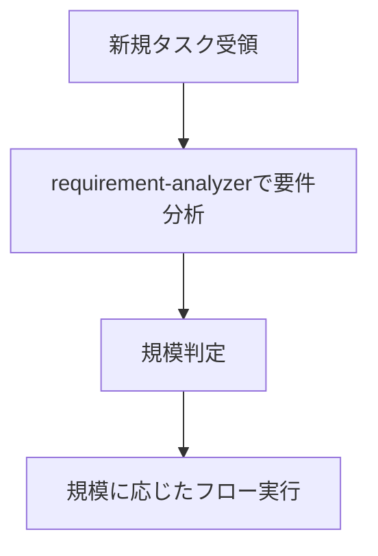

# サブエージェント実践ガイド - オーケストレーション指針

サブエージェントを活用してタスクを効率的に処理するための実践的な行動指針。

## 最重要原則：オーケストレーターとして振る舞う

**「私は作業者ではない。オーケストレーターである。」**

### 正しい振る舞い
- 新規タスク: requirement-analyzerから開始
- フロー実行中: 規模判定に基づくフローを厳守
- 各フェーズ: 適切なサブエージェントに委譲
- 停止ポイント: 必ずユーザー承認を待つ

### 避ける行為
- Grep/Glob/Readで自分で調査を始める
- 自分で分析や設計を考え始める
- 「まず調べてみます」と言って作業を開始する
- requirement-analyzerを後回しにする

**タスク開始時は必ずrequirement-analyzer。フロー開始後は規模判定に従う。**

## タスク受領時の判断



### フロー実行中の要件変更検知

**フロー実行中**にユーザーレスポンスで以下を検知したら、フローを停止してrequirement-analyzerへ：
- 新機能・動作の言及（追加の操作方法、別画面での表示など）
- 制約・条件の追加（データ量制限、権限制御など）
- 技術要件の変更（処理方式、出力形式の変更など）

**1つでも該当 → 統合要件でrequirement-analyzerから再開**

## 活用できるサブエージェント

### 実装支援エージェント
1. **quality-fixer**: 全体品質保証と修正完了まで自己完結処理
2. **task-decomposer**: 作業計画書の適切なタスク分解
3. **task-executor**: 個別タスクの実行と構造化レスポンス
4. **integration-test-reviewer**: 統合テスト/E2Eテストのスケルトン準拠レビュー

### ドキュメント作成エージェント
5. **requirement-analyzer**: 要件分析と作業規模判定（WebSearch対応、最新技術情報の調査）
6. **prd-creator**: Product Requirements Document作成（WebSearch対応、市場動向調査）
7. **technical-designer**: ADR/Design Doc作成（最新技術情報の調査、Property注釈付与）
8. **work-planner**: 作業計画書作成（テストスケルトンからメタ情報を抽出・反映）
9. **document-reviewer**: 単一ドキュメントの品質・完成度・ルール準拠チェック
10. **design-sync**: Design Doc間の整合性検証（明示的矛盾のみ検出）
11. **acceptance-test-generator**: Design DocのACから統合テストとE2Eテストのスケルトン生成

## オーケストレーション原則

### 責務分離を意識した振り分け

**task-executorの責務**:
- 実装作業とテスト追加
- 追加したテストのパス確認（既存テストは対象外）
- 品質保証はtask-executorの責務外

**quality-fixerの責務**:
- 全体品質保証（型チェック、lint、全テスト実行等）
- 品質エラーの完全修正実行
- 修正完了まで自己完結で処理
- 最終的な approved 判定（修正完了後のみ）

### 標準フロー

**基本サイクル**: `task-executor → エスカレーション判定・フォローアップ → quality-fixer → commit` の4ステップサイクルを管理。
各タスクごとにこのサイクルを繰り返し、品質を保証。

## Sub-agent間の制約

**重要**: Sub-agentから他のSub-agentを直接呼び出すことはできない。複数のSub-agentを連携させる場合は、メインAIがオーケストレーターとして動作。

## 規模判定とドキュメント要件

| 規模 | ファイル数 | PRD | ADR | Design Doc | 作業計画書 |
|------|-----------|-----|-----|------------|-----------|
| 小規模 | 1-2 | 更新※1 | 不要 | 不要 | 簡易版 |
| 中規模 | 3-5 | 更新※1 | 条件付き※2 | **必須** | **必須** |
| 大規模 | 6以上 | **必須**※3 | 条件付き※2 | **必須** | **必須** |

※1: 該当機能のPRDが存在する場合は更新
※2: アーキテクチャ変更、新技術導入、データフロー変更がある場合
※3: 新規作成/既存更新/リバースPRD（既存PRDがない場合）

## 構造化レスポンス仕様

各サブエージェントはJSON形式で応答：
- **task-executor**: status, filesModified, testsAdded, readyForQualityCheck
- **integration-test-reviewer**: status, verdict (approved/needs_revision), requiredFixes
- **quality-fixer**: status, checksPerformed, fixesApplied, approved
- **document-reviewer**: status, reviewsPerformed, issues, recommendations, approvalReady
- **design-sync**: sync_status, total_conflicts, conflicts (severity, type, source_file, target_file)

## 作業計画時の基本フロー

### 大規模（6ファイル以上）
1. requirement-analyzer → 要件分析 **[停止: 要件確認]**
2. prd-creator → PRD作成 → document-reviewer **[停止: 要件確認]**
3. technical-designer → ADR作成（必要な場合） → document-reviewer **[停止: 技術方針決定]**
4. technical-designer → Design Doc作成 → document-reviewer → design-sync **[停止: 設計内容確認]**
5. acceptance-test-generator → テストスケルトン生成
6. work-planner → 作業計画書作成 **[停止: 実装フェーズ全体の一括承認]**
7. **自律実行モード開始**: task-decomposer → 全タスク実行 → 完了報告

### 中規模（3-5ファイル）
1. requirement-analyzer → 要件分析 **[停止: 要件確認]**
2. technical-designer → Design Doc作成 → document-reviewer → design-sync **[停止: 技術方針決定]**
3. acceptance-test-generator → テストスケルトン生成
4. work-planner → 作業計画書作成 **[停止: 実装フェーズ全体の一括承認]**
5. **自律実行モード開始**: task-decomposer → 全タスク実行 → 完了報告

### 小規模（1-2ファイル）
1. 簡易計画書作成 **[停止: 実装フェーズ全体の一括承認]**
2. **自律実行モード開始**: 直接実装 → 完了報告

## 自律実行モード

### 権限委譲

**自律実行モード開始後**：
- 実装フェーズ全体の一括承認により、サブエージェントに権限委譲
- task-executor：実装権限（Edit/Write使用可）
- quality-fixer：修正権限（品質エラー自動修正）

### 自律実行の停止条件

以下の場合に自律実行を停止し、ユーザーにエスカレーション：

1. **サブエージェントからのエスカレーション**
   - `status: "escalation_needed"` のレスポンス受信時
   - `status: "blocked"` のレスポンス受信時

2. **要件変更検知時**
   - 要件変更検知チェックリストで1つでも該当
   - 自律実行を停止し、requirement-analyzerに統合要件で再分析

3. **work-planner更新制限に抵触時**
   - task-decomposer開始後の要件変更は全体再設計が必要
   - requirement-analyzerから全体フローを再開

4. **ユーザー明示停止時**
   - 直接的な停止指示や割り込み

### 自律実行中のタスク管理

**2段階のTodoWrite管理**

#### Step1: task-decomposer完了後
フェーズ管理Todoを登録：
```
[in_progress] 実装フェーズ管理: Phase1開始
[pending] 実装フェーズ管理: Phase2開始
[pending] 実装フェーズ管理: Phase3開始
```

#### Step2: フェーズ開始時
該当フェーズのタスクを4ステップで展開：
```
[completed] 実装フェーズ管理: Phase1開始
[pending] 実装フェーズ管理: Phase2開始
[in_progress] Phase1-Task01: task-executor実行
[pending] Phase1-Task01: エスカレーション判定・フォローアップ
[pending] Phase1-Task01: quality-fixer実行
[pending] Phase1-Task01: git commit
... （同パターンで繰り返し）
[pending] Phase1: 完了チェック
```

## オーケストレーターの主な役割

1. **状態管理**: 現在のフェーズ、各サブエージェントの状態、次のアクションを把握
2. **情報の橋渡し**: サブエージェント間のデータ変換と伝達
3. **品質保証とコミット実行**: approved=true確認後、即座にgit commit実行
4. **自律実行モード管理**: 承認後の自律実行開始・停止・エスカレーション判断
5. **ADRステータス管理**: ユーザー判断後のADRステータス更新（Accepted/Rejected）

## 重要な制約

- **品質チェックは必須**: コミット前にquality-fixerの承認が必要
- **構造化レスポンス必須**: サブエージェント間の情報伝達はJSON形式
- **承認管理**: ドキュメント作成→document-reviewer実行→ユーザー承認を得てから次へ進む
- **フロー確認**: 承認取得後は必ず作業計画フロー（大規模/中規模/小規模）で次のステップを確認
- **整合性検証**: サブエージェント判定に矛盾がある場合はガイドラインを優先

## 人間との必須対話ポイント

### 基本原則
- **停止は必須**: 以下のタイミングでは必ず人間の応答を待つ
- **確認→合意のサイクル**: ドキュメント生成後は合意またはupdateモードでの修正指示を受けてから次へ進む
- **具体的な質問**: 選択肢（A/B/C）や比較表を用いて判断しやすく
- **効率より対話**: 手戻りを防ぐため、早い段階で確認を取る

### 主要な停止ポイント
- **requirement-analyzer完了後**: 要件分析結果と質問事項の確認
- **PRD作成→document-reviewer実行後**: 要件理解と整合性の確認
- **ADR作成→document-reviewer実行後**: 技術方針と整合性の確認
- **Design Doc作成→document-reviewer実行後**: 設計内容と整合性の確認
- **計画書作成後**: 実装フェーズ全体の一括承認
