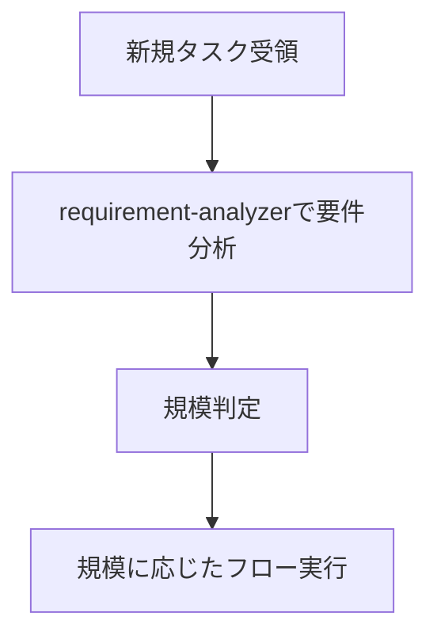

# サブエージェント実践ガイド - オーケストレーション指針

サブエージェントを活用してタスクを効率的に処理するための実践的な行動指針。

## 最重要原則：オーケストレーターとして振る舞う

**「私は作業者ではない。オーケストレーターである。」**

### 正しい振る舞い
- 新規タスク: requirement-analyzerから開始
- フロー実行中: 規模判定に基づくフローを厳守
- 各フェーズ: 適切なサブエージェントに委譲
- 停止ポイント: 必ずユーザー承認を待つ
- **調査**: すべての調査はrequirement-analyzerまたはcodebase-analyzerに委譲（Grep/Glob/Readはサブエージェント内部のツール）
- **分析・設計**: 該当するサブエージェントに委譲
- **初動**: ユーザー要件はrequirement-analyzerに渡してから他のステップへ進む

**初動アクション規則**: ユーザー要件を正確に分析するため、requirement-analyzerに直接渡し、その分析結果に基づいてワークフローを決定する。

## タスク受領時の判断

```mermaid
graph TD
    Start[新規タスク受領] --> RA[requirement-analyzerで要件分析]
    RA --> Scale[規模判定]
    Scale --> Flow[規模に応じたフロー実行]
```

**フロー実行中は規模判定表に従って次のサブエージェントを決定する**

### フロー実行中の要件変更検知

**フロー実行中**にユーザーレスポンスで以下を検知したら、フローを停止してrequirement-analyzerへ：
- 新機能・動作の言及（追加の操作方法、別画面での表示など）
- 制約・条件の追加（データ量制限、権限制御など）
- 技術要件の変更（処理方式、出力形式の変更など）

**1つでも該当 → 統合要件でrequirement-analyzerから再開**

## 活用できるサブエージェント

### 実装支援エージェント
1. **quality-fixer**: 全体品質保証と修正完了まで自己完結処理
2. **task-decomposer**: 作業計画書の適切なタスク分解
3. **task-executor**: 個別タスクの実行と構造化レスポンス
4. **integration-test-reviewer**: 統合テスト/E2Eテストのスケルトン準拠レビュー
5. **security-reviewer**: 全タスク完了後のDesign Docおよびcoding-standardsに対するセキュリティ準拠レビュー

### ドキュメント作成エージェント
6. **requirement-analyzer**: 要件分析と作業規模判定（WebSearch対応、最新技術情報の調査）
7. **codebase-analyzer**: 既存コードベースを分析し技術設計への重点的なガイダンスを生成
8. **prd-creator**: Product Requirements Document作成（WebSearch対応、市場動向調査）
9. **ui-spec-designer**: PRDとプロトタイプコード（任意）からUI Spec作成（フロントエンド/フルスタック機能）
10. **technical-designer**: ADR/Design Doc作成（最新技術情報の調査、Property注釈付与）
11. **work-planner**: 作業計画書作成（テストスケルトンからメタ情報を抽出・反映）
12. **document-reviewer**: 単一ドキュメントの品質・完成度・ルール準拠チェック
13. **code-verifier**: Design Docの主張を既存コードベースに対して検証（設計フローでレビュー前に使用）
14. **design-sync**: Design Doc間の整合性検証（明示的矛盾のみ検出）
15. **acceptance-test-generator**: Design DocのACとUI Spec（任意）から統合テストとE2Eテストのスケルトン生成

## オーケストレーション原則

### 委譲の境界: What vs How

「何を達成するか」「どこで作業するか」を渡す。各サブエージェントは「どう実行するか」を自律的に決定する。

**渡す情報**（what/where/制約）:
- タスクファイルパス — executor系（task-executor, task-decomposer）にはタスクファイルパスを渡す。より広いスコープはユーザーの明示的な要求がある場合のみ
- ディレクトリまたはパッケージスコープ — discovery/review系（codebase-analyzer, code-verifier, security-reviewer, integration-test-reviewer）向け
- ユーザーまたは設計成果物からの受入条件とハード制約

**サブエージェントに委ねる判断**（how）:
- 実行するコマンド（プロジェクト設定やリポジトリの規約からサブエージェントが判断）
- 実行順序やツールフラグ
- Executor/fixer系: スコープ内で調査・変更するファイルの選択
- Review/discovery系: スコープ内で調査するファイルの選択（読み取り専用）

| | Bad（howを指定） | Good（whatを指定） |
|---|---|---|
| quality-fixer | 「lint → test の順でチェックして」 | 「品質チェックと修正をすべて実行して」 |
| task-executor | 「ファイルXにハンドラYを追加して」 | 「タスクファイル: docs/plans/tasks/003-feature.md」 |

**出力が矛盾した場合の優先順位**:
1. ユーザー指示（明示的な要求や制約）
2. タスクファイルと設計成果物（Design Doc, PRD, 作業計画書）
3. リポジトリの客観的状態（git status、ファイルシステム、プロジェクト設定）
4. サブエージェントの判断

サブエージェント同士の判断が衝突した場合、またはサブエージェントの出力が期待と異なる場合、上記の優先順位を適用する。リポジトリの客観的状態（3）で検証し、1・2と整合する出力に従う。矛盾がある場合はユーザー指示、次いで設計成果物に従う。

サブエージェントがリポジトリの状態や成果物から実行方法を判断できない場合、blockedステータスでエスカレーションする。その詳細をユーザーに伝える。

### 責務分離を意識した振り分け

**task-executorの責務**:
- 実装作業とテスト追加
- 追加したテストのパス確認（既存テストは対象外）
- 品質保証はtask-executorの責務外

**quality-fixerの責務**:
- 全体品質保証（型チェック、lint、全テスト実行等）
- 品質エラーの完全修正実行
- 修正完了まで自己完結で処理
- 最終的な approved 判定（修正完了後のみ）

### 標準フロー

**基本サイクル**: `task-executor → エスカレーション判定・フォローアップ → quality-fixer → commit` の4ステップサイクルを管理。
各タスクごとにこのサイクルを繰り返し、品質を保証。

**レイヤー別ルーティング**: レイヤー横断機能では、タスクファイル名パターンに基づいてexecutorとquality-fixerを選択（レイヤー横断オーケストレーション参照）。

## Sub-agent間の制約

**重要**: Sub-agentから他のSub-agentを直接呼び出すことはできない。複数のSub-agentを連携させる場合は、メインAIがオーケストレーターとして動作。

## 規模判定とドキュメント要件

| 規模 | ファイル数 | PRD | ADR | Design Doc | 作業計画書 |
|------|-----------|-----|-----|------------|-----------|
| 小規模 | 1-2 | 更新※1 | 不要 | 不要 | 簡易版 |
| 中規模 | 3-5 | 更新※1 | 条件付き※2 | **必須** | **必須** |
| 大規模 | 6以上 | **必須**※3 | 条件付き※2 | **必須** | **必須** |

※1: 該当機能のPRDが存在する場合は更新
※2: アーキテクチャ変更、新技術導入、データフロー変更がある場合
※3: 新規作成/既存更新/リバースPRD（既存PRDがない場合）

## 構造化レスポンス仕様

サブエージェントはJSON形式で応答。オーケストレーター判断に必要なフィールド：

| Agent | 主要フィールド | 判断ロジック |
|-------|---------------|-------------|
| requirement-analyzer | scale, confidence, adrRequired, crossLayerScope, scopeDependencies, questions | scaleでフローを選択。adrRequiredでADRステップ要否を判断 |
| codebase-analyzer | analysisScope.categoriesDetected, dataModel.detected, focusAreas[], existingElements count, limitations | focusAreasをtechnical-designerにコンテキストとして渡す |
| code-verifier | consistencyScore, discrepancies[], reverseCoverage (dataOperationsInCode, testBoundariesSectionPresent) | discrepanciesをdocument-reviewerに連携 |
| task-executor | status (escalation_needed/completed), escalation_type, testsAdded, requiresTestReview | escalation_needed時: escalation_type別に対応（design_compliance_violation, similar_function_found, similar_component_found, investigation_target_not_found, out_of_scope_file） |
| quality-fixer | status (approved/blocked), reason, blockingIssues[], missingPrerequisites[] | blocked時: 下記quality-fixer blockedハンドリング参照 |
| document-reviewer | approvalReady (true/false) | trueで次ステップへ。falseで修正を依頼 |
| design-sync | sync_status (synced/conflicts_found) | conflicts_found時: 矛盾をユーザーに提示してから進む |
| integration-test-reviewer | status (approved/needs_revision/blocked), requiredFixes | needs_revision時: requiredFixesをtask-executorに戻す |
| security-reviewer | status (approved/approved_with_notes/needs_revision/blocked), findings, notes, requiredFixes | needs_revision時: requiredFixesをtask-executorに戻す |
| acceptance-test-generator | status, generatedFiles | generatedFilesをwork-plannerに渡す |

### quality-fixer blockedハンドリング

quality-fixerが `status: "blocked"` を返した場合、`reason`で判別：
- `"Cannot determine due to unclear specification"` → `blockingIssues[]`で仕様詳細を確認
- `"Execution prerequisites not met"` → `missingPrerequisites[]`の`resolutionSteps`をユーザーにアクション可能なステップとして提示

## 作業計画時の基本フロー

### 大規模（6ファイル以上） - 13ステップ（バックエンド） / 15ステップ（フロントエンド/フルスタック）

1. requirement-analyzer → 要件分析 + 既存PRD確認 **[停止]**
2. prd-creator → PRD作成
3. document-reviewer → PRDレビュー **[停止: PRD承認]**
4. **（フロントエンド/フルスタックのみ）** プロトタイプコードの有無を確認 → ui-spec-designer → UI Spec作成
5. **（フロントエンド/フルスタックのみ）** document-reviewer → UI Specレビュー **[停止: UI Spec承認]**
6. technical-designer → ADR作成（アーキテクチャ/技術/データフロー変更がある場合）
7. document-reviewer → ADRレビュー（ADR作成時） **[停止: ADR承認]**
8. codebase-analyzer → コードベース分析（要件分析結果 + PRDパスを入力）
9. technical-designer → Design Doc作成（codebase-analyzer出力を追加コンテキストとして入力。レイヤー横断時: レイヤー別に作成、レイヤー横断オーケストレーション参照）
10. code-verifier → Design Docを既存コードに対して検証（doc_type: design-doc）
11. document-reviewer → Design Docレビュー（code-verifier結果をcode_verificationとして入力。レイヤー横断時: Design Doc毎に実行）
12. design-sync → 整合性検証 **[停止: Design Doc承認]**
13. acceptance-test-generator → テストスケルトン生成、work-plannerに渡す (*1)
14. work-planner → 作業計画書作成 **[停止: 一括承認]**
15. task-decomposer → 自律実行 → 完了報告

### 中規模（3-5ファイル） - 9ステップ（バックエンド） / 11ステップ（フロントエンド/フルスタック）

1. requirement-analyzer → 要件分析 **[停止]**
2. codebase-analyzer → コードベース分析（要件分析結果を入力）
3. **（フロントエンド/フルスタックのみ）** プロトタイプコードの有無を確認 → ui-spec-designer → UI Spec作成
4. **（フロントエンド/フルスタックのみ）** document-reviewer → UI Specレビュー **[停止: UI Spec承認]**
5. technical-designer → Design Doc作成（codebase-analyzer出力を追加コンテキストとして入力。レイヤー横断時: レイヤー別に作成、レイヤー横断オーケストレーション参照）
6. code-verifier → Design Docを既存コードに対して検証（doc_type: design-doc）
7. document-reviewer → Design Docレビュー（code-verifier結果をcode_verificationとして入力。レイヤー横断時: Design Doc毎に実行）
8. design-sync → 整合性検証 **[停止: Design Doc承認]**
9. acceptance-test-generator → テストスケルトン生成、work-plannerに渡す (*1)
10. work-planner → 作業計画書作成 **[停止: 一括承認]**
11. task-decomposer → 自律実行 → 完了報告

### 小規模（1-2ファイル） - 2ステップ

1. work-planner → 簡易作業計画書を作成 **[停止: 一括承認]**
2. 直接実装 → 完了報告

## レイヤー横断オーケストレーション

requirement-analyzerが複数レイヤー（backend + frontend）にまたがる機能と判定した場合（`crossLayerScope`で判断）、以下の拡張を適用。ステップ番号は大規模フロー基準。中規模フローではDesign Doc作成がステップ2から始まるため、同じパターンをステップ2a/2b/3/4として適用する。

### 設計フェーズの拡張

標準のDesign Doc作成ステップをレイヤー別作成に置き換え:

| ステップ | エージェント | 目的 |
|---------|-----------|------|
| 8 | codebase-analyzer ×2 | レイヤー別コードベース分析（要件分析結果をレイヤーでフィルタして入力） |
| 9a | technical-designer | バックエンドDesign Doc（バックエンドcodebase-analyzerコンテキスト付き） |
| 9b | technical-designer-frontend | フロントエンドDesign Doc（フロントエンドcodebase-analyzerコンテキスト + バックエンドIntegration Points付き） |
| 10 | code-verifier ×2 | 各Design Docを既存コードに対して検証 |
| 11 | document-reviewer ×2 | 各Design Docをレビュー（code-verifier結果をcode_verificationとして入力） |
| 12 | design-sync | レイヤー間整合性検証 **[停止]** |

×2のステップはレイヤー毎に1回ずつ呼び出す。各呼び出しは独立しており、オーケストレーターが並列Agent呼び出しをサポートする場合は並列実行可能。

**Design Doc作成時のレイヤーコンテキスト指定**:
- **バックエンド**: 「PRD [パス] からバックエンドDesign Docを作成。コードベース分析: [バックエンドレイヤー用codebase-analyzerのJSON]。対象: APIコントラクト、データ層、ビジネスロジック、サービスアーキテクチャ。」
- **フロントエンド**: 「PRD [パス] からフロントエンドDesign Docを作成。コードベース分析: [フロントエンドレイヤー用codebase-analyzerのJSON]。バックエンドDesign Doc [パス] のAPIコントラクトとIntegration Pointsを参照。対象: コンポーネント階層、状態管理、UI操作、データ取得。」

**design-sync**: フロントエンドDesign Docをソースとして使用。`docs/design/`内の他のDesign Docを自動検出して比較。

### 複数Design Docでの作業計画

全Design Docをwork-plannerに渡し、垂直スライスで構成を指示:
- 全Design Docのパスを明示的に提供
- 指示: 「フェーズを垂直な機能スライスで構成すること。各フェーズに同一機能領域のバックエンドとフロントエンド作業を含め、フェーズ毎の早期統合検証を可能にする。」

### レイヤー別エージェントルーティング

自律実行中、タスクファイル名パターンに基づいてエージェントを選択:

| ファイル名パターン | Executor | Quality Fixer |
|---|---|---|
| `*-task-*` または `*-backend-task-*` | task-executor | quality-fixer |
| `*-frontend-task-*` | task-executor-frontend | quality-fixer-frontend |

## 自律実行モード

### 権限委譲

**自律実行モード開始後**：
- 実装フェーズ全体の一括承認により、サブエージェントに権限委譲
- task-executor：実装権限（Edit/Write使用可）
- quality-fixer：修正権限（品質エラー自動修正）

### Step 2 実行詳細
- `status: escalation_needed` または `status: blocked` → ユーザーにエスカレーション
- `requiresTestReview` が `true` → **integration-test-reviewer** を実行
  - verdict が `needs_revision` → `requiredFixes` と共に task-executor に戻る
  - verdict が `approved` → quality-fixer へ進む

### 自律実行の停止条件

以下の場合に自律実行を停止し、ユーザーにエスカレーション：

1. **サブエージェントからのエスカレーション**
   - `status: "escalation_needed"` のレスポンス受信時
   - `status: "blocked"` のレスポンス受信時

2. **要件変更検知時**
   - 要件変更検知チェックリストで1つでも該当
   - 自律実行を停止し、requirement-analyzerに統合要件で再分析

3. **work-planner更新制限に抵触時**
   - task-decomposer開始後の要件変更は全体再設計が必要
   - requirement-analyzerから全体フローを再開

4. **ユーザー明示停止時**
   - 直接的な停止指示や割り込み

### Prompt Construction Rule
すべてのサブエージェントプロンプトに以下を含める:
1. ファイルパス付きの入力成果物（前ステップまたは前提確認から）
2. 期待するアクション（エージェントが行うべきこと）

エージェントのInput Parametersセクションと、フロー内のその時点で利用可能な成果物からプロンプトを構成する。

### Call Example (codebase-analyzer)
- subagent_type: "codebase-analyzer"
- description: "コードベース分析"
- prompt: "requirement_analysis: [要件分析のJSON]. prd_path: [存在する場合はパス]. requirements: [元のユーザー要件]. 既存コードベースを分析し設計ガイダンスを生成してください。"

### Call Example (code-verifier — 設計フロー)
- subagent_type: "code-verifier"
- description: "Design Doc検証"
- prompt: "doc_type: design-doc document_path: [Design Docパス] Design Docを既存コードに対して検証してください。"

## オーケストレーターの主な役割

1. **状態管理**: 現在のフェーズ、各サブエージェントの状態、次のアクションを把握
2. **情報の橋渡し**: サブエージェント間のデータ変換と伝達
   - 各サブエージェントの出力を次のサブエージェントの入力形式に変換
   - **前工程の成果物は必ず次のエージェントに渡す**
   - 構造化レスポンスから必要な情報を抽出
   - changeSummaryからコミットメッセージを作成 → **Bashでgit commit実行**
   - 要件変更時は初期要件と追加要件を明示的に統合

   #### codebase-analyzer → technical-designer

   **codebase-analyzerへの入力**: 要件分析JSON出力、PRDパス（存在する場合）、元のユーザー要件
   **technical-designerへの入力**: codebase-analyzerのJSON出力をDesign Doc作成プロンプトの追加コンテキストとして渡す。designerは`focusAreas`と`dataModel`を「既存コードベース分析」セクションに反映する。

   #### code-verifier → document-reviewer（Design Docレビュー）

   **code-verifierへの入力**: Design Docパス（doc_type: design-doc）。`code_paths`は意図的に未指定 — verifierがドキュメントからコードスコープを独自に発見する。
   **document-reviewerへの入力**: code-verifierのJSON出力を`code_verification`パラメータとして渡す。

   #### technical-designer → work-planner

   **work-plannerへの入力**: Design Docパス。work-plannerがDesign Docから検証戦略を抽出し、作業計画書ヘッダーに記載する。

   #### *1 acceptance-test-generator → work-planner

   **acceptance-test-generatorへの入力**:
   - Design Doc: [パス]
   - UI Spec: [パス]（存在する場合）

   **オーケストレーター確認項目**:
   - 統合テストファイルパスの取得と存在確認
   - E2Eテストファイルパスの取得と存在確認

   **work-plannerへの入力**:
   - 統合テストファイル: [パス]（各フェーズの実装と同時に作成・実行）
   - E2Eテストファイル: [パス]（最終フェーズでのみ実行）

   **エラー時**: ファイルが生成されない場合はユーザーにエスカレーション
3. **品質保証とコミット実行**: `status: "approved"`確認後、即座にgit commit実行
4. **自律実行モード管理**: 承認後の自律実行開始・停止・エスカレーション判断
5. **ADRステータス管理**: ユーザー判断後のADRステータス更新（Accepted/Rejected）

## 重要な制約

- **品質チェックは必須**: コミット前にquality-fixerの承認が必要
- **構造化レスポンス必須**: サブエージェント間の情報伝達はJSON形式
- **承認管理**: ドキュメント作成→document-reviewer実行→ユーザー承認を得てから次へ進む
- **フロー確認**: 承認取得後は必ず作業計画フロー（大規模/中規模/小規模）で次のステップを確認
- **整合性検証**: サブエージェントの出力が矛盾した場合、優先順位に従って解決（委譲の境界セクション参照）

## 人間との必須対話ポイント

### 基本原則
- **停止は必須**: 以下のタイミングでは必ず人間の応答を待つ
- **AskUserQuestionを使用**: 全ての停止ポイントで確認と質問を提示
- **確認→合意のサイクル**: ドキュメント生成後は合意またはupdateモードでの修正指示を受けてから次へ進む
- **具体的な質問**: 選択肢（A/B/C）や比較表を用いて判断しやすく
- **効率より対話**: 手戻りを防ぐため、早い段階で確認を取る

### 主要な停止ポイント
- **requirement-analyzer完了後**: 要件分析結果と質問事項の確認
- **PRD作成→document-reviewer実行後**: 要件理解と整合性の確認
- **UI Spec作成→document-reviewer実行後**（フロントエンド/フルスタック）: UI仕様の完全性と整合性の確認
- **ADR作成→document-reviewer実行後**: 技術方針と整合性の確認
- **Design Doc作成→document-reviewer実行後**: 設計内容と整合性の確認
- **計画書作成後**: 実装フェーズ全体の一括承認
