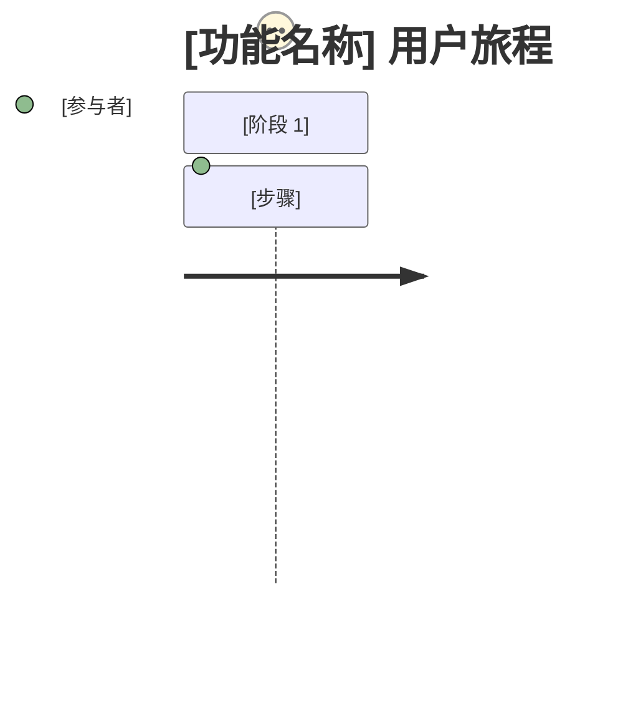

# PRD: [功能名称]

## 概述

### 一句话摘要
[用一句话描述该功能]

### 背景
[为什么需要该功能？它解决了什么问题？]

## 用户故事

### 主要用户
[定义主要目标用户]

### 用户故事
```
作为[用户类型]
我想要[目标/需求]
以便[预期价值/收益]
```

### 使用场景
1. [具体使用场景 1]
2. [具体使用场景 2]
3. [具体使用场景 3]

### 用户旅程图（按需）

[当文字说明无法清晰呈现关键用户流程时才包含此小节，否则删除该小节。]

[从触发事件到目标完成，梳理端到端的用户体验]

### 范围边界图（按需）

[当文字说明无法清晰呈现范围内/范围外之间的关键关系时才包含此小节，否则删除该小节。]
```mermaid
C4Context
    Boundary(scope, "范围内") {
        [范围内组件]
    }
    Boundary(out, "范围外") {
        [范围外组件]
    }
```
[明确该功能包含什么、不包含什么]

## 功能需求

### MVP

能交付上述价值的最小连贯行为或流程。这里的每一项需求都经受住了移除测试：去掉它会破坏该价值，或破坏某项必须遵守的法律、合同、安全或兼容性义务。

- [ ] 需求 1：[详细描述]
  - AC-001：[验收标准 - Given/When/Then 格式或可衡量的标准]
  - AC-002：[验收标准]
  - 移除后果：[缺少它会破坏什么——该价值还是所指明的义务]
- [ ] 需求 2：[详细描述]
  - AC-003：[验收标准]
  - 移除后果：[缺少它会破坏什么]

### 范围外

用户明确提出的非目标，以及为使 MVP 边界可执行而需要的当前排除项。评估请求、设想性想法和未被选中的可能性，只保留在确认前的收敛过程上下文中。

“来源”用于区分用户明确提出的非目标（`user`）与为使已确认的 MVP 边界可执行而需要的当前排除项（`analysis`）。若用户考虑过排除项但认为没有，记录为“无——用户已确认没有此类项”。

- 条目 1：[描述及排除原因] — 来源：user | analysis

## 非功能需求

### 性能
- 响应时间：[目标值]
- 吞吐量：[目标值]
- 并发数：[目标值]

### 可靠性
- 可用性：[目标值]
- 错误率：[目标值]

### 安全
- [安全需求详情]

### 可扩展性
- [未来扩展的考虑事项]

### 无障碍性（功能包含 UI 时）
- 合规标准：[默认：WCAG 2.1 AA（如组织有自定标准则使用组织标准）]
- 目标辅助技术：[屏幕阅读器、键盘操作、语音控制等]
- 平台要求：[例如应用商店审核要求]
- 已知限制：[例如外部库的限制]

## 成功标准

**结果**：[该功能必须产生的那一个可观测结果——下面的每个指标都衡量朝该结果推进的进度]

### 定量指标
1. [指标名称]：在[时间范围]内通过[测量方法]达到[数值目标]
2. [指标名称]：在[时间范围]内通过[测量方法]达到[数值目标]
3. [指标名称]：在[时间范围]内通过[测量方法]达到[数值目标]

### 定性指标
1. [用户体验指标 1]
2. [用户体验指标 2]

### UI 质量指标（功能包含 UI 时）
1. [关键操作完成率 / 错误恢复率 / 重试成功率]
2. [无障碍审计目标分数]

## 技术考量

### 依赖项
- [对现有系统的依赖]
- [对外部服务的依赖]

### 约束条件
- [技术约束]
- [资源约束]

### 假设条件
- [需要验证的前提条件 1]
- [需要验证的前提条件 2]

### 风险与缓解措施
| 风险 | 影响 | 概率 | 缓解措施 |
|------|--------|-------------|------------|
| [风险 1] | 高/中/低 | 高/中/低 | [缓解措施] |
| [风险 2] | 高/中/低 | 高/中/低 | [缓解措施] |

## 待定事项

- [ ] [问题 1]：[选项或影响的描述]
- [ ] [问题 2]：[选项或影响的描述]

*与用户讨论直至此节内容为空，确认后删除本节*

## 附录

### 参考资料
- [相关文档 1]
- [相关文档 2]

### 术语表
- **术语 1**：[定义]
- **术语 2**：[定义]
