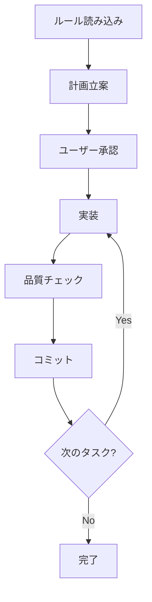

# AI コーディングプロジェクト ボイラープレート 🤖

*他の言語で読む: [English](README.md)*

TypeScript プロジェクトボイラープレート - AI支援開発に最適化。レイヤードアーキテクチャ、包括的な開発ルール、ベストプラクティスを提供します。
Claude Code専用に最適化され、LLMによる開発で高品質のコードを生み出すための包括的なルールとガイドラインを提供します。

## 🎯 特徴

- **Claude Code特化**: Claude CodeとSub-agentで高品質を実現するルール群
- **品質保証**: 段階的品質チェックと自動修正システム
- **TypeScript最適化**: 型安全性とパフォーマンスを両立した設定
- **包括的ルール**: ルールファイルによる開発標準化
- **ボイラープレート設計**: プロジェクト固有部分はプレースホルダー化
- **多言語対応**: 日本語・英語の両言語に対応

## 📂 プロジェクト構成

```
ai-coding-project-boilerplate/
├── .claude/
│   ├── agents-ja/          # Sub-agent定義（日本語）
│   ├── agents-en/          # Sub-agent定義（英語）
│   ├── commands-ja/        # カスタムスラッシュコマンド（日本語）
│   └── commands-en/        # カスタムスラッシュコマンド（英語）
├── docs/
│   ├── rules-ja/           # Claude Code向け開発ルール（日本語）
│   ├── rules-en/           # Claude Code向け開発ルール（英語）
│   ├── guides/
│   │   ├── ja/
│   │   │   └── sub-agents.md  # Sub-agents実践ガイド（日本語）
│   │   └── en/
│   │       └── sub-agents.md  # Sub-agents実践ガイド（英語）
│   ├── adr/               # アーキテクチャ決定記録
│   ├── design/            # 設計ドキュメント
│   ├── plans/             # 作業計画書（git管理外）
│   └── prd/               # 製品要件定義書
├── src/                   # ソースコードディレクトリ
│   └── index.ts           # エントリーポイントサンプル
├── scripts/               # 開発支援スクリプト
│   └── set-language.js    # 言語切り替えスクリプト
├── CLAUDE.ja.md           # Claude Code専用設定（日本語）
├── CLAUDE.en.md           # Claude Code専用設定（英語）
├── README.ja.md           # このファイル
├── README.md              # README（英語版）
├── tsconfig.json          # TypeScript厳格設定
├── biome.json            # Linter・Formatter設定
└── vitest.config.mjs     # テスト設定
```

## 🚀 使い方

### 1. ボイラープレートの導入

```bash
# ボイラープレートをクローンして新しいプロジェクトを作成
git clone https://github.com/shinpr/ai-coding-project-boilerplate.git my-project
cd my-project

# 依存関係のインストール
npm install

# 英語を希望する場合のみ切り替え（デフォルトは日本語）
npm run lang:en    # 英語に切り替える場合
# npm run lang:ja  # すでに日本語に設定済み

# Git履歴をリセットして新しいプロジェクトとして開始
rm -rf .git
git init
git add .
git commit -m "feat: initial commit from AI Coding Project Boilerplate"
```

## 🌐 多言語化機能

このボイラープレートは日本語と英語の両方をサポートしています。

### 言語切り替えコマンド

```bash
# 日本語に切り替え
npm run lang:ja

# 英語に切り替え
npm run lang:en

# 現在の言語設定を確認
npm run lang:status
```

言語を切り替えると、以下のファイルが自動的に更新されます：
- `CLAUDE.md` - Claude Code設定ファイル
- `docs/rules/` - 開発ルールディレクトリ
- `docs/guides/sub-agents.md` - Sub-agentsガイド
- `.claude/commands/` - スラッシュコマンド
- `.claude/agents/` - Sub-agent定義

### 2. プロジェクト固有の設定

1. **基本情報の更新**
   ```json
   // package.json
   {
     "name": "your-project-name",
     "description": "プロジェクトの説明",
     "author": "あなたの名前"
   }
   ```

2. **プロジェクトコンテキストの設定**
   ```bash
   # docs/rules-ja/project-context.md のプレースホルダーを置き換え
   # [プロジェクト名] → 実際のプロジェクト名
   # [プロダクト名をここに記載] → 実際のプロダクト名
   # [ターゲットユーザーの職種をここに記載] → 実際のターゲット
   ```

### 3. GitHubリポジトリの設定

1. **GitHubで新しいリポジトリを作成**
   ```bash
   # 推奨リポジトリ名
   - claude-code-typescript-boilerplate
   - claude-typescript-template
   - ai-coding-boilerplate
   ```

2. **リモートリポジトリの追加**
   ```bash
   git remote add origin https://github.com/your-username/your-repo-name.git
   git branch -M main
   git push -u origin main
   ```

3. **リポジトリ設定（GitHub UI）**
   - **説明文**: "TypeScript project boilerplate specifically designed for Claude Code. Features a comprehensive rule system and sub-agent architecture for generating high quality code efficiently."
   - **トピックス**: `claude-code`, `typescript`, `boilerplate`, `ai-development`, `subagents`, `code-quality`, `multilingual`

## 💻 開発コマンド

### 基本コマンド
```bash
npm run dev        # 開発サーバー起動
npm run build      # プロダクションビルド
npm run test       # テスト実行
npm run test:watch # テスト監視モード
```

### 品質チェック
```bash
npm run check:all   # 全体品質チェック
npm run lint        # Lintチェック
npm run format      # コードフォーマット
npm run check:deps  # 循環依存チェック
```

### 多言語化
```bash
npm run lang:ja     # 日本語に切り替え
npm run lang:en     # 英語に切り替え
npm run lang:status # 現在の言語設定確認
```

### その他のコマンド
```bash
npm run test:coverage       # カバレッジレポート生成
npm run check:unused        # 未使用エクスポート検出
npm run cleanup:processes   # テストプロセスクリーンアップ
```

## 🎯 Claude Code カスタムスラッシュコマンド

このボイラープレートには、Claude Codeでの開発を効率化する5つのカスタムスラッシュコマンドが含まれています：

### `/onboard`
プロジェクトのルールファイルを読み込み、開発規約を徹底します。
- 全ルールファイルの読み込み
- 最重要ルール（特に「調査OK・実装STOP」）の理解
- アーキテクチャパターンの確認

### `/implement`
オーケストレーターとして要件分析から実装まで完全サイクルを管理します。
- 要件の具体化のための対話
- requirement-analyzerによる規模判定
- 設計→計画→実装の自動進行
- 要件変更の自動検知と再分析

### `/design`
要件分析から設計書作成まで実行します。
- 要件の背景と目的の深掘り
- 規模に応じた設計書作成（PRD/ADR/Design Doc）
- document-fixerによる品質保証
- 設計の代替案とトレードオフの提示

### `/plan`
設計書から作業計画とタスク分解を作成します。
- 既存設計書の確認と選択
- work-plannerによる作業計画書作成
- task-decomposerによる1コミット粒度のタスク分解
- 実装フェーズ全体の一括承認取得

### `/build`
分解済みタスクを自律実行モードで実装します。
- タスクファイルの確認
- task-executor → quality-fixer → commitの自動サイクル
- 要件変更や重大エラーの検知と適切な対応
- 実装完了後のサマリーとカバレッジ報告

これらのコマンドは `.claude/commands/` に配置されており、プロジェクト内でのみ使用可能です。

## 🤖 Claude Code専用ワークフロー

### ボイラープレートの核心：Claude Codeで高品質を実現

このボイラープレートは、Claude CodeとSub-agentが高品質のTypeScriptコードを生成するために特別に設計されています。

### 必須ワークフロー

1. **初回ルール読み込み**: タスク開始時に必ず7つのルールファイル（`docs/rules/`）を読み込む
2. **実装前承認**: Edit/Write/MultiEdit操作前にユーザー承認を得る
3. **段階的品質チェック**: Phase 1-6の段階的品質チェックを実施
4. **Sub-agent活用**: 専門的なタスクは適切なSub-agentに委譲

### Claude Code開発プロセス



### 利用可能なSub-agent

- **quality-fixer**: 品質チェック・自動修正
- **task-executor**: 個別タスク実行
- **technical-designer**: ADR・Design Doc作成
- **work-planner**: 作業計画書作成
- **document-reviewer**: ドキュメントの整合性と完成度をレビュー
- **document-fixer**: 複数観点のレビューを統合してドキュメントを自動修正
- **prd-creator**: Product Requirements Document（PRD）作成
- **requirement-analyzer**: 要件分析と作業規模判定
- **task-decomposer**: 作業計画書から1コミット粒度のタスクに分解

詳細は`CLAUDE.md`および`.claude/agents/`内の各定義ファイルを参照してください。

## 📋 開発ルール概要

このボイラープレートは、包括的なルールセットを提供します：

### 核心原則
- **推奨形式**: 禁止事項をメリット・デメリット付きで説明（LLM理解促進）
- **柔軟な実装選択**: プロジェクトの要件に応じて、後方互換性の考慮レベルを調整可能
- **段階的品質保証**: 6段階の体系的品質チェックプロセス
- **Sub-agent連携**: 専門タスクは適切なSub-agentに委譲

### 主要ルール
- ✅ **推奨**: unknown型+型ガード（型安全性確保）
- ❌ **避けるべき**: any型使用（型チェック無効化のため）
- ✅ **推奨**: テストファースト開発（Red-Green-Refactor）
- ❌ **避けるべき**: コメントアウト（バージョン管理で履歴管理）
- ✅ **推奨**: YAGNI原則（現在必要な機能のみ実装）

### 7つのルールファイル
1. **technical-spec.md**: 技術仕様・アーキテクチャ設計
2. **typescript.md**: TypeScript開発ルール（パフォーマンス最適化を含む）
3. **typescript-testing.md**: テストルール・Vitestの活用
4. **project-context.md**: プロジェクトコンテキスト（テンプレート）
5. **ai-development-guide.md**: AI開発者向け実装ガイド
6. **architecture-decision-process.md**: ADR作成・運用プロセス
7. **canonical-phrases.md**: 明確性のための標準化された用語と決定基準

## 🧪 テスト

### Claude Code向けテスト戦略

このボイラープレートは、LLMが効率的にテストを実装できるよう設計されています：

### テストの実行
```bash
npm test                       # 単体テスト実行
npm run test:coverage:fresh    # 正確なカバレッジ計測
npm run test:ui               # Vitest UI起動
npm run cleanup:processes     # テスト後のプロセスクリーンアップ
```

### テストヘルパーの活用方針
- **ビルダーパターン**: 複雑なテストデータの構築を簡素化
- **カスタムアサーション**: 繰り返し使用する検証ロジックを共通化
- **モックの判断基準**: シンプルで安定的なものは共通化、複雑・変更頻度の高いものは個別実装
- **重複防止**: 3回目の重複で共通化を検討（Rule of Three）

### Vitest最適化
- プロセス管理: 自動クリーンアップでゾンビプロセス防止
- 型安全モック: any型を避けた型安全なモック実装
- Red-Green-Refactor: テストファースト開発をサポート

## 🏗️ アーキテクチャ

### Claude Code最適化アーキテクチャ

このボイラープレートは、LLMが理解・実装しやすいアーキテクチャパターンを提供します：

### アーキテクチャパターンの選択

`docs/rules/architecture/`にLLM開発に最適化されたアーキテクチャパターンを用意：

#### 1. **Layered Architecture** 
- **特徴**: 明確な責務分離、企業開発に最適
- **LLMメリット**: 各層の役割が明確で理解しやすい
- **適用場面**: 大規模・複雑なビジネスロジック

#### 2. **Vertical Slice Architecture** 
- **特徴**: 1機能1ファイル、LLM開発に最適化
- **LLMメリット**: コンテキストウィンドウ効率利用
- **適用場面**: Claude Code開発、機能の独立性重視

#### 3. **Hybrid Progressive Architecture** 
- **特徴**: 小規模→大規模への段階的進化
- **LLMメリット**: プロジェクト成長に応じて柔軟に対応
- **適用場面**: スタートアップ、段階的成長

### 設計原則（LLM最適化）
- **明確な責務分離**: 1ファイル1責務でコンテキスト効率化
- **依存性注入**: テスタビリティとモック化容易性
- **型安全性優先**: unknown型+型ガードでランタイムエラー防止
- **YAGNI徹底**: 過度な抽象化を避け、必要最小限の実装

## 📚 ドキュメント体系

このボイラープレートは、Claude Codeが効率的に開発できるよう体系的なドキュメントを提供：

- **`docs/rules/`**: 6つの包括的な開発ルール（Claude Code必読）
- **`docs/adr/`**: アーキテクチャ決定記録（重要な技術決定の記録）
- **`docs/design/`**: 設計ドキュメント（複雑な機能の詳細設計）
- **`docs/plans/`**: 作業計画書（中規模以上の変更時に作成）
- **`docs/prd/`**: 製品要件定義書（新機能開発時）

## 🤔 よくある質問

### Q: Claude Codeでの開発手順は？
A: 1) 7つのルールファイルを読み込み → 2) 計画立案・承認 → 3) 実装 → 4) 段階的品質チェック → 5) コミット

### Q: Sub-agentはどう使う？
A: quality-fixer（品質チェック）、task-executor（タスク実行）等を適切に活用。詳細は`CLAUDE.md`参照。

### Q: エラーが発生したら？
A: Phase 1-6の段階的品質チェックを実行。各Phaseでエラーを完全解消してから次へ。

### Q: ボイラープレートのカスタマイズ方法は？
A: `docs/rules/project-context.md`のプレースホルダーを置き換え、環境変数と型定義をプロジェクト向けに調整。

### Q: 言語の切り替え方法は？
A: `npm run lang:ja`（日本語）または`npm run lang:en`（英語）で簡単に切り替え可能。設定は`.claudelang`ファイルに保存されます。

## 📄 ライセンス

MIT License - 自由に使用・改変・配布可能

## 🎯 このボイラープレートについて

AI コーディングプロジェクト ボイラープレートは、Claude CodeとSub-agentが高品質のTypeScriptコードを生成できるよう特別に設計されたボイラープレートです。多言語対応により、日本語・英語の開発環境で最適な開発体験を提供します。

---

Claude Codeで楽しい開発を！ 🤖✨