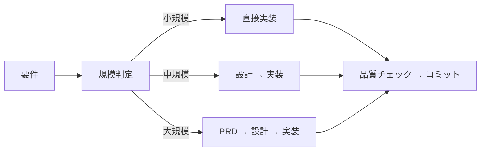

# AI コーディングプロジェクト ボイラープレート 🤖

*他の言語で読む: [English](README.md)*

[](https://www.typescriptlang.org/)
[](https://nodejs.org/)
[](https://claude.ai/code)
[](https://opensource.org/licenses/MIT)
[](https://github.com/shinpr/ai-coding-project-boilerplate/pulls)

⚡ **このボイラープレートは以下のような開発者のためのツールです**
- AIを活用して**プロダクション品質のTypeScriptプロジェクト**を開発したい
- 長時間のAIコーディングで起きる**コンテキスト枯渇**を回避したい
- **専門AIエージェント**で開発のワークフローを標準化したい

## 📖 目次
1. [クイックスタート（3ステップ）](#-クイックスタート3ステップ)
2. [なぜサブエージェント？](#-なぜサブエージェント)
3. [スキルシステム](#-スキルシステム)
4. [実プロジェクトの成果](#-実プロジェクトの成果)
5. [ドキュメント＆ガイド](#-ドキュメントガイド)
6. [スラッシュコマンド](#-スラッシュコマンド)
7. [開発ワークフロー](#-claude-code-ワークフロー)
8. [プロジェクト構成](#-プロジェクト構成)
9. [パッケージマネージャーの設定](#-パッケージマネージャーの設定)
10. [多言語対応](#-多言語対応)
11. [よくある質問](#-よくある質問)

> **どれを使うべき？**
> - **このボイラープレート**を使う → **Claude Code**で**TypeScript × サブエージェント**に最適化し、**精度を最大化**したい場合
> - **[claude-code-workflows](https://github.com/shinpr/claude-code-workflows)**を使う → **Claude Code**で**どんなプロジェクトでも2コマンドで始められる**、**プログラミング言語非依存**のワークフロー
> - **[Agentic Code](https://github.com/shinpr/agentic-code)**を使う → **設定不要**で**どんなツール**でも**プログラミング言語の指定なく**開発したい場合（Codex CLI/Cursor/Aider等）

## ⚡ クイックスタート（3ステップ）

```bash
# 1. プロジェクト作成（30秒）
npx create-ai-project my-project --lang=ja

# 2. 依存関係インストール（自動）
cd my-project && npm install

# 3. Claude Codeを起動して設定
claude                         # Claude Codeを起動
/project-inject                # プロジェクトコンテキストを設定
/implement <あなたの作りたい機能> # 開発開始！
```

> 💡 **初めての方は？** [クイックスタートガイド](docs/guides/ja/quickstart.md)で詳細なセットアップ手順を確認

## 🚀 なぜサブエージェント？

**従来のAIコーディングの問題**
- ❌ 長時間のセッションでコンテキストを失う
- ❌ 時間とともにコード品質が低下
- ❌ 大規模タスクで頻繁なセッション再起動が必要

**サブエージェントによる解決**
- ✅ 専門的な単一の役割に分割（設計、実装、レビュー）
- ✅ コンテキストを常に新鮮に保ち、品質を一定に維持
- ✅ 品質低下なしで規模感のあるタスクを処理

各サブエージェントは1つのタスクに集中します。その結果、コンテキストは枯渇せず、品質も維持されます。

👉 [サブエージェントについて詳しく（Anthropic docs）](https://docs.anthropic.com/en/docs/claude-code/sub-agents)

### 📸 デモ


*サブエージェントが連携してプロダクション品質のTypeScriptプロジェクトを構築する様子*

## 🎨 スキルシステム

このボイラープレートでは、自律的（Agentic）な実装ワークフローで用いられている原理原則を、日常のタスクにおいても必要に応じて参照できるようスキルとして提供しています。

### 適用されるスキル

| スキル | 目的 |
|--------|------|
| `coding-standards` | 汎用コーディング原則、アンチパターン、デバッグ |
| `typescript-rules` | TypeScript型安全性、非同期パターン、リファクタリング |
| `typescript-testing` | Vitest、TDD、カバレッジ要件 |
| `documentation-criteria` | PRD、ADR、Design Doc基準 |
| `technical-spec` | アーキテクチャ、環境設定、ビルドコマンド |
| `implementation-approach` | 戦略パターン、タスク分解 |
| `integration-e2e-testing` | 統合/E2Eテスト設計、ROIベース選択 |
| `project-context` | プロジェクト固有の設定（カスタマイズ可能） |

**フロントエンド専用スキル**も`frontend/`配下で利用可能（例：`frontend/typescript-rules`）。

👉 [スキルの仕組みについて（Claude Code docs）](https://code.claude.com/docs/ja/skills)

## 🎯 実プロジェクトの成果

### [Sub agents MCP Server](https://github.com/shinpr/sub-agents-mcp)
**内容**: Claude Code/Cursor CLIをサブエージェント化するMCPサーバー  
**時間**: 2日間 → **TypeScript 30ファイル、フルテストカバレッジ**  
**結果**: プロダクション環境にデプロイ済み、3分でセットアップ可能

### [MCP Image Generator](https://github.com/shinpr/mcp-image)
**内容**: Gemini API経由のAI画像生成  
**時間**: 1.5日間 → **高度な機能を持つクリエイティブツール**  
**結果**: マルチ画像ブレンディング、キャラクター一貫性、ワンコマンド統合

> 💡 **ポイント**: 適切なルール + サブエージェント = 素早くプロダクション品質のコードを生成できる

## 📚 ドキュメント＆ガイド

- **[クイックスタートガイド](docs/guides/ja/quickstart.md)** - 5分で動かす
- **[ユースケース＆コマンド](docs/guides/ja/use-cases.md)** - 日常ワークフローのリファレンス
- **[ルール編集ガイド](docs/guides/ja/rule-editing-guide.md)** - プロジェクトに合わせてカスタマイズ
- **[設計思想](https://qiita.com/shinpr/items/98771c2b8d2e15cafcd5)** - なぜこれが機能するのか

## 📝 スラッシュコマンド

Claude Codeで利用できる主要なコマンド：

| コマンド | 目的 | 使用場面 |
|---------|------|----------|
| `/implement` | 要件から実装までの一貫した開発 | 新機能開発（Backend） |
| `/task` | ルールに基づいた単一タスクの実行 | バグ修正、小規模な変更 |
| `/design` | 設計書の作成 | アーキテクチャの計画時（Backend） |
| `/plan` | 設計書から作業計画書を作成 | 設計承認後（Backend） |
| `/build` | 既存の計画から実行 | 作業の再開時（Backend） |
| `/review` | コードの準拠性確認 | 実装完了後 |
| `/front-design` | フロントエンド設計書の作成 | React/Viteアーキテクチャ計画時 |
| `/front-plan` | フロントエンド作業計画書を作成 | フロントエンド設計承認後 |
| `/front-build` | フロントエンド実装の実行 | Reactコンポーネント開発 |

[コマンドの詳細はこちら →](docs/guides/ja/use-cases.md)

## 🤖 Claude Code ワークフロー



### 動作の仕組み

1. **要件分析**: `/implement`コマンドがタスクの規模を判断します
2. **ドキュメント生成**: 必要に応じてドキュメント（PRD、Design Doc、Work Plan）を作成します
3. **タスク実行**: 専門のエージェントが各フェーズを担当します
4. **品質保証**: テスト、型チェック、必要に応じた修正を行います
5. **コミット**: タスクごとに整理されたコミットを作成します

## 📂 プロジェクト構成

```
ai-coding-project-boilerplate/
├── .claude/               # AIエージェント設定
│   ├── agents/           # 専門サブエージェント定義
│   ├── commands/         # スラッシュコマンド定義
│   └── skills/           # 自動コンテキスト読み込み用スキル
│       ├── coding-standards/
│       ├── typescript-rules/
│       ├── typescript-testing/
│       ├── documentation-criteria/
│       ├── technical-spec/
│       ├── project-context/
│       └── frontend/     # フロントエンド専用スキル
├── docs/
│   ├── guides/           # ユーザードキュメント
│   ├── adr/              # アーキテクチャ決定
│   ├── design/           # 設計ドキュメント
│   └── prd/              # 製品要件
├── src/                  # あなたのソースコード
├── scripts/              # ユーティリティスクリプト
└── CLAUDE.md             # Claude Code設定
```

## 🔧 パッケージマネージャーの設定

このボイラープレートはデフォルトでnpmを使用しますが、bunやpnpmなど好みのパッケージマネージャーに切り替えることができます。

`package.json`には2つの環境依存設定があります：

- **`packageManager`**: 使用するパッケージマネージャーとバージョン
- **`scripts`**: 各スクリプトの実行コマンド

これらを変更すると、Claude Codeがそれを認識し、適切なコマンドで実行します。

### bunに切り替える場合

```json
{
  "packageManager": "bun@1.3.3",
  "scripts": {
    "build": "bun run tsc && tsc-alias",
    "dev": "bun run src/index.ts",
    "test": "bun test",
    "check": "bunx @biomejs/biome check src",
    "check:all": "bun run check && bun run lint && bun run format:check && bun run check:unused && bun run check:deps && bun run build && bun test"
  }
}
```

上記は代表例です。ルールやサブエージェント定義で言及されているスクリプトは以下の通りです。必要に応じて書き換えてください：

`build`, `build:frontend`, `dev`, `preview`, `type-check`, `test`, `test:coverage`, `test:coverage:fresh`, `test:safe`, `cleanup:processes`, `check`, `check:fix`, `check:code`, `check:unused`, `check:deps`, `check:all`, `format`, `format:check`, `lint`, `lint:fix`

## 🌐 多言語対応

日本語と英語に対応しています：

```bash
npm run lang:ja         # 日本語に切り替え
npm run lang:en         # 英語に切り替え
npm run lang:status     # 現在の言語設定を確認
```

言語を切り替えると、設定ファイル、ルール、エージェント定義が自動的に更新されます。

## 🤔 よくある質問

**Q: サブエージェントはどのように動作しますか？**  
A: `/implement`や`/task`コマンドを使用すると、タスクに応じて適切なエージェントが自動的に選択され、実行されます。

**Q: エラーが発生した場合の対処法は？**  
A: quality-fixerが多くの問題を自動的に検出・修正します。自動修正できない場合は、具体的な対処方法をご案内します。

**Q: プロジェクトに合わせたカスタマイズは可能ですか？**  
A: はい、可能です。`/project-inject`コマンドを実行して、プロジェクト固有の設定を行ってください。

**Q: 基本的な開発の流れを教えてください。**  
A: 初回は`/project-inject`でプロジェクト設定を行い、その後は`/implement`で機能開発、品質チェック、コミットという流れになります。

**Q: GitHub CopilotやCursorとはどう違いますか？**  
A: これらのツールはコード記述の支援に特化していますが、本ボイラープレートは開発プロセス全体をサポートする仕組みを提供しています。

## 🤖 サブエージェント一覧

| エージェント | 担当領域 | 使用されるタイミング |
|------------|---------|------------------|
| **requirement-analyzer** | タスク規模の判定 | `/implement`コマンド実行時 |
| **technical-designer** | 設計ドキュメントの作成 | 中規模・大規模機能の開発時 |
| **document-reviewer** | ドキュメント品質チェック | ドキュメント作成後 |
| **design-sync** | Design Doc間の整合性検証 | Design Doc作成後 |
| **acceptance-test-generator** | ACからテストスケルトン生成 | 設計承認後 |
| **work-planner** | タスクの分解と計画 | 設計完了後 |
| **task-executor** | 実装作業 | 開発フェーズ |
| **quality-fixer** | 品質問題の修正 | エラーや警告の検出時 |
| **code-reviewer** | コードレビュー | `/review`コマンド実行時 |
| **integration-test-reviewer** | テスト実装品質の検証 | テスト実装後 |

[エージェントの詳細 →](.claude/agents-ja/)

## 📄 ライセンス

MIT License - 自由に使用・改変・配布可能

## 🎯 このプロジェクトについて

AI Coding Project Boilerplateは、AIを活用した開発において、コード品質と開発効率のバランスを重視して設計されています。サブエージェントによる役割分担とコンテキスト管理により、TypeScriptプロジェクトの効率的な開発をサポートします。