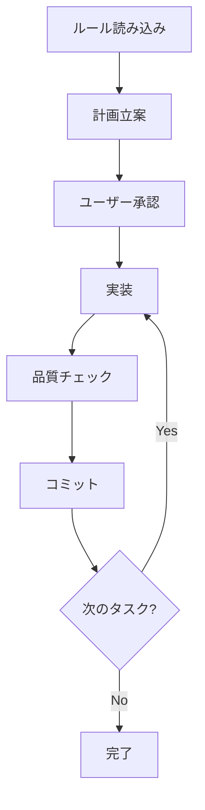

# AI コーディングプロジェクト ボイラープレート 🤖

*他の言語で読む: [English](README.md)*

[](https://www.typescriptlang.org/)
[](https://nodejs.org/)
[](https://claude.ai/code)
[](https://opensource.org/licenses/MIT)
[](https://github.com/shinpr/ai-coding-project-boilerplate/pulls)

## 📚 ドキュメント＆ガイド

初めての方は**[クイックスタートガイド](docs/guides/ja/quickstart.md)**で5分でセットアップから最初の機能実装まで体験できます。日常的な開発でサッと参照する**[ユースケース別クイックリファレンス](docs/guides/ja/use-cases.md)**も用意しています。

このツールの背景や思想について知りたい方は、[設計書駆動で品質を保証する「Agentic Coding」実践ガイド](https://qiita.com/shinpr/items/98771c2b8d2e15cafcd5)をご覧ください。

## 🚀 コンテキスト枯渇を防ぐSub agents - 大規模プロジェクトでも安定した開発を実現

AIコーディングの課題「コンテキスト枯渇による品質低下」をSub agents（サブエージェント）の連携で改善。長時間の作業でも安定した開発をサポートします。

## 📸 デモ


*Sub agents（サブエージェント）を活用したプロダクション品質のTypeScriptプロジェクト作成*

## 🎯 このボイラープレートで作成されたプロジェクト例

実際にこのボイラープレートで作られたプロジェクトです。

### [Sub agents MCP Server](https://github.com/shinpr/sub-agents-mcp)
**MCP経由でClaude Code/Cursor CLIをサブエージェント的に呼び出せるサーバー**

- **作成期間**: 約2日間
- **規模**: TypeScript 約30ファイル、包括的なテストスイート付き
- **公開**: [GitHub](https://github.com/shinpr/sub-agents-mcp)
- **特徴**: 
  - AI CLIツールに特化したMCPサーバー実装
  - MCP経由でClaude Code/Cursor CLIをサブエージェントとして活用
  - 3分でセットアップ可能な簡単インストール
  - プロダクション品質のコード（テスト、型定義、CI/CD完備）

> 💡 適切なルールとプロセスがあれば、AIコーディングでもプロダクションレベルのコードを作成できます。

### [MCP Image Generator](https://github.com/shinpr/mcp-image)
**Gemini APIを活用したAI画像生成MCPサーバー**

- **作成期間**: 約1.5日間
- **規模**: TypeScript 約30ファイル、包括的なテストスイート付き
- **公開**: [GitHub](https://github.com/shinpr/mcp-image)
- **特徴**: 
  - Gemini 2.5 Flash Image APIによる高品質画像生成
  - 自然言語での画像編集・変換機能
  - Gemini APIの先進機能をMCP経由でシームレスに活用（マルチ画像ブレンディング、キャラクター一貫性維持など）
  - Claude Code/Cursorへワンコマンドで統合可能

> 💡 開発効率化だけでなく、創造性拡張の領域でも活用できます。

## ⚡ 3ステップで開発開始

```bash
# 1. プロジェクト作成（30秒）
npx github:shinpr/ai-coding-project-boilerplate my-project --lang=ja

# 2. 依存関係インストール（自動）
cd my-project && npm install

# 3. Claude Codeで開発開始
claude  # ターミナルでClaude Codeを起動
```

> 💡 **開発を開始**: `/implement` コマンドで要件分析から実装までを一貫サポート

## 🌐 日本語環境への切り替え

このボイラープレートは日本語と英語の両方をサポートしています。

```bash
# 日本語に切り替え
npm run lang:ja

# 英語に切り替え（必要な場合）
npm run lang:en

# 現在の言語設定を確認
npm run lang:status
```

言語を切り替えると、Claude Code設定ファイル（CLAUDE.md）、開発ルール（docs/rules/）、サブエージェント定義（.claude/agents/）、カスタムスラッシュコマンド（.claude/commands/）が自動更新されます。

## 🎯 なぜサブエージェントなのか？

従来のAIコーディングでは、長時間の作業によってAIが作業途中の内容を忘れたり、auto-compactが実行されコンテキストが欠落する「コンテキスト枯渇」、タスクが進むにつれて実装精度が落ちる「品質低下」、といった問題が発生していました。

サブエージェントを活用することでこれらを改善できます。各タスクを専門のAIエージェントが必要なコンテキストだけを得た状態で処理でき、長時間の作業でも品質低下を抑制し、大規模プロジェクトでもセッション切り替えの頻度を削減できます。

## 🤖 利用可能なサブエージェント一覧

専門タスクごとに独立したAIエージェントが動作。コンテキスト枯渇を緩和します

| エージェント | 役割 | いつ使われるか |
|------------|------|--------------|
| **quality-fixer** | 品質問題の修正サポート | 型エラー、lint、テスト失敗時に起動 |
| **task-executor** | タスク実行 | 作業計画書の手順を着実に実装 |
| **technical-designer** | 設計書作成 | ADR、Design Docが必要な時 |
| **work-planner** | 作業計画書作成 | 設計ドキュメントから実装計画を作成 |
| **requirement-analyzer** | 要件分析 | タスクの規模判定と開発アプローチ提案 |
| **prd-creator** | PRD作成 | ビジネス要件を構造化 |
| **document-reviewer** | ドキュメントレビュー | 整合性と完成度を検証 |
| **task-decomposer** | タスク分解 | 作業計画を1コミット単位に分割 |
| **rule-advisor** | ルール選択 | タスク開始時に適切なルールセットを選択 |
| **code-reviewer** | コードレビュー | Design Doc準拠を第三者視点で評価 |
| **acceptance-test-generator** | 受入テスト生成 | Design DocのACから統合/E2Eテストのスケルトンを生成 |

詳細は`CLAUDE.md`および`.claude/agents/`内の各定義ファイルを参照してください。

## 📂 プロジェクト構成

```
ai-coding-project-boilerplate/
├── .claude/
│   ├── agents-ja/          # サブエージェント定義（日本語）⭐
│   ├── agents-en/          # サブエージェント定義（英語）
│   ├── commands-ja/        # スラッシュコマンド（日本語）⭐
│   └── commands-en/        # スラッシュコマンド（英語）
├── docs/
│   ├── rules-ja/           # Claude Code向け開発ルール（日本語）⭐
│   │   └── rules-index.yaml  # ルールファイルのインデックス
│   ├── rules-en/           # Claude Code向け開発ルール（英語）
│   │   └── rules-index.yaml  # ルールファイルのインデックス
│   ├── guides/
│   │   ├── ja/
│   │   │   ├── quickstart.md     # クイックスタートガイド
│   │   │   ├── use-cases.md      # コマンドチートシート
│   │   │   └── sub-agents.md     # サブエージェント実践ガイド
│   │   └── en/
│   │       ├── quickstart.md     # Quick Start Guide
│   │       ├── use-cases.md      # Use Cases Guide
│   │       └── sub-agents.md     # Sub-agents Practice Guide
│   ├── adr/               # アーキテクチャ決定記録
│   ├── design/            # 設計ドキュメント
│   ├── plans/             # 作業計画書（git管理外）
│   └── prd/               # 製品要件定義書
├── src/                   # ソースコードディレクトリ
│   └── index.ts           # エントリーポイントサンプル
├── scripts/               # 開発支援スクリプト
│   └── set-language.js    # 言語切り替えスクリプト
├── CLAUDE.ja.md           # Claude Code専用設定（日本語）⭐
├── CLAUDE.en.md           # Claude Code専用設定（英語）
├── README.ja.md           # このファイル
├── README.md              # README（英語版）
├── tsconfig.json          # TypeScript厳格設定
├── biome.json             # Linter・Formatter設定
└── vitest.config.mjs      # テスト設定
```

## 📝 スラッシュコマンド

Claude Codeで使える便利なコマンド一覧

| コマンド | 説明 | 使用例 |
|---------|------|--------|
| `/implement` | 要件分析から実装まで全自動 | 新機能開発時 |
| `/design` | 設計書作成（PRD/ADR/Design Doc） | アーキテクチャ決定時 |
| `/plan` | 作業計画とタスク分解 | 大規模変更時 |
| `/build` | タスク自動実行 | 計画済みタスクの実装 |
| `/task` | ルールベース実行 | 単一タスク実行時 |
| `/review` | Design Doc準拠検証 | 実装完了後の検証 |
| `/refine-rule` | ルール変更要求を精度最大化して実装 | ルール改善・明確化時 |
| `/sync-rules` | ルールメタデータ同期 | ルール編集後の最適化 |
| `/project-inject` | プロジェクトコンテキスト注入 | ボイラープレート利用開始時 |

詳細は `.claude/commands/` 内の各定義ファイルを参照してください。

## 🚀 基本的な使い方

### 新しいプロジェクトの作成

```bash
# npxで作成（推奨）
npx github:shinpr/ai-coding-project-boilerplate my-project --lang=ja
cd my-project
npm install
```

### プロジェクト固有の設定

```bash
# Claude Codeでプロジェクトコンテキストを注入
/project-inject
# プロジェクトの背景情報を対話的に設定
# → docs/rules/project-context.md を自動更新
```

```json
// 2. package.json の基本情報を更新（必要に応じて）
{
  "name": "your-project-name",
  "description": "プロジェクトの説明",
  "author": "あなたの名前"
}
```

## 💻 開発コマンド

### 基本コマンド
```bash
npm run dev        # 開発サーバー起動
npm run build      # プロダクションビルド
npm run test       # テスト実行
npm run test:watch # テスト監視モード
```

### 品質チェック
```bash
npm run check:all   # 全体品質チェック
npm run lint        # Lintチェック
npm run format      # コードフォーマット
npm run check:deps  # 循環依存チェック
```

## 🤖 Claude Code専用ワークフロー

### 推奨ワークフロー

1. 初回ルール読み込み: タスク開始時に必要なルールファイル（`docs/rules/`）を読み込む
2. 実装前確認: Edit/Write/MultiEdit操作前にユーザー確認を推奨
3. 段階的品質チェック: Phase 1-6の段階的品質チェックを実施
4. サブエージェント活用: 専門的なタスクでサブエージェントを活用

### Claude Code開発プロセス



## 💡 実践ガイド

[設計書駆動で品質を保証する「Agentic Coding」実践ガイド](https://qiita.com/shinpr/items/98771c2b8d2e15cafcd5)

このボイラープレートの詳しい使い方と実装背景をまとめた記事です。

## 📋 開発ルール概要

### 基本方針

禁止事項をメリット・デメリット付きで説明することでLLMの理解を促進。プロジェクトの要件に応じて柔軟に調整可能で、6段階の体系的品質チェックプロセスとサブエージェント連携により品質を保証します。

### 主要ルール

unknown型+型ガードで型安全性を確保し、any型は避ける。テストファースト開発（Red-Green-Refactor）を基本とし、コメントアウトではなくバージョン管理で履歴管理。YAGNI原則に従い現在必要な機能のみ実装します。

## 🧪 AIがサポートする品質保証

### AIを活用した品質チェック

サブエージェントが品質チェックをサポート。task-executorがTDD（Red-Green-Refactor）で実装し、quality-fixerが型エラーやlintを修正、code-reviewerが実装の完全性を検証します。

### 手動で確認したい場合

```bash
npm test                    # テスト実行
npm run test:coverage:fresh # カバレッジ計測
npm run check:all           # 全品質チェック（型、lint、テスト、ビルド）
```

## 🏗️ アーキテクチャ

### Claude Code向けアーキテクチャパターン

AIコーディングに適した3つのアーキテクチャパターンを用意。Layered Architecture（明確な責務分離、企業開発向け）、Vertical Slice Architecture（1機能1ファイル、コンテキスト効率重視）、Hybrid Progressive Architecture（小規模から大規模への段階的進化）から選択できます。

詳細は`docs/rules/architecture/`を参照してください。

## 🤔 よくある質問

**Q: サブエージェントはどう使う？**  
`/implement`コマンドなどで呼び出せます。もちろん、サブエージェント名をプロンプトに含めることで明示的に呼び出すことができます。

**Q: エラーが発生したら？**  
quality-fixerが修正を試みます。自動修正できない場合は、具体的な対処法を案内します。

**Q: 言語の切り替え方法は？**  
`npm run lang:ja`（日本語）または`npm run lang:en`（英語）で切り替え。

**Q: カスタマイズ方法は？**  
`/project-inject`コマンドを実行して、対話的にプロジェクトコンテキストを設定。

**Q: Claude Codeでの開発手順は？**  
初回：`/project-inject`でコンテキスト設定  
開発：`/implement`または`/task`で実装 → 品質チェック → コミット

## 📄 ライセンス

MIT License - 自由に使用・改変・配布可能

## 🎯 このボイラープレートについて

Claude CodeとSub agentsを活用したTypeScript開発をサポートするボイラープレート。日本語・英語の両言語に対応。

---

開発の効率化にお役立てください 🤖