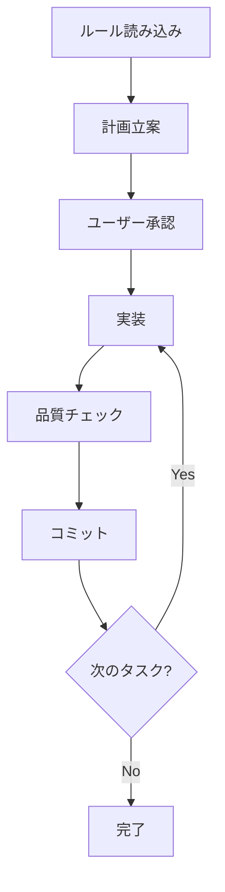

# AI コーディングプロジェクト ボイラープレート 🤖

*他の言語で読む: [English](README.md)*

[](https://www.typescriptlang.org/)
[](https://nodejs.org/)
[](https://claude.ai/code)
[](https://opensource.org/licenses/MIT)
[](https://github.com/shinpr/ai-coding-project-boilerplate/pulls)

## 🚀 コンテキスト枯渇を防ぐSub agents - 大規模プロジェクトでも安定した開発を実現

AIコーディングの課題「コンテキスト枯渇による品質低下」をSub agentsの連携で改善。長時間の作業でも安定した開発をサポートします。

## 📸 デモ


*Sub agentsを活用したプロダクション品質のTypeScriptプロジェクト作成*

## 🎯 このボイラープレートで作成されたプロジェクト例

実際にこのボイラープレートとClaude Codeを使用して開発されたプロジェクトをご紹介します。

### [Sub agents MCP Server](https://github.com/shinpr/sub-agents-mcp)
**MCP経由でClaude Code/Cursor CLIをサブエージェント的に呼び出せるサーバー**

- **作成期間**: 約2日間
- **規模**: TypeScript 約30ファイル、包括的なテストスイート付き
- **公開**: [GitHub](https://github.com/shinpr/sub-agents-mcp)
- **特徴**: 
  - AI CLIツールに特化したMCPサーバー実装
  - MCP経由でClaude Code/Cursor CLIをサブエージェントとして活用
  - 3分でセットアップ可能な簡単インストール
  - プロダクション品質のコード（テスト、型定義、CI/CD完備）

> 💡 **ポイント**: 適切なルールとプロセスがあれば、AIコーディングでもプロダクションレベルのコード作成をサポートできます。

## ⚡ 3ステップで開発開始

```bash
# 1. プロジェクト作成（30秒）
npx github:shinpr/ai-coding-project-boilerplate my-project --lang=ja

# 2. 依存関係インストール（自動）
cd my-project && npm install

# 3. Claude Codeで開発開始
claude  # ターミナルでClaude Codeを起動
```

> 💡 **開発を開始**: `/implement` コマンドで要件分析から実装までを一貫サポート

## 🌐 日本語環境への切り替え

このボイラープレートは日本語と英語の両方をサポートしています。

```bash
# 日本語に切り替え
npm run lang:ja

# 英語に切り替え（必要な場合）
npm run lang:en

# 現在の言語設定を確認
npm run lang:status
```

言語を切り替えると、以下が自動的に更新されます
- `CLAUDE.md` - Claude Code設定ファイル
- `docs/rules/` - 開発ルール
- `.claude/agents/` - Sub agents定義
- `.claude/commands/` - スラッシュコマンド

## 🎯 なぜSub agentsなのか？

### 従来のAIコーディングの問題
- ❌ **コンテキスト枯渇**: 長時間の作業でAIが前の内容を忘れる
- ❌ **品質低下**: タスクが進むにつれて実装精度が落ちる
- ❌ **セッション切り替え**: 大規模タスクで頻繁な再起動が必要

### Sub agentsによる改善アプローチ
- ✅ **専門エージェントが独立動作**: 各タスクを専門AIが新鮮な状態で処理
- ✅ **品質の安定性向上**: 長時間の作業でも品質低下を抑制
- ✅ **大規模プロジェクト対応**: セッション切り替えの頻度を削減

## 🤖 利用可能なSub agents一覧

専門タスクごとに独立したAIエージェントが動作。コンテキスト枯渇を緩和します

| エージェント | 役割 | いつ使われるか |
|------------|------|--------------|
| **quality-fixer** | 品質問題の修正サポート | 型エラー、lint、テスト失敗時に起動 |
| **task-executor** | タスク実行 | 作業計画書の手順を着実に実装 |
| **technical-designer** | 設計書作成 | ADR、Design Docが必要な時 |
| **work-planner** | 作業計画書作成 | 設計ドキュメントから実装計画を作成 |
| **requirement-analyzer** | 要件分析 | タスクの規模判定と開発アプローチ提案 |
| **prd-creator** | PRD作成 | ビジネス要件を構造化 |
| **document-reviewer** | ドキュメントレビュー | 整合性と完成度を検証 |
| **task-decomposer** | タスク分解 | 作業計画を1コミット単位に分割 |
| **rule-advisor** | ルール選択 | タスク開始時に適切なルールセットを選択 |
| **code-reviewer** | コードレビュー | Design Doc準拠を第三者視点で評価 |
| **e2e-test-generator** | 統合テスト生成 | Design DocのACからit.todoスケルトンを自動生成 |

詳細は`CLAUDE.md`および`.claude/agents/`内の各定義ファイルを参照してください。

## 📂 プロジェクト構成

```
ai-coding-project-boilerplate/
├── .claude/
│   ├── agents-ja/          # Sub agents定義（日本語）⭐
│   ├── agents-en/          # Sub agents定義（英語）
│   ├── commands-ja/        # スラッシュコマンド（日本語）⭐
│   └── commands-en/        # スラッシュコマンド（英語）
├── docs/
│   ├── rules-ja/           # Claude Code向け開発ルール（日本語）⭐
│   │   └── rules-index.yaml  # ルールファイルのインデックス
│   ├── rules-en/           # Claude Code向け開発ルール（英語）
│   │   └── rules-index.yaml  # ルールファイルのインデックス
│   ├── guides/
│   │   ├── ja/
│   │   │   └── sub-agents.md  # Sub agents実践ガイド
│   │   └── en/
│   │       └── sub-agents.md  # Sub agents実践ガイド
│   ├── adr/               # アーキテクチャ決定記録
│   ├── design/            # 設計ドキュメント
│   ├── plans/             # 作業計画書（git管理外）
│   └── prd/               # 製品要件定義書
├── src/                   # ソースコードディレクトリ
│   └── index.ts           # エントリーポイントサンプル
├── scripts/               # 開発支援スクリプト
│   └── set-language.js    # 言語切り替えスクリプト
├── CLAUDE.ja.md           # Claude Code専用設定（日本語）⭐
├── CLAUDE.en.md           # Claude Code専用設定（英語）
├── README.ja.md           # このファイル
├── README.md              # README（英語版）
├── tsconfig.json          # TypeScript厳格設定
├── biome.json             # Linter・Formatter設定
└── vitest.config.mjs      # テスト設定
```

## 📝 スラッシュコマンド

Claude Codeで使える便利なコマンド一覧

| コマンド | 説明 | 使用例 |
|---------|------|--------|
| `/implement` | 要件分析から実装まで全自動 | 新機能開発時 |
| `/design` | 設計書作成（PRD/ADR/Design Doc） | アーキテクチャ決定時 |
| `/plan` | 作業計画とタスク分解 | 大規模変更時 |
| `/build` | タスク自動実行 | 計画済みタスクの実装 |
| `/task` | ルールベース実行 | 単一タスク実行時 |
| `/review` | Design Doc準拠検証 | 実装完了後の検証 |
| `/rule-maintenance` | ルール管理 | ルール追加・更新時 |
| `/onboard` | ルール読み込み | プロジェクト開始時 |

詳細は `.claude/commands/` 内の各定義ファイルを参照してください。

## 🚀 基本的な使い方

### 新しいプロジェクトの作成

```bash
# npxで作成（推奨）
npx github:shinpr/ai-coding-project-boilerplate my-project --lang=ja
cd my-project
npm install
```

### プロジェクト固有の設定

```json
// package.json
{
  "name": "your-project-name",
  "description": "プロジェクトの説明",
  "author": "あなたの名前"
}
```

```bash
# docs/rules-ja/project-context.md のプレースホルダーを置き換え
# [プロジェクト名] → 実際のプロジェクト名
# [プロダクト名をここに記載] → 実際のプロダクト名
# [ターゲットユーザーの職種をここに記載] → 実際のターゲット
```

## 💻 開発コマンド

### 基本コマンド
```bash
npm run dev        # 開発サーバー起動
npm run build      # プロダクションビルド
npm run test       # テスト実行
npm run test:watch # テスト監視モード
```

### 品質チェック
```bash
npm run check:all   # 全体品質チェック
npm run lint        # Lintチェック
npm run format      # コードフォーマット
npm run check:deps  # 循環依存チェック
```

## 🤖 Claude Code専用ワークフロー

### 推奨ワークフロー

1. **初回ルール読み込み**: タスク開始時に必要なルールファイル（`docs/rules/`）を読み込む
2. **実装前確認**: Edit/Write/MultiEdit操作前にユーザー確認を推奨
3. **段階的品質チェック**: Phase 1-6の段階的品質チェックを実施
4. **Sub agents活用**: 専門的なタスクでSub agentsを活用

### Claude Code開発プロセス



## 💡 実践ガイド

[設計書駆動で品質を保証する「Agentic Coding」実践ガイド](https://qiita.com/shinpr/items/98771c2b8d2e15cafcd5)

このボイラープレートの詳しい使い方と、なぜこのような仕組みになっているのかをまとめた記事です。Sub agentsやContext Engineeringの実装背景も含めて解説しています。

## 📋 開発ルール概要

### 基本方針
- **推奨形式**: 禁止事項をメリット・デメリット付きで説明（LLM理解促進）
- **柔軟な実装選択**: プロジェクトの要件に応じて調整可能
- **段階的品質保証**: 6段階の体系的品質チェックプロセス
- **Sub agents連携**: 専門タスクでSub agentsを活用

### 主要ルール
- ✅ **推奨**: unknown型+型ガード（型安全性確保）
- ❌ **避けるべき**: any型使用（型チェック無効化のため）
- ✅ **推奨**: テストファースト開発（Red-Green-Refactor）
- ❌ **避けるべき**: コメントアウト（バージョン管理で履歴管理）
- ✅ **推奨**: YAGNI原則（現在必要な機能のみ実装）

## 🧪 AIがサポートする品質保証

### AIを活用した品質チェック

Sub agentsが品質チェックをサポート
- **task-executor** がTDD（Red-Green-Refactor）で実装、追加したテストのパスまで対応
- **quality-fixer** が型エラー、lint修正、全テストパスまで自律的に完遂
- **code-reviewer** が実装の完全性を検証

### 手動で確認したい場合

```bash
npm test                    # テスト実行
npm run test:coverage:fresh # カバレッジ計測
npm run check:all           # 全品質チェック（型、lint、テスト、ビルド）
```

## 🏗️ アーキテクチャ

### Claude Code向けアーキテクチャパターン

AIコーディングに適したアーキテクチャパターンを用意
- **Layered Architecture**: 明確な責務分離、企業開発向け  
- **Vertical Slice Architecture**: 1機能1ファイル、コンテキスト効率を重視
- **Hybrid Progressive Architecture**: 小規模から大規模への段階的進化

詳細は`docs/rules/architecture/`を参照してください。

## 🤔 よくある質問

### Q: Sub agentsはどう使う？
A: `/implement`や`/task`コマンドで呼び出せます。適切なタイミングで専門エージェントが起動します。

### Q: エラーが発生したら？
A: quality-fixerが修正を試みます。自動修正できない場合は、具体的な対処法をご案内します。

### Q: 言語の切り替え方法は？
A: `npm run lang:ja`（日本語）または`npm run lang:en`（英語）で切り替え。

### Q: カスタマイズ方法は？
A: `docs/rules/project-context.md`のプレースホルダーを置き換えるだけ。

### Q: Claude Codeでの開発手順は？
A: 1) ルールファイルを読み込み → 2) 計画立案・承認 → 3) 実装 → 4) 品質チェック → 5) コミット

## 📄 ライセンス

MIT License - 自由に使用・改変・配布可能

## 🎯 このボイラープレートについて

AI コーディングプロジェクト ボイラープレートは、Claude CodeとSub agentsを活用したTypeScript開発をサポートするボイラープレートです。日本語・英語の両言語に対応し、AIコーディングの第一歩を支援します。

---

開発の効率化にお役立てください 🤖