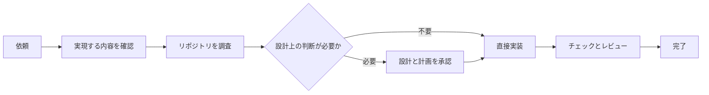

# AI Coding Project Boilerplate：Claude Codeスターターキット

*他の言語で読む: [English](README.md) | [简体中文](README.zh-CN.md)*

[](https://www.typescriptlang.org/)
[](https://nodejs.org/)
[](https://claude.ai/code)
[](https://opensource.org/licenses/MIT)

TypeScriptリポジトリに、Claude Codeを使った開発環境を組み込むスターターキットです。プロジェクト共通の`CLAUDE.md`、すぐに使えるコマンド、専門エージェント、スキルを導入し、リポジトリ内のルールに沿って要件整理から設計、実装、検証まで進められるようにします。

新しいプロジェクトを作成し、導入したClaude Code環境を継続して更新できます。プロンプトやエージェント定義を一から用意することなく、リポジトリ内でチームと共有・バージョン管理しながら、プロジェクトに合わせて育てられます。

## このスターターキットでできること

- `CLAUDE.md`で、プロジェクト共通のルール、Claude Codeに任せる判断、ユーザーへ確認する場面を定める
- `/implement`を使い、依頼内容の整理から実装、検証までを一貫して進める
- 単純な変更は軽量に進め、設計上の判断が必要な変更にだけ設計書やレビューを追加する
- 完了した実装が合意した成果とリポジトリの基準を満たし、不要な変更を含まず、機能、信頼性、セキュリティに重大な問題がないことを確認する
- リポジトリに用意されたテスト、型チェック、lint、ビルドをワークフロー内で実行する
- プロジェクト固有の前提を記録し、繰り返し使うチームの知識をスキルとして追加する
- 同じ構成を日本語・英語のどちらでも利用する

## リポジトリに追加されるもの

| パス | 役割 |
|---|---|
| `CLAUDE.md` | プロジェクト共通のルール、Claude Codeに任せる判断、ユーザーへ確認する場面 |
| `.claude/commands/` | 実装、設計、計画、レビュー、診断、初期設定を開始するコマンド |
| `.claude/agents/` | リポジトリ調査、設計、実装、テスト、レビューを担当する専門エージェント |
| `.claude/skills/` | 現在の作業に関係する場合だけClaudeが読み込む開発ガイド |
| `docs/guides/` | 導入方法、コマンド、スキル編集についての利用者向けガイド |

`/create-skill`、`/refine-skill`、`/sync-skills`も同梱しているため、スキルの構成を手作業で管理せずに、プロジェクト固有のルールを追加・改善できます。

## クイックスタート

### 新しいプロジェクトを作成する

```bash
npx create-ai-project my-project --lang=ja
cd my-project
npm install
claude
```

### このスターターキットで作成したプロジェクトを更新する

プロジェクトルートで実行します。

```bash
npx create-ai-project update --dry-run
npx create-ai-project update
claude
```

更新コマンドは、管理対象の`CLAUDE.md`、コマンド、エージェント、スキルを更新します。ソースコードや`package.json`の設定は置き換えません。

Claude Codeを起動したら、次のコマンドを実行します。

```text
/project-inject
/implement APIにレート制限を追加
```

`/project-inject`では、ドメイン上の制約、品質基準、ディレクトリ規約、外部スキーマやAPI契約の参照先など、Claudeが必要とするリポジトリ固有の情報を記録します。その後は`/implement`を使って、変更を最初から最後まで進められます。

導入手順と初回実行の詳しい流れは[クイックスタート](docs/guides/ja/quickstart.md)を参照してください。

## 開発の進み方


```mermaid
flowchart LR
    A[依頼] --> B[実現する内容を確認]
    B --> C[リポジトリを調査]
    C --> D{設計上の判断が必要か}
    D -->|不要| E[直接実装]
    D -->|必要| F[設計と計画を承認]
    F --> E
    E --> G[チェックとレビュー]
    G --> H[完了]
```

Claude Codeは、最初に変更の目的を確認し、既存の実装を調べます。進め方が明確な変更はそのまま実装し、プロダクトや技術上の判断が必要な変更では、必要な設計書と計画を作成してから実装します。設計を決めるうえで確認が必要な点は、承認前にリポジトリや実際の動作で確かめます。追加の動作確認も、判断に必要な範囲だけで行います。最後にリポジトリで利用できるチェックを実行し、確認できなかった項目があれば明記します。

ドキュメントを作成する条件、テストの選び方、各ワークフローで行うことは[ユースケースとコマンド](docs/guides/ja/use-cases.md)で説明しています。

## よく使うコマンド

| コマンド | 用途 |
|---|---|
| `/implement` | 要件整理から実装、検証まで変更を一貫して進める |
| `/design`, `/front-design` | 実装前に変更内容を設計する |
| `/plan`, `/front-plan` | 承認済みの設計から実行可能な計画を作る |
| `/build`, `/front-build` | 承認済みの計画から実装を再開する |
| `/review`, `/front-review` | 完了した実装が合意した成果、リポジトリの基準、セキュリティ要件を満たしているか確認する |
| `/diagnose` | コードを変更せずに問題を調査し、根拠のある解決策を比較する |
| `/project-inject` | 今後のClaude Codeセッションで使うプロジェクト固有の前提と品質基準を記録する |
| `/create-skill`, `/refine-skill` | 繰り返し使うプロジェクトルールを追加・改善する |

使用例とすべてのコマンドは[ユースケースとコマンド](docs/guides/ja/use-cases.md)を参照してください。

## プロジェクトに合わせて育てる

リポジトリ全体に適用する事実、制約、品質基準は、`/project-inject`で記録します。プロジェクトの目的、開発上の規約、外部資料の参照先をClaudeが把握できるため、依頼のたびに同じ前提を伝える必要がありません。

特定の作業でだけ使うチームの知識や判断基準は、スキルとして作成・修正できます。同梱のスキル編集ワークフローは、情報を置く場所の判断、変更内容のレビュー、メタデータの同期を支援します。具体例と検証方法は[スキル編集ガイド](docs/guides/ja/skills-editing-guide.md)を参照してください。

## 言語とプロジェクト設定

Claude Codeで使用する言語環境は次のコマンドで切り替えられます。

```bash
npm run lang:ja
npm run lang:en
npm run lang:status
```

ワークフローは、リポジトリの設定からパッケージマネージャーと品質チェック用のコマンドを検出します。生成したプロジェクトで異なるコマンドを使う場合は、`package.json`の`packageManager`と該当するscriptを変更してください。

## ガイド

- [クイックスタート](docs/guides/ja/quickstart.md)
- [ユースケースとコマンド](docs/guides/ja/use-cases.md)
- [スキル編集ガイド](docs/guides/ja/skills-editing-guide.md)

## ライセンス

[MIT](LICENSE)
