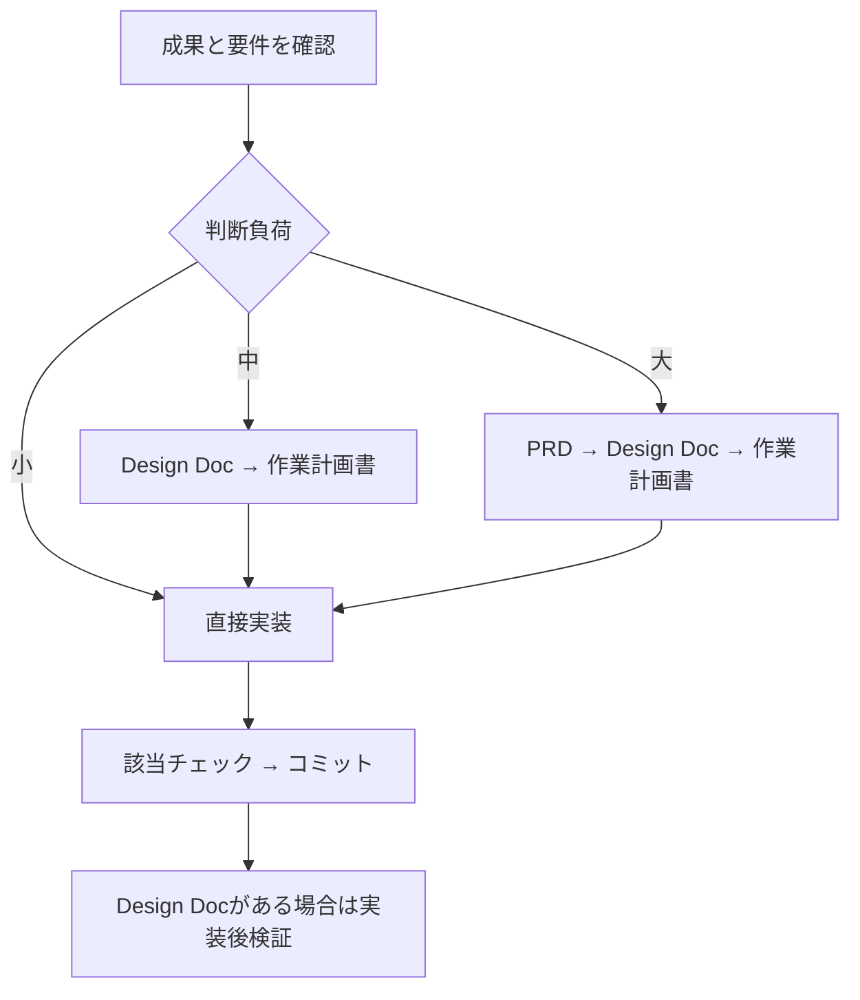

# AI Coding Project Boilerplate — Claude Code向け

*他の言語で読む: [English](README.md)*

[](https://www.typescriptlang.org/)
[](https://nodejs.org/)
[](https://claude.ai/code)
[](https://opensource.org/licenses/MIT)

TypeScriptプロジェクト向けの、エビデンスに基づくClaude Codeワークフローです。確認済みの要件とリポジトリのエビデンスを、設計・実装・レビュー・品質チェックまで引き継ぐコマンド、専門エージェント、スキルを導入します。

## 主な機能

- `/implement`による一貫した実装と、設計・計画・実装・レビュー・診断を個別に実行できるコマンド
- 小さな変更は直接実装し、判断負荷が必要とする場合にだけ永続的なドキュメントを作成
- 所有する責務、観察可能なエビデンス、証明義務から実装・テスト境界を判断
- 受理済みの振る舞いと証明義務に基づく統合/E2Eテスト選定
- ワークフロー内の各コミット前に該当する品質チェックを実行し、実行できなかったチェックも明示
- 同じ契約を持つ英語・日本語のコマンド、エージェント、スキル環境

## クイックスタート

```bash
npx create-ai-project my-project --lang=ja
cd my-project
npm install
claude
```

Claude Code内で実行します。

```text
/project-inject
/implement APIにレート制限を追加
```

`/project-inject`はプロジェクト固有の前提情報を記録します。`/implement`は成果とスコープを確認し、リポジトリを調査して必要な設計成果物だけを作成した後、実装、品質チェック、完了したタスク境界のコミットまで進めます。

初回実行の詳しい流れは[クイックスタート](docs/guides/ja/quickstart.md)を参照してください。

## ワークフロー


```mermaid
flowchart TD
    R[成果と要件を確認] --> S{判断負荷}
    S -->|小| I[直接実装]
    S -->|中| D[Design Doc → 作業計画書]
    S -->|大| P[PRD → Design Doc → 作業計画書]
    D --> I
    P --> I
    I --> Q[該当チェック → コミット]
    Q --> V[Design Docがある場合は実装後検証]
```

永続的な技術選択が条件を満たす場合は、Design Docの前にADRバッチを追加します。フロントエンドまたはフルスタックでは、UIに関する判断が残っている場合にだけUI Specを作成します。ファイル数は変更範囲を調べる材料にはなりますが、経路を決定しません。

| スケール | 経路 |
|---|---|
| 小 | まとまった成果が1つで、1つの責務境界内にリポジトリが支持する明白な実装が1つある → 直接実装 |
| 中 | まとまった成果が1つで、境界をまたぐ調整または永続的になりうる選択を含む → Design Doc、作業計画書 |
| 大 | 独立して価値を持つ成果が複数あり、それぞれ別の設計判断を要する → PRD、Design Doc、作業計画書 |

## コマンド

| コマンド | 用途 |
|---|---|
| `/implement` | 要件確認から実装完了まで一貫して進める |
| `/task` | 該当するスキルを使って単独のタスクを実行する |
| `/design`, `/front-design` | スコープを確認し、実装せずに設計成果物を承認まで進める |
| `/plan`, `/front-plan` | Design Docから作業計画書を作成し、承認まで進める |
| `/build`, `/front-build` | 承認済みの計画に基づく実装を実行する |
| `/review`, `/front-review` | Design Doc準拠とセキュリティをレビューし、必要に応じて修正する |
| `/diagnose` | 問題を調査し、原因を検証して解決策を導く |
| `/reverse-engineer` | 既存コードからPRDやDesign Docを作成する |
| `/add-integration-tests` | 既存実装に統合/E2Eの証明を追加する |
| `/update-doc` | 既存のPRD、ADR、Design Docを更新・レビューする |
| `/create-skill`, `/refine-skill` | プロジェクトのスキルを作成・修正する |
| `/project-inject`, `/sync-skills` | プロジェクトコンテキストとスキルメタデータを管理する |

使用例とすべてのコマンドは[ユースケースとコマンド](docs/guides/ja/use-cases.md)を参照してください。

## スキルとプロジェクトコンテキスト

スキルは、1つの責務で繰り返し使う判断基準を持ち、必要なときだけ読み込まれます。同梱スキルは、要件収束、ドキュメント経路、実装方針、コーディングとテスト、統合/E2Eの証明、オーケストレーション、LLM向けハンドオフを扱います。

ドメイン制約、ディレクトリ規約、外部エビデンスの参照方法など、リポジトリ固有の前提には`/project-inject`を使います。繰り返し使うプロジェクトルールには`/create-skill`または`/refine-skill`を使います。情報の置き場所とスキル変更の検証方法は[スキル編集ガイド](docs/guides/ja/skills-editing-guide.md)を参照してください。

[rashomon](https://github.com/shinpr/rashomon)を使うと、スキル変更の有無による実行結果を比較し、変更が実際に振る舞いを改善したか検証できます。

## 既存プロジェクトの更新

プロジェクトルートで実行します。

```bash
npx create-ai-project update --dry-run
npx create-ai-project update
```

更新処理は、管理対象のエージェント、コマンド、スキル、Claudeルールを更新し、ソースコードとパッケージ設定は保持します。個別に管理するファイルには`--ignore`と`--unignore`を使用できます。

## 設定

使用する言語環境は次のコマンドで切り替えます。

```bash
npm run lang:ja
npm run lang:en
npm run lang:status
```

ワークフローはリポジトリ設定からパッケージマネージャーと品質コマンドを検出します。生成先プロジェクトで異なるコマンドを使う場合は、`package.json`の`packageManager`と各scriptを変更してください。

## ガイド

- [クイックスタート](docs/guides/ja/quickstart.md)
- [ユースケースとコマンド](docs/guides/ja/use-cases.md)
- [スキル編集ガイド](docs/guides/ja/skills-editing-guide.md)

## ライセンス

[MIT](LICENSE)
