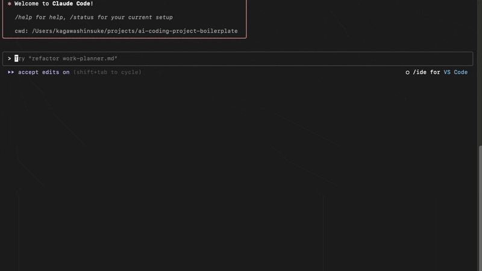

# AI コーディングプロジェクト ボイラープレート — Claude Code対応 🤖

*他の言語で読む: [English](README.md)*

[](https://www.typescriptlang.org/)
[](https://nodejs.org/)
[](https://claude.ai/code)
[](https://opensource.org/licenses/MIT)
[](https://github.com/shinpr/ai-coding-project-boilerplate/pulls)

> **Claude Code向けAgentic Codingスターターキット & ワークフローボイラープレート** — サブエージェントとContext Engineeringで、コンテキスト枯渇なしにプロダクション品質のTypeScriptプロジェクトを構築。

⚡ **このボイラープレートは以下のような開発者のためのツールです**
- AIを活用して**TypeScriptプロジェクト**を効率的に開発したい
- 長時間のAIコーディングで起きる**コンテキスト枯渇**を回避したい
- **専門AIエージェント**で開発のワークフローを標準化したい

## 📖 目次
1. [クイックスタート（3ステップ）](#-クイックスタート3ステップ)
2. [既存プロジェクトの更新](#-既存プロジェクトの更新)
3. [Vibe Codingの先へ：なぜサブエージェント？](#-vibe-codingの先へなぜサブエージェント)
4. [スキルシステム](#-スキルシステム)
5. [このボイラープレートで作られたプロジェクト](#-このボイラープレートで作られたプロジェクト)
6. [ドキュメント＆ガイド](#-ドキュメントガイド)
7. [スラッシュコマンド](#-スラッシュコマンド)
8. [開発ワークフロー](#-claude-code-ワークフロー)
9. [プロジェクト構成](#-プロジェクト構成)
10. [パッケージマネージャーの設定](#-パッケージマネージャーの設定)
11. [多言語対応](#-多言語対応)
12. [よくある質問](#-よくある質問)

## ⚡ クイックスタート（3ステップ）

```bash
# 1. プロジェクト作成
npx create-ai-project my-project --lang=ja

# 2. 依存関係インストール（自動）
cd my-project && npm install

# 3. Claude Codeを起動して設定
claude                         # Claude Codeを起動
/project-inject                # プロジェクトの前提情報を設定（毎セッションAIが参照）
/implement <あなたの作りたい機能> # 開発開始！
```

> 💡 **初めての方は？** [クイックスタートガイド](docs/guides/ja/quickstart.md)で詳細なセットアップ手順を確認

## 🔄 既存プロジェクトの更新

プロジェクトのエージェント定義、コマンド、スキル、AIルールを最新の状態に保ちます。プロジェクトのルートディレクトリで実行してください。

```bash
# 変更内容をプレビュー（適用なし）
npx create-ai-project update --dry-run

# 更新を適用
npx create-ai-project update
```

### 仕組み

`npx create-ai-project update`を実行すると、CLIが以下を行います。

1. `.create-ai-project.json`マニフェストから現在のバージョンを確認
2. 最新のパッケージバージョンと比較
3. CHANGELOGを表示してレビュー
4. 管理対象ファイルを最新版に置換
5. 言語設定に基づいてアクティブディレクトリを再生成

### 更新対象

| 対象 | パス |
|------|------|
| エージェント定義 | `.claude/agents-{lang}/` |
| コマンド定義 | `.claude/commands-{lang}/` |
| スキル定義 | `.claude/skills-{lang}/` |
| AIルール | `CLAUDE.{lang}.md` |

ソースコード（`src/`）、`package.json`、その他のプロジェクトファイルは変更されません。

### カスタマイズしたファイルの保護

ファイルをカスタマイズしていて上書きされたくない場合

```bash
# ignoreリストに追加
npx create-ai-project update --ignore skills project-context
npx create-ai-project update --ignore agents task-executor
npx create-ai-project update --ignore commands implement
npx create-ai-project update --ignore CLAUDE.md

# ignoreリストから削除
npx create-ai-project update --unignore skills project-context
```

ignoreされたファイルは更新時に保護されます。ただし、ignoreしたファイルと他の更新されたコンポーネント間でバージョンの不整合が発生する可能性があります。

### 既存プロジェクトでの初回実行

更新機能導入前に作成されたプロジェクトでも、プロジェクトのルートディレクトリで`npx create-ai-project update`を実行するだけで利用できます。`.claudelang`から言語設定を自動検出し、マニフェストを初期化します。

## 🚀 Vibe Codingの先へ：なぜサブエージェント？

Vibe Codingの先へ — **Agentic Coding**（構造化されたワークフローを専門AIエージェントに委任するアプローチ）がプロフェッショナルな開発の標準になりつつあります。このボイラープレートはClaude Codeのサブエージェントでそれを実現します。

**従来のAIコーディングの問題**
- ❌ 長時間のセッションでコンテキストを失う
- ❌ 時間とともにコード品質が低下
- ❌ 大規模タスクで頻繁なセッション再起動が必要

**サブエージェントによるContext Engineering**
- ✅ 専門的な単一の役割に分割（設計、実装、レビュー）
- ✅ 各エージェントが新鮮で集中したコンテキストを持つ — 枯渇なし
- ✅ 品質低下なしで規模感のあるタスクを処理

これはClaude Codeのサブエージェント機構が、各エージェントを独立したコンテキストウィンドウで実行する仕組みに基づいています。親セッションがタスクを委任し、各サブエージェントはクリーンで集中したコンテキストで処理を開始します。品質チェック（lint、型チェック、テスト、ビルド）はCIではなくコミット前にローカルで実行されるため、フィードバックループが速く、pushする時点でコードは検証済みです。

👉 [サブエージェントについて詳しく（Anthropic docs）](https://docs.anthropic.com/en/docs/claude-code/sub-agents)

### 📸 デモ



*サブエージェントが連携してTypeScriptプロジェクトを構築する様子*

## 🎨 スキルシステム

このボイラープレートでは、自律的（Agentic）な実装ワークフローで用いられている原理原則を、日常のタスクにおいても必要に応じて参照できるようスキルとして提供しています。

### 適用されるスキル

| スキル | 目的 |
|--------|------|
| `coding-standards` | 汎用コーディング原則、アンチパターン、デバッグ |
| `typescript-rules` | TypeScript型安全性、非同期パターン、リファクタリング |
| `typescript-testing` | Vitest、TDD、カバレッジ要件 |
| `documentation-criteria` | PRD、ADR、Design Doc基準 |
| `technical-spec` | アーキテクチャ、環境設定、ビルドコマンド |
| `implementation-approach` | 戦略パターン、タスク分解 |
| `integration-e2e-testing` | 統合/E2Eテスト設計、ROIベース選択 |
| `project-context` | AIの実行精度のためのプロジェクト前提情報（`/project-inject`で設定） |

**フロントエンド専用スキル**も`frontend/`配下で利用可能（例：`frontend/typescript-rules`）。

👉 [スキルの仕組みについて（Claude Code docs）](https://code.claude.com/docs/ja/skills)

## 🎯 このボイラープレートで作られたプロジェクト

### ⏱️ 時間比較
- **ボイラープレートなし**: セットアップ + 基盤構築に約1週間
- **ボイラープレートあり**: 約2日でプロダクション品質のアプリケーション

### 実績

**Sub Agents MCP Server** — Claude Code/Cursor CLIをサブエージェント化するMCPサーバー
⏱️ 初期開発2日間 → テストコードがソースの約9割を占める構成でプロダクション稼働中

**MCP Image Generator** — Gemini API経由のAI画像生成
⏱️ 初期開発1.5日間 → マルチ画像ブレンディング、キャラクター一貫性を持つクリエイティブツール

いずれもデフォルトの`/implement`ワークフローで構築。エージェントの手動オーケストレーションは不要でした。

> プロジェクトを見る: [sub-agents-mcp](https://github.com/shinpr/sub-agents-mcp) ・ [mcp-image](https://github.com/shinpr/mcp-image)

## 📚 ドキュメント＆ガイド

- **[クイックスタートガイド](docs/guides/ja/quickstart.md)** - 5分で動かす
- **[ユースケース＆コマンド](docs/guides/ja/use-cases.md)** - 日常ワークフローのリファレンス
- **[スキル編集ガイド](docs/guides/ja/skills-editing-guide.md)** - ライブラリドキュメント、チームルール、プロジェクト固有の知識をAIに追加
- **[設計思想](https://qiita.com/shinpr/items/98771c2b8d2e15cafcd5)** - このアプローチがなぜ有効か

## 📝 スラッシュコマンド

Claude Codeで利用できる主要なコマンド

| コマンド | 目的 | 使用場面 |
|---------|------|----------|
| `/implement` | 要件から実装までの一貫した開発 | 新機能開発 |
| `/task` | スキルに基づいた単一タスクの実行 | バグ修正、小規模な変更 |
| `/design` | 設計書の作成 | アーキテクチャの計画時 |
| `/plan` | 設計書から作業計画書を作成 | 設計承認後 |
| `/build` | 既存の計画から実行 | 作業の再開時 |
| `/review` | コードの準拠性確認 | 実装完了後 |
| `/diagnose` | 根本原因分析ワークフロー | デバッグ、トラブルシューティング |
| `/reverse-engineer` | コードからPRD/Design Docを生成 | 既存システムのドキュメント化 |

フロントエンド用（`/front-design`, `/front-build`, `/front-review`, `/front-plan`）やユーティリティコマンド（`/add-integration-tests`, `/update-doc`）も利用できます。

[コマンドの詳細はこちら →](docs/guides/ja/use-cases.md)

## 🤖 Claude Code ワークフロー


### リバースエンジニアリングワークフロー


### 動作の仕組み

1. **要件分析**: `/implement`コマンドがタスクの規模を判断します
2. **ドキュメント生成**: 必要に応じてドキュメント（PRD、Design Doc、Work Plan）を作成します
3. **タスク実行**: 専門のエージェントが各フェーズを担当します
4. **品質保証**: テスト、型チェック、必要に応じた修正を行います
5. **コミット**: タスクごとに整理されたコミットを作成します

## 📂 プロジェクト構成

```
ai-coding-project-boilerplate/
├── .claude/               # AIエージェント設定
│   ├── agents/           # 専門サブエージェント定義
│   ├── commands/         # スラッシュコマンド定義
│   └── skills/           # 自動コンテキスト読み込み用スキル
│       ├── coding-standards/
│       ├── typescript-rules/
│       ├── typescript-testing/
│       ├── documentation-criteria/
│       ├── technical-spec/
│       ├── project-context/
│       └── frontend/     # フロントエンド専用スキル
├── docs/
│   ├── guides/           # ユーザードキュメント
│   ├── adr/              # アーキテクチャ決定
│   ├── design/           # 設計ドキュメント
│   └── prd/              # 製品要件
├── src/                  # あなたのソースコード
├── scripts/              # ユーティリティスクリプト
└── CLAUDE.md             # Claude Code設定
```

## 🔧 パッケージマネージャーの設定

このボイラープレートはデフォルトでnpmを使用しますが、bunやpnpmなど好みのパッケージマネージャーに切り替えることができます。

`package.json`には2つの環境依存設定があります。

- **`packageManager`**: 使用するパッケージマネージャーとバージョン
- **`scripts`**: 各スクリプトの実行コマンド

これらを変更すると、Claude Codeがそれを認識し、適切なコマンドで実行します。

### bunに切り替える場合

```json
{
  "packageManager": "bun@1.3.3",
  "scripts": {
    "build": "bun run tsc && tsc-alias",
    "dev": "bun run src/index.ts",
    "test": "bun test",
    "check": "bunx @biomejs/biome check src",
    "check:all": "bun run check && bun run lint && bun run format:check && bun run check:unused && bun run check:deps && bun run build && bun test"
  }
}
```

上記は代表例です。スキルやサブエージェント定義で言及されているスクリプトは以下の通りです。必要に応じて書き換えてください。

`build`, `build:frontend`, `dev`, `preview`, `type-check`, `test`, `test:coverage`, `test:coverage:fresh`, `test:safe`, `cleanup:processes`, `check`, `check:fix`, `check:code`, `check:unused`, `check:deps`, `check:all`, `format`, `format:check`, `lint`, `lint:fix`

## 🌐 多言語対応

日本語と英語に対応しています。

```bash
npm run lang:ja         # 日本語に切り替え
npm run lang:en         # 英語に切り替え
npm run lang:status     # 現在の言語設定を確認
```

言語を切り替えると、設定ファイル、ルール、エージェント定義が自動的に更新されます。

## 🤔 よくある質問

**Q: サブエージェントはどのように動作しますか？**  
A: `/implement`や`/task`コマンドを使用すると、タスクに応じて適切なエージェントが自動的に選択され、実行されます。

**Q: エラーが発生した場合の対処法は？**  
A: quality-fixerが多くの問題を自動的に検出・修正します。自動修正できない場合は、具体的な対処方法をご案内します。

**Q: プロジェクトに合わせたカスタマイズは可能ですか？**
A: はい、可能です。`/project-inject`を実行してプロジェクトの前提情報を設定してください。この情報は毎セッション開始時にAIが読み込み、実行精度の向上に使われます。

**Q: AIにライブラリのドキュメント（llms.txt、APIリファレンス等）を参照させることはできますか？**
A: はい。`.claude/skills/`配下にカスタムスキルを作成し、関連するURLを記載してください。詳しくは[スキル編集ガイド](docs/guides/ja/skills-editing-guide.md)を参照してください。

**Q: 基本的な開発の流れを教えてください。**
A: 初回は`/project-inject`でプロジェクト設定を行い、その後は`/implement`で機能開発、品質チェック、コミットという流れになります。

**Q: GitHub CopilotやCursorとはどう違いますか？**
A: これらのツールはコード記述の支援に特化していますが、本ボイラープレートは開発プロセス全体をサポートする仕組みを提供しています。

**Q: Agentic Codingとは？このボイラープレートはどう関係しますか？**
A: Agentic Codingは、会話的なプロンプティングではなく構造化されたワークフローを専門AIエージェントに委任するアプローチです。このボイラープレートは設定済みのサブエージェント、CLAUDE.mdルール、品質チェックを提供しているので、基盤を自分で組み立てることなくすぐに実践できます。

**Q: コンテキスト枯渇はどう防いでいますか？**
A: Context Engineeringにより防止しています。各サブエージェントは単一の責務に集中した独自のコンテキストウィンドウで実行されるため、セッションが長くなってもコンテキストは常に新鮮です。実際に770K+トークンのセッションで品質低下なく開発を完了しています — 詳細は[設計思想の記事](https://qiita.com/shinpr/items/98771c2b8d2e15cafcd5)をご覧ください。

## 🤖 サブエージェント

要件分析、設計、計画、実装、品質保証、コードレビュー、デバッグ、リバースエンジニアリングをカバーする20以上の専門サブエージェントを搭載しています。各エージェントは独自のコンテキストウィンドウで実行されるため、集中した処理が可能です。

[エージェントの詳細 →](.claude/agents-ja/)

## 📄 ライセンス

MIT License - 自由に使用・改変・配布可能

## 🎯 このプロジェクトについて

AI Coding Project Boilerplateは、Claude Codeに要件分析から品質チェックまでの構造化された開発ライフサイクルを与えるツールです。専門サブエージェントとContext Engineeringにより、各エージェントが独自のコンテキストウィンドウで集中したタスクを処理するため、長時間のセッションでも品質が安定します。設定済みのCLAUDE.mdルール、カスタムスキル、スラッシュコマンドが同梱されており、ツール基盤を自分で構築することなくAgentic CodingでTypeScriptプロジェクトを始められます。