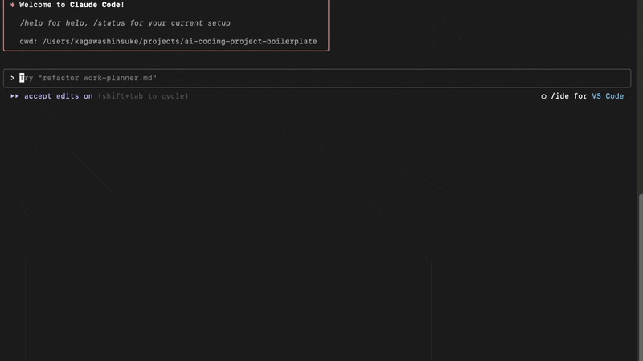
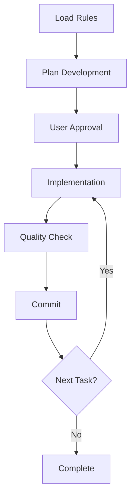

# AI Coding Project Boilerplate 🤖

*Read this in other languages: [日本語](README.ja.md)*

[](https://www.typescriptlang.org/)
[](https://nodejs.org/)
[](https://claude.ai/code)
[](https://opensource.org/licenses/MIT)
[](https://github.com/shinpr/ai-coding-project-boilerplate/pulls)

## 🚀 Beat Context Exhaustion with Sub agents - Production-Ready AI Development at Scale

Sub agents orchestration solves the #1 problem in AI coding: context exhaustion. Maintain consistent quality across large projects with specialized agents handling each task independently.

## 📸 Quick Demo


*Creating a production-ready TypeScript project with sub agents in action*

## 🎯 Real Project Built with This Boilerplate

See what's possible with this boilerplate and Claude Code:

### [Sub agents MCP Server](https://github.com/shinpr/sub-agents-mcp)
**MCP server that enables Claude Code/Cursor CLI to work as sub agents**

- **Development Time**: ~2 days
- **Scale**: ~30 TypeScript files with comprehensive test suite
- **Published**: [GitHub](https://github.com/shinpr/sub-agents-mcp)
- **Features**: 
  - MCP server implementation specialized for AI CLI tools
  - Enables Claude Code/Cursor CLI to function as sub agents via MCP
  - 3-minute setup with simple installation
  - Production-quality code (tests, type definitions, CI/CD included)

> 💡 **Key Insight**: With proper rules and processes, AI coding can produce production-ready code that matches human developer standards.

## ⚡ Get Started in 3 Steps

```bash
# 1. Create your project (30 seconds)
npx github:shinpr/ai-coding-project-boilerplate my-project

# 2. Install dependencies (automatic)
cd my-project && npm install

# 3. Launch Claude Code and start building
claude  # Launch Claude Code in terminal
```

> 💡 **Start development**: Type `/implement` for end-to-end support from requirements to production-ready code

## 🎯 Why Sub agents?

### The Problem with Traditional AI Coding
- ❌ **Context Exhaustion**: AI forgets earlier context in long sessions
- ❌ **Quality Degradation**: Implementation accuracy drops over time
- ❌ **Session Switching**: Large tasks require frequent restarts

### The Sub agents Solution
- ✅ **Independent Specialized Agents**: Each task handled by a fresh, specialized AI
- ✅ **Consistent Quality**: Maintains high standards throughout the entire project
- ✅ **Large-Scale Projects**: Complete complex projects without session switching

## 🤖 Complete Sub agents Roster

Specialized AI agents work independently on each task type, preventing context exhaustion

| Agent | Role | When It's Used |
|-------|------|----------------|
| **quality-fixer** | Automated quality fixes | Triggered on type errors, lint issues, test failures |
| **task-executor** | Task implementation | Executes work plan steps systematically |
| **technical-designer** | Design documentation | Creates ADRs and Design Docs when needed |
| **work-planner** | Work plan creation | Transforms design docs into implementation plans |
| **requirement-analyzer** | Requirements analysis | Assesses task scale and recommends approach |
| **prd-creator** | PRD creation | Structures business requirements |
| **document-reviewer** | Document review | Validates consistency and completeness |
| **task-decomposer** | Task breakdown | Splits work plans into single-commit tasks |
| **rule-advisor** | Rule selection | Selects optimal ruleset at task start |
| **code-reviewer** | Code review | Objectively evaluates compliance with Design Docs |

See `CLAUDE.md` and individual definition files in `.claude/agents/` for details.

## 📂 Project Structure

```
ai-coding-project-boilerplate/
├── .claude/
│   ├── agents-en/          # Sub agents definitions (English)
│   ├── agents-ja/          # Sub agents definitions (Japanese)
│   ├── commands-en/        # Slash commands (English)
│   └── commands-ja/        # Slash commands (Japanese)
├── docs/
│   ├── rules-en/           # Claude Code development rules (English)
│   │   └── rules-index.yaml  # Rule file index
│   ├── rules-ja/           # Claude Code development rules (Japanese)
│   │   └── rules-index.yaml  # Rule file index
│   ├── guides/
│   │   ├── en/
│   │   │   └── sub-agents.md  # Sub agents practical guide
│   │   └── ja/
│   │       └── sub-agents.md  # Sub agents practical guide
│   ├── adr/               # Architecture Decision Records
│   ├── design/            # Design documents
│   ├── plans/             # Work plans (git-ignored)
│   └── prd/               # Product Requirements Documents
├── src/                   # Source code directory
│   └── index.ts           # Entry point sample
├── scripts/               # Development support scripts
│   └── set-language.js    # Language switching script
├── CLAUDE.en.md           # Claude Code configuration (English)
├── CLAUDE.ja.md           # Claude Code configuration (Japanese)
├── README.md              # This file
├── README.ja.md           # README (Japanese)
├── tsconfig.json          # TypeScript strict configuration
├── biome.json             # Linter & Formatter configuration
└── vitest.config.mjs      # Test configuration
```

## 📝 Slash Commands

Powerful commands available in Claude Code

| Command | Description | Use Case |
|---------|-------------|----------|
| `/implement` | End-to-end automation from requirements to code | New feature development |
| `/design` | Create design docs (PRD/ADR/Design Doc) | Architecture decisions |
| `/plan` | Work planning and task decomposition | Large-scale changes |
| `/build` | Automatic task execution | Implementing planned tasks |
| `/task` | Rule-based execution | Single task execution |
| `/review` | Design Doc compliance check | Post-implementation validation |
| `/rule-maintenance` | Rule management | Adding/updating rules |
| `/onboard` | Load project rules | Project initialization |

See individual definition files in `.claude/commands/` for details.

## 🚀 Basic Usage

### Creating a New Project

```bash
# Create with npx (recommended)
npx github:shinpr/ai-coding-project-boilerplate my-project
cd my-project
npm install
```

### Project Configuration

```json
// package.json
{
  "name": "your-project-name",
  "description": "Your project description",
  "author": "Your name"
}
```

```bash
# Replace placeholders in docs/rules/project-context.md
# [Project Name] → Your actual project name
# [Product Name Here] → Your actual product name
# [Target User Role Here] → Your actual target users
```

## 💻 Development Commands

### Essential Commands
```bash
npm run dev        # Start development server
npm run build      # Production build
npm run test       # Run tests
npm run test:watch # Test watch mode
```

### Quality Checks
```bash
npm run check:all   # Complete quality check
npm run lint        # Lint check
npm run format      # Code formatting
npm run check:deps  # Circular dependency check
```

## 🤖 Claude Code Workflow

### Recommended Workflow

1. **Initial Rule Loading**: Load necessary rule files from `docs/rules/` at task start
2. **Pre-Implementation Approval**: Get user approval before Edit/Write/MultiEdit operations
3. **Progressive Quality Checks**: Execute Phase 1-6 quality checks systematically
4. **Sub agents Utilization**: Leverage appropriate Sub agents for specialized tasks

### Development Process



## 📋 Development Rules Overview

### Core Principles
- **Recommended Format**: Explain prohibitions with pros/cons for better LLM understanding
- **Flexible Implementation**: Adjust based on project requirements
- **Progressive Quality Assurance**: 6-phase systematic quality check process
- **Sub agents Integration**: Leverage specialized agents for complex tasks

### Key Rules
- ✅ **Recommended**: unknown type + type guards for type safety
- ❌ **Avoid**: any type usage (disables type checking)
- ✅ **Recommended**: Test-first development (Red-Green-Refactor)
- ❌ **Avoid**: Commented-out code (use version control)
- ✅ **Recommended**: YAGNI principle (implement only what's needed now)

## 🧪 AI-Powered Quality Assurance

### Quality Checks with Sub agents

Sub agents automatically ensure code quality:
- **task-executor** implements with TDD (Red-Green-Refactor), ensures new tests pass
- **quality-fixer** automatically fixes type errors, lint issues, and ensures all tests pass
- **code-reviewer** validates implementation completeness

### Manual Verification

```bash
npm test                    # Run tests
npm run test:coverage:fresh # Measure coverage
npm run check:all           # Complete quality check (types, lint, tests, build)
```

## 🏗️ Architecture

### Claude Code-Optimized Patterns

Architecture patterns designed for AI coding efficiency:
- **Layered Architecture**: Clear separation of concerns, enterprise-ready
- **Vertical Slice Architecture**: One feature per file, optimized for context efficiency
- **Hybrid Progressive Architecture**: Scales from small to large projects gracefully

See `docs/rules/architecture/` for detailed patterns.

## 🌐 Multilingual Support

This boilerplate supports both English and Japanese.

### Language Switching

```bash
# Switch to Japanese
npm run lang:ja

# Switch to English
npm run lang:en

# Check current language
npm run lang:status
```

Language switching automatically updates:
- `CLAUDE.md` - Claude Code configuration
- `docs/rules/` - Development rules
- `.claude/agents/` - Sub agents definitions
- `.claude/commands/` - Slash commands

## 🤔 FAQ

### Q: How do I use Sub agents?
A: Use `/implement` or `/task` commands. The appropriate specialized agents activate automatically.

### Q: What happens when errors occur?
A: quality-fixer attempts automatic fixes. If it can't resolve them, it provides specific instructions.

### Q: How do I switch languages?
A: Run `npm run lang:ja` (Japanese) or `npm run lang:en` (English).

### Q: How do I customize the boilerplate?
A: Replace placeholders in `docs/rules/project-context.md`.

### Q: What's the Claude Code development workflow?
A: 1) Load rules → 2) Plan & approve → 3) Implement → 4) Quality check → 5) Commit

## 📄 License

MIT License - Free to use, modify, and distribute

## 🎯 About This Boilerplate

AI Coding Project Boilerplate is the ultimate TypeScript development accelerator, engineered for Claude Code and Sub agents to generate production-ready code at unprecedented speed and quality. With comprehensive multilingual support, it delivers exceptional development experiences for teams worldwide.

---

Happy Coding with Claude Code! 🤖✨