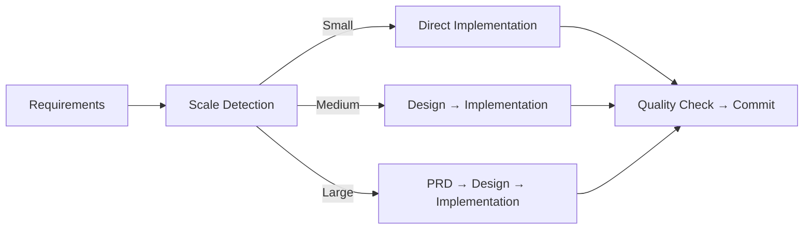

# AI Coding Project Boilerplate 🤖

*Read this in other languages: [日本語](README.ja.md)*

[](https://www.typescriptlang.org/)
[](https://nodejs.org/)
[](https://claude.ai/code)
[](https://opensource.org/licenses/MIT)
[](https://github.com/shinpr/ai-coding-project-boilerplate/pulls)

⚡ **This boilerplate is for developers who want to:**
- Build **production-ready TypeScript projects** faster with AI
- Avoid **context exhaustion** in long AI coding sessions
- Standardize team workflows with **specialized AI agents**

## 📖 Table of Contents
1. [Quick Start (3 Steps)](#-quick-start-3-steps)
2. [Why Sub Agents?](#-why-sub-agents)
3. [Real Projects & Results](#-real-world-results)
4. [Documentation & Guides](#-documentation--guides)
5. [Slash Commands](#-slash-commands)
6. [Development Workflow](#-claude-code-workflow)
7. [Project Structure](#-project-structure)
8. [Package Manager Configuration](#-package-manager-configuration)
9. [Development Commands](#-development-commands)
10. [Rules & Quality Assurance](#-development-rules--quality-assurance)
11. [Multilingual Support](#-multilingual-support)
12. [FAQ](#-faq)

> **Which one should you use?**
> - **Use this Boilerplate** if you want to **maximize precision** with **TypeScript × Sub-agent** setup optimized for **Claude Code**.
> - **Use [claude-code-workflows](https://github.com/shinpr/claude-code-workflows)** if you're on **Claude Code** and want to **start with any project** in **2 commands** and **language-agnostic** workflows.
> - **Use [Agentic Code](https://github.com/shinpr/agentic-code)** if you want **zero-config**, **tool-agnostic** workflows **without language restrictions** (Codex CLI/Cursor/Aider etc.).

## ⚡ Quick Start (3 Steps)

```bash
# 1. Create your project (30 seconds)
npx github:shinpr/ai-coding-project-boilerplate my-project

# 2. Install dependencies (automatic)
cd my-project && npm install

# 3. Launch Claude Code and configure
claude                    # Launch Claude Code
/project-inject          # Configure project context
/implement <your feature> # Start building!
```

> 💡 **First time?** Check the [Quick Start Guide](docs/guides/en/quickstart.md) for detailed setup instructions

## 🚀 Why Sub Agents?

**Traditional AI coding struggles with:**
- ❌ Losing context in long sessions
- ❌ Declining code quality over time  
- ❌ Frequent session restarts for large tasks

**Sub agents solve this by:**
- ✅ Splitting work into specialized roles (design, implementation, review)
- ✅ Keeping context fresh and quality consistent
- ✅ Handling large projects without degradation

Each agent focuses on one thing and does it well. No context exhaustion, no quality drop.

👉 [Learn more about Sub Agents (Anthropic docs)](https://docs.anthropic.com/en/docs/claude-code/sub-agents)

### 📸 Demo


*Sub agents working together to build a production-ready TypeScript project*

## 🎯 Real-World Results

### ⏱️ Time Comparison
- **Without this boilerplate**: ~1 week for setup + infrastructure
- **With this boilerplate**: ~2 days to production-ready application

### Success Stories

#### [Sub agents MCP Server](https://github.com/shinpr/sub-agents-mcp)
**What**: MCP server enabling Claude Code/Cursor CLI as sub agents  
**Time**: 2 days → **30 TypeScript files with full test coverage**  
**Result**: Production-deployed, 3-minute setup

#### [MCP Image Generator](https://github.com/shinpr/mcp-image)
**What**: AI image generation via Gemini API  
**Time**: 1.5 days → **Complete creative tool with advanced features**  
**Result**: Multi-image blending, character consistency, one-command integration

> 💡 **Key Insight**: Proper rules + sub agents = production-quality code at AI speed

## 📚 Documentation & Guides

- **[Quick Start Guide](docs/guides/en/quickstart.md)** - Get running in 5 minutes
- **[Use Cases & Commands](docs/guides/en/use-cases.md)** - Daily workflow reference
- **[Rule Editing Guide](docs/guides/en/rule-editing-guide.md)** - Customize for your project
- **[Design Philosophy](https://dev.to/shinpr/zero-context-exhaustion-building-production-ready-ai-coding-teams-with-claude-code-sub-agents-31b)** - Why it works (770K tokens without exhaustion)

## 📝 Slash Commands

Essential commands for Claude Code:

| Command | Purpose | When to Use |
|---------|---------|-------------|
| `/implement` | End-to-end feature development | New features (Backend) |
| `/task` | Single task with rule precision | Bug fixes, small changes |
| `/design` | Create design docs only | Architecture planning (Backend) |
| `/plan` | Create work plan from design | After design approval (Backend) |
| `/build` | Execute from existing plan | Resume work (Backend) |
| `/review` | Check code compliance | Post-implementation |
| `/front-design` | Create frontend design docs | React/Vite architecture planning |
| `/front-plan` | Create frontend work plan | After frontend design approval |
| `/front-build` | Execute frontend implementation | React component development |

[Full command reference →](docs/guides/en/use-cases.md)

## 🤖 Claude Code Workflow



### How It Works

1. **Requirement Analysis**: `/implement` command analyzes task scale
2. **Document Generation**: Creates necessary docs (PRD, Design Doc, Work Plan)
3. **Task Execution**: Specialized agents handle each phase
4. **Quality Assurance**: Automatic testing, type checking, and fixes
5. **Commit & Continue**: Clean commits for each completed task

## 📂 Project Structure

```
ai-coding-project-boilerplate/
├── .claude/               # AI agent configurations
│   ├── agents/           # Specialized sub-agent definitions
│   └── commands/         # Slash command definitions
├── docs/
│   ├── rules/            # Development rules & patterns
│   ├── guides/           # User documentation
│   ├── adr/              # Architecture decisions
│   ├── design/           # Design documents
│   └── prd/              # Product requirements
├── src/                  # Your source code
├── scripts/              # Utility scripts
└── CLAUDE.md             # Claude Code configuration
```

## 🔧 Package Manager Configuration

This boilerplate uses npm by default, but you can switch to your preferred package manager like bun or pnpm.

There are two environment-dependent settings in `package.json`:

- **`packageManager`**: The package manager and version to use
- **`scripts`**: The execution commands for each script

When you change these, Claude Code will recognize them and execute with the appropriate commands.

### Switching to bun

```json
{
  "packageManager": "bun@1.3.3",
  "scripts": {
    "build": "bun run tsc && tsc-alias",
    "dev": "bun run src/index.ts",
    "test": "bun test",
    "check": "bunx @biomejs/biome check src",
    "check:all": "bun run check && bun run lint && bun run format:check && bun run check:unused && bun run check:deps && bun run build && bun test"
  }
}
```

The above are representative examples. The following scripts are referenced in rules and sub-agent definitions. Update them as needed:

`build`, `build:frontend`, `dev`, `preview`, `type-check`, `test`, `test:coverage`, `test:coverage:fresh`, `test:safe`, `cleanup:processes`, `check`, `check:fix`, `check:unused`, `check:deps`, `check:all`, `format`, `format:check`, `lint`, `lint:fix`

## 🛠️ Development Commands

### Core Scripts
```bash
# Backend
npm run dev              # Start development server (Backend)
npm run build            # Production build (Backend, default)
npm run build:backend    # Production build (Backend, explicit)

# Frontend
npm run dev:frontend     # Start Vite dev server
npm run build:frontend   # Production build with Vite
npm run preview          # Preview production build

# Common
npm run test[:watch]     # Run tests (with optional watch mode)
npm run type-check       # TypeScript type check only
npm run check:all        # Complete check: types + lint + test + build
```

### Quality Tools
```bash
npm run lint             # Lint check
npm run format           # Auto-format code
npm run check:deps       # Check circular dependencies
```

## 📋 Development Rules & Quality Assurance

### Why Rules Matter

Rules guide AI to produce consistent, high-quality code. Without them, AI output varies wildly.  
With them, you get predictable, production-ready results.

### Core Principles

- ✅ **Use**: `unknown` type + type guards for safety
- ❌ **Avoid**: `any` type (breaks type checking)
- ✅ **Use**: Test-first development (Red-Green-Refactor)
- ❌ **Avoid**: Commented-out code (use git instead)
- ✅ **Use**: YAGNI principle (only build what's needed now)

### Automated Quality Checks

Sub agents handle quality automatically:

**Backend:**
- **task-executor**: Implements with TDD approach
- **quality-fixer**: Fixes type/lint/test issues
- **code-reviewer**: Validates against design docs

**Frontend:**
- **task-executor-frontend**: React component implementation with TDD
- **quality-fixer-frontend**: Fixes quality + Lighthouse + bundle size
- **technical-designer-frontend**: React architecture & design decisions

Manual verification: `npm run check:all`

## 🌐 Multilingual Support

Full support for English and Japanese:

```bash
npm run lang:en         # Switch to English
npm run lang:ja         # Switch to Japanese
npm run lang:status     # Check current language
```

Automatically updates all configurations, rules, and agent definitions.

## 🤔 FAQ

**Q: How do sub agents work?**  
A: Just use `/implement` or `/task`. The right agents activate automatically.

**Q: What if there are errors?**  
A: quality-fixer auto-fixes most issues. If not, it provides clear instructions.

**Q: Can I customize for my project?**  
A: Yes! Run `/project-inject` to configure project-specific context.

**Q: What's the typical workflow?**  
A: `/project-inject` (once) → `/implement` (features) → auto quality checks → commit

**Q: How is this different from Copilot/Cursor?**  
A: Those help write code. This manages entire development lifecycle with specialized agents.

## 🤖 Complete Sub Agents Roster

| Agent | Specialization | Activation |
|-------|---------------|------------|
| **requirement-analyzer** | Scale assessment | Start of `/implement` |
| **technical-designer** | Design documentation | Medium/large features |
| **work-planner** | Task breakdown | After design approval |
| **task-executor** | Implementation | During build phase |
| **quality-fixer** | Automated fixes | On any quality issue |
| **code-reviewer** | Compliance check | `/review` command |

[Full agent list →](.claude/agents-en/)

## 📄 License

MIT License - Free to use, modify, and distribute

## 🎯 About This Project

The AI Coding Project Boilerplate is engineered to maximize AI coding productivity while maintaining human-level code quality. By leveraging specialized sub agents and context engineering, it enables teams to build production-ready TypeScript applications at unprecedented speed.

---

Happy Coding with Claude Code! 🤖✨