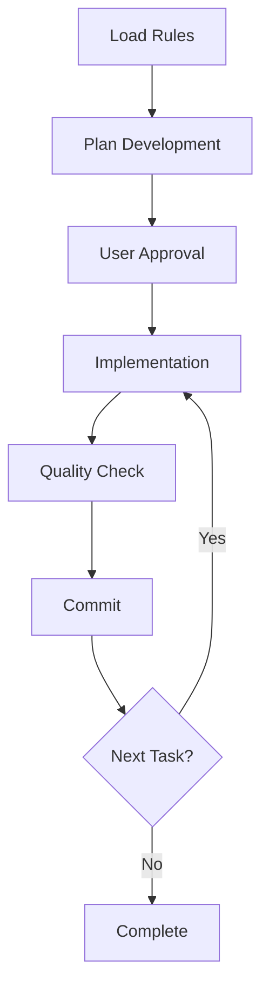

# AI Coding Project Boilerplate 🤖

*Read this in other languages: [日本語](README.ja.md)*

TypeScript project boilerplate optimized for AI-assisted development with layered architecture, comprehensive development rules, and best practices. Specifically designed for Claude Code with comprehensive rules and guidelines to generate high-quality code through LLM development.

## 🎯 Features

- **Claude Code Specialized**: Rule set optimized for high-quality development with Claude Code and subagents
- **Quality Assurance**: Progressive quality checks and automatic correction system
- **TypeScript Optimized**: Configuration that balances type safety and performance
- **Comprehensive Rules**: Development standardization through rule files
- **Boilerplate Design**: Project-specific parts are placeholder-based
- **Multilingual Support**: Supports both Japanese and English languages

## 📂 Project Structure

```
ai-coding-project-boilerplate/
├── .claude/
│   ├── agents-ja/          # subagent definitions (Japanese)
│   ├── agents-en/          # subagent definitions (English)
│   ├── commands-ja/        # Custom slash commands (Japanese)
│   └── commands-en/        # Custom slash commands (English)
├── docs/
│   ├── rules-ja/           # Development rules for Claude Code (Japanese)
│   │   └── rules-index.yaml  # Rule file index with metadata
│   ├── rules-en/           # Development rules for Claude Code (English)
│   │   └── rules-index.yaml  # Rule file index with metadata
│   ├── guides/
│   │   ├── ja/
│   │   │   └── sub-agents.md  # subagents practical guide (Japanese)
│   │   └── en/
│   │       └── sub-agents.md  # subagents practical guide (English)
│   ├── adr/               # Architecture Decision Records
│   ├── design/            # Design documents
│   ├── plans/             # Work plans (excluded from git)
│   └── prd/               # Product Requirements Documents
├── src/                   # Source code directory
│   └── index.ts           # Entry point sample
├── scripts/               # Development support scripts
│   └── set-language.js    # Language switching script
├── CLAUDE.ja.md           # Claude Code configuration (Japanese)
├── CLAUDE.en.md           # Claude Code configuration (English)
├── README.ja.md           # README (Japanese)
├── README.md              # README (English - this file)
├── tsconfig.json          # TypeScript strict configuration
├── biome.json            # Linter & Formatter configuration
└── vitest.config.mjs     # Test configuration
```

## 🌐 Multilingual Support

This boilerplate supports both Japanese and English languages.

### Language Switching Commands

```bash
# Switch to Japanese
npm run lang:ja

# Switch to English
npm run lang:en

# Check current language setting
npm run lang:status
```

When you switch languages, the following files are automatically updated:
- `CLAUDE.md` - Claude Code configuration file
- `docs/rules/` - Development rules directory
- `docs/guides/sub-agents.md` - subagents guide
- `.claude/commands/` - Slash commands
- `.claude/agents/` - subagent definitions

## 🚀 Getting Started

### 1. Setting Up the Boilerplate

```bash
# Clone the boilerplate to create a new project
git clone https://github.com/shinpr/ai-coding-project-boilerplate.git my-project
cd my-project

# Install dependencies
npm install

# Set up your project language (configure as English project)
npm run lang:en    # Set up as English project
# npm run lang:ja  # Set up as Japanese project if preferred

# Reset Git history and start as a new project
rm -rf .git
git init
git add .
git commit -m "feat: initial commit from AI Coding Project Boilerplate"
```

### 2. Project-Specific Configuration

1. **Update Basic Information**
   ```json
   // package.json
   {
     "name": "your-project-name",
     "description": "Your project description",
     "author": "Your name"
   }
   ```

2. **Configure Project Context**
   ```bash
   # Replace placeholders in docs/rules/project-context.md
   # [Project Name] → Actual project name
   # [Product Name Here] → Actual product name
   # [Target User Role Here] → Actual target users
   ```

### 3. GitHub Repository Setup

1. **Create New Repository on GitHub**
   ```bash
   # Recommended repository names
   - claude-code-typescript-boilerplate
   - claude-typescript-template
   - ai-coding-boilerplate
   ```

2. **Add Remote Repository**
   ```bash
   git remote add origin https://github.com/your-username/your-repo-name.git
   git branch -M main
   git push -u origin main
   ```

3. **Repository Settings (GitHub UI)**
   - **Description**: "TypeScript project boilerplate specifically designed for Claude Code. Features a comprehensive rule system and subagent architecture for generating high quality code efficiently."
   - **Topics**: `claude-code`, `typescript`, `boilerplate`, `ai-development`, `subagents`, `code-quality`, `multilingual`

## 💻 Development Commands

### Basic Commands
```bash
npm run dev        # Start development server
npm run build      # Production build
npm run test       # Run tests
npm run test:watch # Test watch mode
```

### Quality Checks
```bash
npm run check:all   # Overall quality check
npm run lint        # Lint check
npm run format      # Code formatting
npm run check:deps  # Circular dependency check
```

### Language Switching
```bash
npm run lang:ja     # Switch to Japanese
npm run lang:en     # Switch to English
npm run lang:status # Check current language setting
```

### Additional Commands
```bash
npm run test:coverage       # Generate coverage report
npm run check:unused        # Detect unused exports
npm run cleanup:processes   # Cleanup test processes
```

## 🎯 Claude Code Custom Slash Commands

This boilerplate includes 6 custom slash commands to streamline development with Claude Code:

### `/onboard`
Loads project rule files and enforces development conventions.
- Load all rule files
- Understand critical rules (especially "Investigation OK, Implementation STOP")
- Confirm architecture patterns

### `/implement`
Acts as orchestrator managing the complete cycle from requirement analysis to implementation.
- Interactive requirement clarification
- Scale assessment via requirement-analyzer
- Automated progression: design → planning → implementation
- Automatic detection and re-analysis of requirement changes

### `/design`
Executes from requirement analysis to design document creation.
- Deep dive into requirement background and objectives
- Scale-appropriate design document creation (PRD/ADR/Design Doc)
- Quality assurance via document-fixer
- Present design alternatives and trade-offs

### `/plan`
Creates work plans and task decomposition from design documents.
- Review and select existing design documents
- Create work plans via work-planner
- Task decomposition to commit-level granularity via task-decomposer
- Obtain bulk approval for entire implementation phase

### `/build`
Implements decomposed tasks in autonomous execution mode.
- Review task files
- Automated cycle: task-executor → quality-fixer → commit
- Detect requirement changes or critical errors with appropriate responses
- Post-implementation summary and coverage reporting

### `/task`
Executes tasks following appropriate rules.
- Clarify applicable development rules before execution
- Determine initial actions based on rules
- Identify prohibitions to avoid in the task
- Promote metacognition and prevent implementation errors proactively

These commands are located in `.claude/commands/` and are only available within the project.

## 🤖 Claude Code Specialized Workflow

### Boilerplate Core: Achieving High Quality with Claude Code

This boilerplate is specifically designed for Claude Code and subagents to generate high-quality TypeScript code.

### Essential Workflow

1. **Initial Rule Loading**: Always load 7 rule files (`docs/rules/`) at task start
2. **Pre-Implementation Approval**: Obtain user approval before Edit/Write/MultiEdit operations
3. **Progressive Quality Checks**: Implement Phase 1-6 progressive quality checks
4. **subagent Utilization**: Delegate specialized tasks to appropriate subagents

### Claude Code Development Process



### Available subagents

- **quality-fixer**: Quality check & automatic correction - Automatically fixes TypeScript project quality issues
- **task-executor**: Individual task execution - Executes tasks according to task file instructions
- **technical-designer**: ADR & Design Doc creation - Creates technical design documents
- **work-planner**: Work plan creation - Creates structured implementation plans from design documents
- **document-reviewer**: Review document consistency and completeness - Validates documents from multiple perspectives
- **document-fixer**: Integrate multi-perspective reviews and automatically correct documents
- **prd-creator**: Product Requirements Document (PRD) creation - Creates structured business requirements
- **requirement-analyzer**: Requirement analysis and work scale assessment - Analyzes user requirements and determines appropriate development approach
- **task-decomposer**: Decompose work plans into commit-level tasks - Breaks down plans into 1-commit granular tasks
- **rule-advisor**: Selects minimal effective ruleset for maximum AI execution accuracy

For details, refer to `CLAUDE.md` and individual definition files in `.claude/agents/`.

## 📋 Development Rules Overview

This boilerplate provides a comprehensive rule set:

### Core Principles
- **Recommended Format**: Explain prohibitions with benefits/drawbacks (promotes LLM understanding)
- **Flexible Implementation Choice**: Adjustable backward compatibility consideration levels based on project requirements
- **Progressive Quality Assurance**: 6-phase systematic quality check process
- **subagent Integration**: Delegate specialized tasks to appropriate subagents

### Key Rules
- ✅ **Recommended**: unknown type + type guards (ensure type safety)
- ❌ **Avoid**: any type usage (disables type checking)
- ✅ **Recommended**: Test-first development (Red-Green-Refactor)
- ❌ **Avoid**: Commented-out code (use version control for history)
- ✅ **Recommended**: YAGNI principle (implement only currently needed features)

### Rule Index System

The `rules-index.yaml` file in each language directory provides:
- **Metadata**: Description, priority, and keywords for each rule file
- **Dynamic Rule Selection**: AI agents can select appropriate rules based on task context
- **Efficiency**: Load only necessary rules to optimize context usage

### 6 Core Rule Files
1. **technical-spec.md**: Technical specifications & architecture design
2. **typescript.md**: TypeScript development rules (including performance optimization)
3. **typescript-testing.md**: Testing rules & Vitest utilization
4. **project-context.md**: Project context (template)
5. **ai-development-guide.md**: Implementation guide for AI developers
6. **architecture-decision-process.md**: ADR creation & operation process

## 🧪 Testing

### Testing Strategy for Claude Code

This boilerplate is designed for LLMs to implement tests efficiently:

### Running Tests
```bash
npm test                       # Run unit tests
npm run test:coverage:fresh    # Accurate coverage measurement
npm run test:ui               # Launch Vitest UI
npm run cleanup:processes     # Cleanup processes after testing
```

### Test Helper Utilization Policy
- **Builder Pattern**: Simplify construction of complex test data
- **Custom Assertions**: Share common validation logic
- **Mock Decision Criteria**: Share simple and stable mocks, implement complex/frequently changing ones individually
- **Duplication Prevention**: Consider sharing on 3rd duplication (Rule of Three)

### Vitest Optimization
- Process Management: Prevent zombie processes with automatic cleanup
- Type-Safe Mocks: Type-safe mock implementation avoiding any types
- Red-Green-Refactor: Support test-first development

## 🏗️ Architecture

### Claude Code Optimized Architecture

This boilerplate provides architecture patterns that are easy for LLMs to understand and implement:

### Architecture Pattern Selection

`docs/rules/architecture/` contains architecture patterns optimized for LLM development:

#### 1. **Layered Architecture** 
- **Features**: Clear separation of concerns, optimal for enterprise development
- **LLM Benefits**: Clear role definition for each layer, easy to understand
- **Use Cases**: Large-scale, complex business logic

#### 2. **Vertical Slice Architecture** 
- **Features**: One feature per file, optimized for LLM development
- **LLM Benefits**: Efficient use of context window
- **Use Cases**: Claude Code development, feature independence focus

#### 3. **Hybrid Progressive Architecture** 
- **Features**: Progressive evolution from small to large scale
- **LLM Benefits**: Flexible response to project growth
- **Use Cases**: Startups, progressive growth

### Design Principles (LLM Optimized)
- **Clear Separation of Concerns**: One file, one responsibility for context efficiency
- **Dependency Injection**: Testability and easy mocking
- **Type Safety Priority**: Prevent runtime errors with unknown types + type guards
- **YAGNI Adherence**: Avoid excessive abstraction, implement only what's needed

## 📚 Documentation System

This boilerplate provides systematic documentation for efficient Claude Code development:

- **`docs/rules/`**: 6 comprehensive development rules (required reading for Claude Code)
- **`docs/adr/`**: Architecture Decision Records (record of important technical decisions)
- **`docs/design/`**: Design documents (detailed design for complex features)
- **`docs/plans/`**: Work plans (created for medium-scale or larger changes)
- **`docs/prd/`**: Product Requirements Documents (for new feature development)

## 🤔 Frequently Asked Questions

### Q: What's the development procedure with Claude Code?
A: 1) Load 7 rule files → 2) Plan & get approval → 3) Implement → 4) Progressive quality checks → 5) Commit

### Q: How to use subagents?
A: Properly utilize quality-fixer (quality checks), task-executor (task execution), etc. See `CLAUDE.md` for details.

### Q: What to do when errors occur?
A: Execute Phase 1-6 progressive quality checks. Completely resolve errors in each Phase before proceeding.

### Q: How to customize the boilerplate?
A: Replace placeholders in `docs/rules/project-context.md`, adjust environment variables and type definitions for your project.

### Q: How to switch languages?
A: Use `npm run lang:ja` (Japanese) or `npm run lang:en` (English) to easily switch. Settings are saved in the `.claudelang` file.

## 📄 License

MIT License - Free to use, modify, and distribute

## 🎯 About This Boilerplate

AI Coding Project Boilerplate is specifically designed to enable Claude Code and subagents to generate high-quality TypeScript code. With multilingual support, it provides an optimal development experience in both Japanese and English environments.

---

Happy Coding with Claude Code! 🤖✨