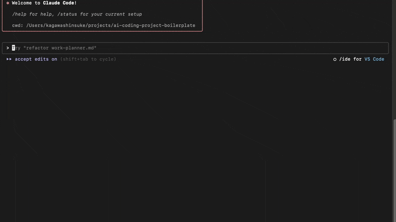
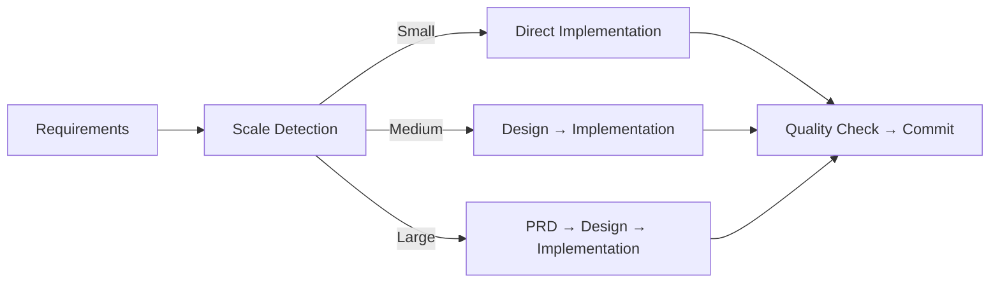
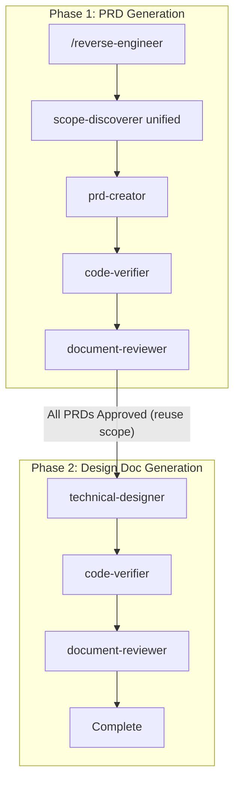

# AI Coding Project Boilerplate for Claude Code 🤖

*Read this in other languages: [日本語](README.ja.md)*

[](https://www.typescriptlang.org/)
[](https://nodejs.org/)
[](https://claude.ai/code)
[](https://opensource.org/licenses/MIT)
[](https://github.com/shinpr/ai-coding-project-boilerplate/pulls)

> **Agentic coding starter kit and workflow boilerplate for Claude Code** — Build production-ready TypeScript projects with sub-agents, context engineering, and zero context exhaustion.

⚡ **This boilerplate is for developers who want to:**
- Build **TypeScript projects** faster with AI-driven workflows
- Avoid **context exhaustion** in long AI coding sessions
- Standardize team workflows with **specialized AI agents**

## 📖 Table of Contents
1. [Quick Start (3 Steps)](#-quick-start-3-steps)
2. [Updating Existing Projects](#-updating-existing-projects)
3. [Beyond Vibe Coding: Why Sub Agents?](#-beyond-vibe-coding-why-sub-agents)
4. [Skills System](#-skills-system)
5. [Built with This Boilerplate](#-built-with-this-boilerplate)
6. [Documentation & Guides](#-documentation--guides)
7. [Slash Commands](#-slash-commands)
8. [Development Workflow](#-claude-code-workflow)
9. [Project Structure](#-project-structure)
10. [Package Manager Configuration](#-package-manager-configuration)
11. [Multilingual Support](#-multilingual-support)
12. [FAQ](#-faq)

## ⚡ Quick Start (3 Steps)

```bash
# 1. Create your project
npx create-ai-project my-project

# 2. Install dependencies (automatic)
cd my-project && npm install

# 3. Launch Claude Code and configure
claude                    # Launch Claude Code
/project-inject          # Set up project prerequisites (read every session by AI)
/implement <your feature> # Start building!
```

> 💡 **First time?** Check the [Quick Start Guide](docs/guides/en/quickstart.md) for detailed setup instructions

## 🔄 Updating Existing Projects

Keep your project's agent definitions, commands, skills, and AI rules up to date. Run from your project's root directory:

```bash
# Preview changes without applying
npx create-ai-project update --dry-run

# Apply updates
npx create-ai-project update
```

### How It Works

When you run `npx create-ai-project update`, the CLI:

1. Checks your project's `.create-ai-project.json` manifest for the current version
2. Compares it with the latest package version
3. Shows the CHANGELOG for review
4. Replaces managed files with the latest versions
5. Regenerates active directories for your language setting

### What Gets Updated

| Target | Path |
|--------|------|
| Agent definitions | `.claude/agents-{lang}/` |
| Command definitions | `.claude/commands-{lang}/` |
| Skill definitions | `.claude/skills-{lang}/` |
| AI rules | `CLAUDE.{lang}.md` |

Your source code (`src/`), `package.json`, and other project files are never touched.

### Protecting Customized Files

If you've customized a file and don't want it overwritten:

```bash
# Add to ignore list
npx create-ai-project update --ignore skills project-context
npx create-ai-project update --ignore agents task-executor
npx create-ai-project update --ignore commands implement
npx create-ai-project update --ignore CLAUDE.md

# Remove from ignore list
npx create-ai-project update --unignore skills project-context
```

Ignored files are preserved during updates. Note that ignoring files may cause version mismatch with other updated components.

### First Run on Existing Projects

If your project was created before the update feature, just run `npx create-ai-project update` from your project's root directory. It will automatically initialize the manifest by detecting your language from `.claudelang`.

## 🚀 Beyond Vibe Coding: Why Sub Agents?

As teams move beyond vibe coding, **agentic coding** — delegating structured workflows to specialized AI agents — is becoming the professional standard. This boilerplate implements that approach with Claude Code sub-agents:

**Traditional AI coding struggles with:**
- ❌ Losing context in long sessions
- ❌ Declining code quality over time
- ❌ Frequent session restarts for large tasks

**Sub agents solve this through context engineering:**
- ✅ Splitting work into specialized roles (design, implementation, review)
- ✅ Each agent gets fresh, focused context — no exhaustion
- ✅ Handling large projects without degradation

This works because Claude Code's sub-agent mechanism runs each agent in its own context window. The parent session delegates tasks, and each sub-agent starts with a clean, focused context. Quality checks (lint, type check, test, build) run locally before each commit — not in CI. The feedback loop stays fast, and code is already verified when it's pushed.

👉 [Learn more about Sub Agents (Anthropic docs)](https://docs.anthropic.com/en/docs/claude-code/sub-agents)

### 📸 Demo



*Sub agents working together on a TypeScript project*

## 🎨 Skills System

This boilerplate provides the principles used in agentic implementation workflows as skills, making them available for reference in everyday tasks as needed.

### Applied Skills

| Skill | Purpose |
|-------|---------|
| `coding-standards` | Universal coding principles, anti-patterns, debugging |
| `typescript-rules` | TypeScript type safety, async patterns, refactoring |
| `typescript-testing` | Vitest, TDD, coverage requirements |
| `documentation-criteria` | PRD, ADR, Design Doc standards |
| `technical-spec` | Architecture, environment, build commands |
| `implementation-approach` | Strategy patterns, task decomposition |
| `integration-e2e-testing` | Integration/E2E test design, ROI-based selection |
| `frontend-typescript-rules` | React component design, Props-driven patterns |
| `frontend-typescript-testing` | React Testing Library, MSW, Playwright E2E |
| `frontend-technical-spec` | React architecture, environment, data flow |
| `project-context` | Project-specific prerequisites for AI accuracy (set via `/project-inject`) |

👉 [Learn how Skills work (Claude Code docs)](https://code.claude.com/docs/en/skills)

## 🎯 Built with This Boilerplate

### ⏱️ Time Comparison
- **Without this boilerplate**: ~1 week for setup + infrastructure
- **With this boilerplate**: ~2 days to production-ready application

### Success Stories

**Sub Agents MCP Server** — MCP server enabling Claude Code/Cursor CLI as sub agents
⏱️ Initial development in 2 days — test code makes up ~90% of the codebase, now in production

**MCP Image Generator** — AI image generation via Gemini API
⏱️ Initial development in 1.5 days — complete creative tool with multi-image blending and character consistency

Both were built using the default `/implement` workflow — no manual agent orchestration needed.

> See these projects: [sub-agents-mcp](https://github.com/shinpr/sub-agents-mcp) ・ [mcp-image](https://github.com/shinpr/mcp-image)

## 📚 Documentation & Guides

- **[Quick Start Guide](docs/guides/en/quickstart.md)** - Get running in 5 minutes
- **[Use Cases & Commands](docs/guides/en/use-cases.md)** - Daily workflow reference
- **[Skills Editing Guide](docs/guides/en/skills-editing-guide.md)** - Add library docs, team rules, and project-specific knowledge for AI
- **[Design Philosophy](https://dev.to/shinpr/zero-context-exhaustion-building-production-ready-ai-coding-teams-with-claude-code-sub-agents-31b)** - Why this approach works

## 📝 Slash Commands

Essential commands for Claude Code:

| Command | Purpose | When to Use |
|---------|---------|-------------|
| `/implement` | End-to-end feature development | New features |
| `/task` | Single task with skill-based precision | Bug fixes, small changes |
| `/design` | Create design docs only | Architecture planning |
| `/plan` | Create work plan from design | After design approval |
| `/build` | Execute from existing plan | Resume work |
| `/review` | Check code compliance | Post-implementation |
| `/diagnose` | Root cause analysis workflow | Debugging, troubleshooting |
| `/reverse-engineer` | Generate PRD/Design Docs from code | Legacy system documentation |

Frontend equivalents (`/front-design` for UI Spec + Design Doc, `/front-build`, `/front-review`, `/front-plan`) and utility commands (`/add-integration-tests`, `/update-doc`) are also available.

[Full command reference →](docs/guides/en/use-cases.md)

## 🤖 Claude Code Workflow


```mermaid
graph LR
    A[Requirements] --> B[Scale Detection]
    B -->|Small| C[Direct Implementation]
    B -->|Medium| D[Design → Implementation]
    B -->|Large| E[PRD → Design → Implementation]

    C --> F[Quality Check → Commit]
    D --> F
    E --> F
```

### Reverse Engineering Workflow

Generate PRD and Design Docs from existing code:


```mermaid
graph TB
    subgraph Phase1[Phase 1: PRD Generation]
        CMD["/reverse-engineer"] --> SD[scope-discoverer unified]
        SD --> PRD[prd-creator]
        PRD --> CV1[code-verifier]
        CV1 --> DR1[document-reviewer]
    end

    subgraph Phase2[Phase 2: Design Doc Generation]
        TD[technical-designer] --> CV2[code-verifier]
        CV2 --> DR2[document-reviewer]
        DR2 --> DONE[Complete]
    end

    DR1 --> |"All PRDs Approved (reuse scope)"| TD
```

### How It Works

1. **Requirement Analysis**: `/implement` command analyzes task scale
2. **Document Generation**: Creates necessary docs (PRD, UI Spec, Design Doc, Work Plan)
3. **Task Execution**: Specialized agents handle each phase
4. **Quality Assurance**: Automatic testing, type checking, and fixes
5. **Commit & Continue**: Clean commits for each completed task

## 📂 Project Structure

```
ai-coding-project-boilerplate/
├── .claude/               # AI agent configurations
│   ├── agents/           # Specialized sub-agent definitions
│   ├── commands/         # Slash command definitions
│   └── skills/           # Skills for automatic context loading
│       ├── coding-standards/
│       ├── typescript-rules/
│       ├── typescript-testing/
│       ├── documentation-criteria/
│       ├── technical-spec/
│       ├── project-context/
│       ├── frontend-typescript-rules/
│       ├── frontend-typescript-testing/
│       └── frontend-technical-spec/
├── docs/
│   ├── guides/           # User documentation
│   ├── adr/              # Architecture decisions
│   ├── design/           # Design documents
│   └── prd/              # Product requirements
├── src/                  # Your source code
├── scripts/              # Utility scripts
└── CLAUDE.md             # Claude Code configuration
```

## 🔧 Package Manager Configuration

This boilerplate uses npm by default, but you can switch to your preferred package manager like bun or pnpm.

There are two environment-dependent settings in `package.json`:

- **`packageManager`**: The package manager and version to use
- **`scripts`**: The execution commands for each script

When you change these, Claude Code will recognize them and execute with the appropriate commands.

### Switching to bun

```json
{
  "packageManager": "bun@1.3.3",
  "scripts": {
    "build": "bun run tsc && tsc-alias",
    "dev": "bun run src/index.ts",
    "test": "bun test",
    "check": "bunx @biomejs/biome check src",
    "check:all": "bun run check && bun run lint && bun run format:check && bun run check:unused && bun run check:deps && bun run build && bun test"
  }
}
```

The above are representative examples. The following scripts are referenced in skills and sub-agent definitions. Update them as needed:

`build`, `dev`, `type-check`, `test`, `test:coverage`, `test:coverage:fresh`, `test:safe`, `cleanup:processes`, `check`, `check:fix`, `check:code`, `check:unused`, `check:deps`, `check:all`, `format`, `format:check`, `lint`, `lint:fix`

## 🌐 Multilingual Support

Full support for English and Japanese:

```bash
npm run lang:en         # Switch to English
npm run lang:ja         # Switch to Japanese
npm run lang:status     # Check current language
```

Automatically updates all configurations, rules, and agent definitions.

## 🤔 FAQ

**Q: How do sub agents work?**  
A: Just use `/implement` or `/task`. The right agents activate automatically.

**Q: What if there are errors?**  
A: quality-fixer auto-fixes most issues. If not, it provides clear instructions.

**Q: Can I customize for my project?**
A: Yes! Run `/project-inject` to set up project-specific prerequisites. This information is read by AI at the start of every session to improve execution accuracy.

**Q: Can I make AI reference my library documentation (llms.txt, API refs, etc.)?**
A: Yes — create a custom skill under `.claude/skills/` with the relevant URLs. See the [Skills Editing Guide](docs/guides/en/skills-editing-guide.md) for details.

**Q: What's the typical workflow?**
A: `/project-inject` (once) → `/implement` (features) → auto quality checks → commit

**Q: How is this different from Copilot/Cursor?**
A: Those help write code. This manages entire development lifecycle with specialized agents.

**Q: What is agentic coding and how does this boilerplate support it?**
A: Agentic coding delegates structured workflows to specialized AI agents instead of relying on conversational prompting. This boilerplate provides pre-configured sub-agents, CLAUDE.md rules, and quality checks so you can adopt that approach without building the scaffolding yourself.

**Q: How does this prevent context exhaustion?**
A: Through context engineering. Each sub-agent runs in its own context window focused on a single responsibility, so context stays fresh regardless of session length. We've run 770K+ token sessions without quality degradation — details in the [design philosophy post](https://dev.to/shinpr/zero-context-exhaustion-building-production-ready-ai-coding-teams-with-claude-code-sub-agents-31b).

## 🤖 Sub Agents

20+ specialized sub-agents covering the full development lifecycle: requirement analysis, UI specification, design, planning, implementation, quality assurance, code review, debugging, and reverse engineering. Each agent runs in its own context window for focused execution.

[Full agent list →](.claude/agents-en/)

## 📄 License

MIT License - Free to use, modify, and distribute

## 🎯 About This Project

AI Coding Project Boilerplate gives Claude Code a structured development lifecycle — from requirements analysis through automated quality checks — using specialized sub-agents and context engineering. Each agent handles a focused task in its own context window, which keeps quality consistent across long sessions. The boilerplate ships with pre-configured CLAUDE.md rules, custom skills, and slash commands, so you can start building TypeScript projects with agentic workflows without assembling the tooling yourself.

---

Happy Coding with Claude Code! 🤖✨