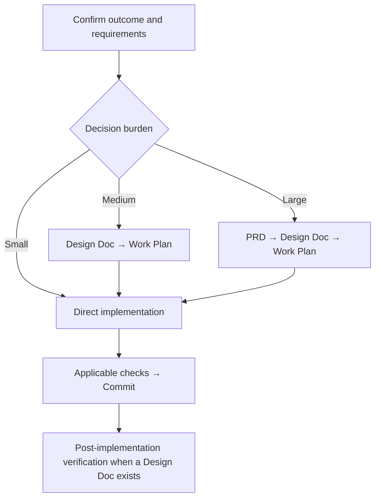

# AI Coding Project Boilerplate for Claude Code

*Read this in other languages: [日本語](README.ja.md)*

[](https://www.typescriptlang.org/)
[](https://nodejs.org/)
[](https://claude.ai/code)
[](https://opensource.org/licenses/MIT)

Evidence-driven Claude Code workflows for TypeScript projects. The package installs commands, specialized agents, and skills that carry confirmed requirements and repository evidence through design, implementation, review, and quality checks.

## What it provides

- End-to-end implementation with `/implement`, plus separate design, planning, build, review, and diagnosis commands
- Direct implementation for small changes; durable documents only when the decision burden requires them
- Repository-aware implementation and test boundaries based on owning responsibility, observable evidence, and proof obligations
- Integration/E2E selection from accepted behavior and proof obligations
- Applicable quality checks before each workflow commit, with checks that could not run reported explicitly
- Equivalent English and Japanese command, agent, and skill environments

## Quick start

```bash
npx create-ai-project my-project
cd my-project
npm install
claude
```

Inside Claude Code:

```text
/project-inject
/implement Add rate limiting to the API
```

`/project-inject` records project-specific prerequisites. `/implement` confirms the outcome and scope, reads the repository, creates only the required design artifacts, implements the change, runs applicable checks, and commits completed task boundaries.

For setup details and what to expect during the first run, see the [Quick Start Guide](docs/guides/en/quickstart.md).

## Workflow


```mermaid
flowchart TD
    R[Confirm outcome and requirements] --> S{Decision burden}
    S -->|Small| I[Direct implementation]
    S -->|Medium| D[Design Doc → Work Plan]
    S -->|Large| P[PRD → Design Doc → Work Plan]
    D --> I
    P --> I
    I --> Q[Applicable checks → Commit]
    Q --> V[Post-implementation verification when a Design Doc exists]
```

A qualifying durable technical choice adds an ADR batch before the Design Doc. Frontend and fullstack work add a UI Spec only when UI decisions remain open. File count supports scope investigation but does not determine the route.

| Scale | Route |
|---|---|
| Small | One coherent outcome with one evident repository-supported implementation inside one responsibility boundary → direct implementation |
| Medium | One coherent outcome coordinating a boundary or containing a potentially durable choice → Design Doc and Work Plan |
| Large | Multiple independently valuable outcomes requiring separate design decisions → PRD, Design Doc, and Work Plan |

## Commands

| Command | Use it for |
|---|---|
| `/implement` | Complete a change from requirement confirmation through implementation |
| `/task` | Execute a focused standalone task with the applicable skills |
| `/design`, `/front-design` | Confirm scope and produce approved design artifacts without implementation |
| `/plan`, `/front-plan` | Create and approve a Work Plan from a Design Doc |
| `/build`, `/front-build` | Execute approved planned work |
| `/review`, `/front-review` | Review Design Doc compliance and security, then optionally apply corrections |
| `/diagnose` | Investigate a problem, verify the cause, and derive solutions |
| `/reverse-engineer` | Produce PRDs and Design Docs from existing code |
| `/add-integration-tests` | Add integration/E2E proof to an existing implementation |
| `/update-doc` | Update and review an existing PRD, ADR, or Design Doc |
| `/create-skill`, `/refine-skill` | Create or revise project skills |
| `/project-inject`, `/sync-skills` | Maintain project context and skill metadata |

See [Use Cases & Commands](docs/guides/en/use-cases.md) for examples and the complete command reference.

## Skills and project context

Skills contain reusable judgment criteria for a responsibility and load when relevant. The included skills cover requirement convergence, document routing, implementation strategy, coding and testing, integration/E2E proof, orchestration, and LLM-facing handoffs.

Use `/project-inject` for repository-specific prerequisites such as domain constraints, directory conventions, and external evidence sources. Use `/create-skill` or `/refine-skill` for reusable project rules. The [Skills Editing Guide](docs/guides/en/skills-editing-guide.md) explains where information belongs and how to validate a skill change.

[rashomon](https://github.com/shinpr/rashomon) can compare runs with and without a skill change when you need evidence that the change improved behavior.

## Updating an existing project

From the project root:

```bash
npx create-ai-project update --dry-run
npx create-ai-project update
```

The updater refreshes managed agent, command, skill, and Claude rule files while preserving source code and package configuration. Use `--ignore` and `--unignore` for managed files you maintain separately.

## Configuration

Switch the active language environment with:

```bash
npm run lang:en
npm run lang:ja
npm run lang:status
```

The workflows detect the package manager and quality commands from repository configuration. Change `packageManager` and project scripts in `package.json` when the generated project uses different commands.

## Guides

- [Quick Start Guide](docs/guides/en/quickstart.md)
- [Use Cases & Commands](docs/guides/en/use-cases.md)
- [Skills Editing Guide](docs/guides/en/skills-editing-guide.md)

## License

[MIT](LICENSE)
