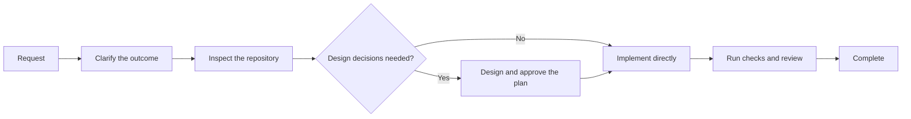

# AI Coding Project Boilerplate — A Starter Kit for Claude Code

*Read this in other languages: [日本語](README.ja.md) | [简体中文](README.zh-CN.md)*

[](https://www.typescriptlang.org/)
[](https://nodejs.org/)
[](https://claude.ai/code)
[](https://opensource.org/licenses/MIT)

Set up a TypeScript repository for structured development with Claude Code. `create-ai-project` adds a project-level `CLAUDE.md`, ready-to-use commands, specialized agents, and skills so Claude can take a request through design, implementation, and verification using rules stored alongside your code.

Use it to start a new project and keep its Claude Code setup up to date. Instead of assembling prompts and agent definitions yourself, you get a working development environment that lives in the repository, where your team can version, share, and adapt it.

## What this starter kit helps with

- Use `CLAUDE.md` to define project-wide rules, what Claude Code can decide, and when it should ask you
- Complete a change with `/implement`, from clarifying the request to implementation and verification
- Keep straightforward changes lightweight while adding design documents and reviews when the change needs them
- Run the repository's applicable tests, type checks, linting, and build checks as part of the workflow
- Record project-specific context and turn recurring team knowledge into reusable skills
- Use the same setup in English or Japanese

## What it adds to your repository

| Path | Purpose |
|---|---|
| `CLAUDE.md` | Project-wide rules, including what Claude Code can decide and when it should ask you |
| `.claude/commands/` | Entry points for implementation, design, planning, review, diagnosis, and project setup |
| `.claude/agents/` | Specialized roles for repository analysis, design, implementation, testing, and review |
| `.claude/skills/` | Development guidance that Claude loads when it is relevant to the current work |
| `docs/guides/` | Setup, command, and skill-editing guides for project users |

The kit also includes `/create-skill`, `/refine-skill`, and `/sync-skills` so you can add project-specific guidance without maintaining the skill structure by hand.

## Quick start

### Start a new project

```bash
npx create-ai-project my-project
cd my-project
npm install
claude
```

### Update a project created with this starter kit

Run these commands from the project root:

```bash
npx create-ai-project update --dry-run
npx create-ai-project update
claude
```

The updater refreshes the managed `CLAUDE.md`, commands, agents, and skills without replacing your source code or package configuration.

Once Claude Code is running:

```text
/project-inject
/implement Add rate limiting to the API
```

`/project-inject` records the repository-specific information Claude needs, such as domain constraints, directory conventions, and where to find external schemas or API contracts. You can then use `/implement` for an end-to-end change.

See the [Quick Start Guide](docs/guides/en/quickstart.md) for the full setup and first-run walkthrough.

## How development runs


```mermaid
flowchart LR
    A[Request] --> B[Clarify the outcome]
    B --> C[Inspect the repository]
    C --> D{Design decisions needed?}
    D -->|No| E[Implement directly]
    D -->|Yes| F[Design and approve the plan]
    F --> E
    E --> G[Run checks and review]
    G --> H[Complete]
```

Claude Code first confirms what the change should accomplish and inspects the existing implementation. Straightforward changes can proceed directly. Changes that need product or technical decisions get the necessary design and planning documents before implementation. Before approving a design, Claude checks any facts that could affect the chosen approach against the repository or actual behavior. Any additional experiment is limited to what is needed to make that decision. The workflow then runs the applicable repository checks and reports anything it could not verify.

See [Use Cases & Commands](docs/guides/en/use-cases.md) for when documents are created, how tests are selected, and what each workflow covers.

## Common entry points

| Command | Use it for |
|---|---|
| `/implement` | Take a change from requirements through implementation and verification |
| `/design`, `/front-design` | Design a change before implementation |
| `/plan`, `/front-plan` | Turn an approved design into an executable plan |
| `/build`, `/front-build` | Continue from an approved plan |
| `/review`, `/front-review` | Review an implementation against its design and security requirements |
| `/diagnose` | Investigate a problem and compare solutions backed by the findings, without changing code |
| `/project-inject` | Record project-specific context for future Claude Code sessions |
| `/create-skill`, `/refine-skill` | Add or improve reusable project guidance |

See [Use Cases & Commands](docs/guides/en/use-cases.md) for examples and the complete command reference.

## Adapt it to your project

Use `/project-inject` for facts and constraints that apply across the repository. This keeps Claude aware of the project's purpose, conventions, and external sources without repeating them in every request.

When your team has guidance that should apply only to particular work, create or refine a skill instead. The included skill-editing workflow helps decide where the information belongs, reviews the change, and keeps skill metadata in sync. See the [Skills Editing Guide](docs/guides/en/skills-editing-guide.md) for examples and validation guidance.

## Language and project configuration

Switch the active Claude Code environment with:

```bash
npm run lang:en
npm run lang:ja
npm run lang:status
```

The workflows discover the package manager and quality commands from the repository. If your generated project uses different commands, update `packageManager` and the relevant scripts in `package.json`.

## Guides

- [Quick Start Guide](docs/guides/en/quickstart.md)
- [Use Cases & Commands](docs/guides/en/use-cases.md)
- [Skills Editing Guide](docs/guides/en/skills-editing-guide.md)

## License

[MIT](LICENSE)
