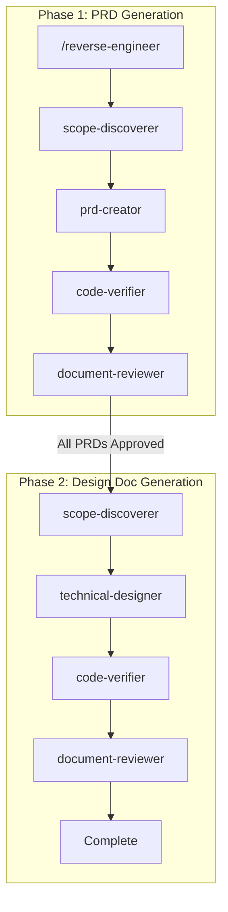

# AI Coding Project Boilerplate 🤖

*Read this in other languages: [日本語](README.ja.md)*

[](https://www.typescriptlang.org/)
[](https://nodejs.org/)
[](https://claude.ai/code)
[](https://opensource.org/licenses/MIT)
[](https://github.com/shinpr/ai-coding-project-boilerplate/pulls)

⚡ **This boilerplate is for developers who want to:**
- Build **production-ready TypeScript projects** faster with AI
- Avoid **context exhaustion** in long AI coding sessions
- Standardize team workflows with **specialized AI agents**

## 📖 Table of Contents
1. [Quick Start (3 Steps)](#-quick-start-3-steps)
2. [Updating Existing Projects](#-updating-existing-projects)
3. [Why Sub Agents?](#-why-sub-agents)
4. [Skills System](#-skills-system)
5. [Real Projects & Results](#-real-world-results)
6. [Documentation & Guides](#-documentation--guides)
7. [Slash Commands](#-slash-commands)
8. [Development Workflow](#-claude-code-workflow)
9. [Project Structure](#-project-structure)
10. [Package Manager Configuration](#-package-manager-configuration)
11. [Multilingual Support](#-multilingual-support)
12. [FAQ](#-faq)

> **Which one should you use?**
> - **Use this Boilerplate** if you want to **maximize precision** with **TypeScript × Sub-agent** setup optimized for **Claude Code**.
> - **Use [claude-code-workflows](https://github.com/shinpr/claude-code-workflows)** if you're on **Claude Code** and want to **start with any project** in **2 commands** and **language-agnostic** workflows.
> - **Use [Agentic Code](https://github.com/shinpr/agentic-code)** if you want **zero-config**, **tool-agnostic** workflows **without language restrictions** (Codex CLI/Cursor/Aider etc.).

## ⚡ Quick Start (3 Steps)

```bash
# 1. Create your project (30 seconds)
npx create-ai-project my-project

# 2. Install dependencies (automatic)
cd my-project && npm install

# 3. Launch Claude Code and configure
claude                    # Launch Claude Code
/project-inject          # Configure project context
/implement <your feature> # Start building!
```

> 💡 **First time?** Check the [Quick Start Guide](docs/guides/en/quickstart.md) for detailed setup instructions

## 🔄 Updating Existing Projects

Keep your project's agent definitions, commands, skills, and AI rules up to date. Run from your project's root directory:

```bash
# Preview changes without applying
npx create-ai-project update --dry-run

# Apply updates
npx create-ai-project update
```

### How It Works

When you run `npx create-ai-project update`, the CLI:

1. Checks your project's `.create-ai-project.json` manifest for the current version
2. Compares it with the latest package version
3. Shows the CHANGELOG for review
4. Replaces managed files with the latest versions
5. Regenerates active directories for your language setting

### What Gets Updated

| Target | Path |
|--------|------|
| Agent definitions | `.claude/agents-{lang}/` |
| Command definitions | `.claude/commands-{lang}/` |
| Skill definitions | `.claude/skills-{lang}/` |
| AI rules | `CLAUDE.{lang}.md` |

Your source code (`src/`), `package.json`, and other project files are never touched.

### Protecting Customized Files

If you've customized a file and don't want it overwritten:

```bash
# Add to ignore list
npx create-ai-project update --ignore skills project-context
npx create-ai-project update --ignore agents task-executor
npx create-ai-project update --ignore commands implement
npx create-ai-project update --ignore CLAUDE.md

# Remove from ignore list
npx create-ai-project update --unignore skills project-context
```

Ignored files are preserved during updates. Note that ignoring files may cause version mismatch with other updated components.

### First Run on Existing Projects

If your project was created before the update feature, just run `npx create-ai-project update` from your project's root directory. It will automatically initialize the manifest by detecting your language from `.claudelang`.

## 🚀 Why Sub Agents?

**Traditional AI coding struggles with:**
- ❌ Losing context in long sessions
- ❌ Declining code quality over time  
- ❌ Frequent session restarts for large tasks

**Sub agents solve this by:**
- ✅ Splitting work into specialized roles (design, implementation, review)
- ✅ Keeping context fresh and quality consistent
- ✅ Handling large projects without degradation

Each agent focuses on one thing and does it well. No context exhaustion, no quality drop.

👉 [Learn more about Sub Agents (Anthropic docs)](https://docs.anthropic.com/en/docs/claude-code/sub-agents)

### 📸 Demo


*Sub agents working together to build a production-ready TypeScript project*

## 🎨 Skills System

This boilerplate provides the principles used in agentic implementation workflows as skills, making them available for reference in everyday tasks as needed.

### Applied Skills

| Skill | Purpose |
|-------|---------|
| `coding-standards` | Universal coding principles, anti-patterns, debugging |
| `typescript-rules` | TypeScript type safety, async patterns, refactoring |
| `typescript-testing` | Vitest, TDD, coverage requirements |
| `documentation-criteria` | PRD, ADR, Design Doc standards |
| `technical-spec` | Architecture, environment, build commands |
| `implementation-approach` | Strategy patterns, task decomposition |
| `integration-e2e-testing` | Integration/E2E test design, ROI-based selection |
| `project-context` | Project-specific configuration (customizable) |

**Frontend-specific skills** are also available under `frontend/` (e.g., `frontend/typescript-rules`).

👉 [Learn how Skills work (Claude Code docs)](https://code.claude.com/docs/en/skills)

## 🎯 Real-World Results

### ⏱️ Time Comparison
- **Without this boilerplate**: ~1 week for setup + infrastructure
- **With this boilerplate**: ~2 days to production-ready application

### Success Stories

#### [Sub agents MCP Server](https://github.com/shinpr/sub-agents-mcp)
**What**: MCP server enabling Claude Code/Cursor CLI as sub agents  
**Time**: 2 days → **30 TypeScript files with full test coverage**  
**Result**: Production-deployed, 3-minute setup

#### [MCP Image Generator](https://github.com/shinpr/mcp-image)
**What**: AI image generation via Gemini API  
**Time**: 1.5 days → **Complete creative tool with advanced features**  
**Result**: Multi-image blending, character consistency, one-command integration

> 💡 **Key Insight**: Proper rules + sub agents = production-quality code at AI speed

## 📚 Documentation & Guides

- **[Quick Start Guide](docs/guides/en/quickstart.md)** - Get running in 5 minutes
- **[Use Cases & Commands](docs/guides/en/use-cases.md)** - Daily workflow reference
- **[Rule Editing Guide](docs/guides/en/rule-editing-guide.md)** - Customize for your project
- **[Design Philosophy](https://dev.to/shinpr/zero-context-exhaustion-building-production-ready-ai-coding-teams-with-claude-code-sub-agents-31b)** - Why it works (770K tokens without exhaustion)

## 📝 Slash Commands

Essential commands for Claude Code:

| Command | Purpose | When to Use |
|---------|---------|-------------|
| `/implement` | End-to-end feature development | New features (Backend) |
| `/task` | Single task with rule precision | Bug fixes, small changes |
| `/design` | Create design docs only | Architecture planning (Backend) |
| `/plan` | Create work plan from design | After design approval (Backend) |
| `/build` | Execute from existing plan | Resume work (Backend) |
| `/review` | Check code compliance | Post-implementation (Backend) |
| `/front-design` | Create frontend design docs | React/Vite architecture planning |
| `/front-plan` | Create frontend work plan | After frontend design approval |
| `/front-build` | Execute frontend implementation | React component development |
| `/front-review` | Check frontend code compliance | Post-implementation (Frontend) |
| `/diagnose` | Root cause analysis workflow | Debugging, troubleshooting |
| `/reverse-engineer` | Generate PRD/Design Docs from code | Legacy system documentation (Backend) |
| `/front-reverse-design` | Generate frontend Design Docs | Existing frontend code documentation |
| `/add-integration-tests` | Add integration/E2E tests | When Design Doc exists but tests missing |
| `/update-doc` | Update existing design documents | Spec changes, review feedback |

[Full command reference →](docs/guides/en/use-cases.md)

## 🤖 Claude Code Workflow

```mermaid
graph LR
    A[Requirements] --> B[Scale Detection]
    B -->|Small| C[Direct Implementation]
    B -->|Medium| D[Design → Implementation]
    B -->|Large| E[PRD → Design → Implementation]

    C --> F[Quality Check → Commit]
    D --> F
    E --> F
```



### Reverse Engineering Workflow

Generate PRD and Design Docs from existing code:



### How It Works

1. **Requirement Analysis**: `/implement` command analyzes task scale
2. **Document Generation**: Creates necessary docs (PRD, Design Doc, Work Plan)
3. **Task Execution**: Specialized agents handle each phase
4. **Quality Assurance**: Automatic testing, type checking, and fixes
5. **Commit & Continue**: Clean commits for each completed task

## 📂 Project Structure

```
ai-coding-project-boilerplate/
├── .claude/               # AI agent configurations
│   ├── agents/           # Specialized sub-agent definitions
│   ├── commands/         # Slash command definitions
│   └── skills/           # Skills for automatic context loading
│       ├── coding-standards/
│       ├── typescript-rules/
│       ├── typescript-testing/
│       ├── documentation-criteria/
│       ├── technical-spec/
│       ├── project-context/
│       └── frontend/     # Frontend-specific skills
├── docs/
│   ├── guides/           # User documentation
│   ├── adr/              # Architecture decisions
│   ├── design/           # Design documents
│   └── prd/              # Product requirements
├── src/                  # Your source code
├── scripts/              # Utility scripts
└── CLAUDE.md             # Claude Code configuration
```

## 🔧 Package Manager Configuration

This boilerplate uses npm by default, but you can switch to your preferred package manager like bun or pnpm.

There are two environment-dependent settings in `package.json`:

- **`packageManager`**: The package manager and version to use
- **`scripts`**: The execution commands for each script

When you change these, Claude Code will recognize them and execute with the appropriate commands.

### Switching to bun

```json
{
  "packageManager": "bun@1.3.3",
  "scripts": {
    "build": "bun run tsc && tsc-alias",
    "dev": "bun run src/index.ts",
    "test": "bun test",
    "check": "bunx @biomejs/biome check src",
    "check:all": "bun run check && bun run lint && bun run format:check && bun run check:unused && bun run check:deps && bun run build && bun test"
  }
}
```

The above are representative examples. The following scripts are referenced in rules and sub-agent definitions. Update them as needed:

`build`, `build:frontend`, `dev`, `preview`, `type-check`, `test`, `test:coverage`, `test:coverage:fresh`, `test:safe`, `cleanup:processes`, `check`, `check:fix`, `check:code`, `check:unused`, `check:deps`, `check:all`, `format`, `format:check`, `lint`, `lint:fix`

## 🌐 Multilingual Support

Full support for English and Japanese:

```bash
npm run lang:en         # Switch to English
npm run lang:ja         # Switch to Japanese
npm run lang:status     # Check current language
```

Automatically updates all configurations, rules, and agent definitions.

## 🤔 FAQ

**Q: How do sub agents work?**  
A: Just use `/implement` or `/task`. The right agents activate automatically.

**Q: What if there are errors?**  
A: quality-fixer auto-fixes most issues. If not, it provides clear instructions.

**Q: Can I customize for my project?**  
A: Yes! Run `/project-inject` to configure project-specific context.

**Q: What's the typical workflow?**  
A: `/project-inject` (once) → `/implement` (features) → auto quality checks → commit

**Q: How is this different from Copilot/Cursor?**  
A: Those help write code. This manages entire development lifecycle with specialized agents.

## 🤖 Complete Sub Agents Roster

| Agent | Specialization | Activation |
|-------|---------------|------------|
| **requirement-analyzer** | Scale assessment | Start of `/implement` |
| **technical-designer** | Design documentation | Medium/large features |
| **document-reviewer** | Document quality check | After document creation |
| **design-sync** | Design Doc consistency | After Design Doc creation |
| **acceptance-test-generator** | Test skeleton from ACs | After design approval |
| **work-planner** | Task breakdown | After design approval |
| **task-executor** | Implementation | During build phase |
| **quality-fixer** | Automated fixes | On any quality issue |
| **code-reviewer** | Compliance check | `/review` command |
| **integration-test-reviewer** | Test implementation quality | After test implementation |
| **investigator** | Problem investigation | `/diagnose` Step 1 |
| **verifier** | Investigation verification | `/diagnose` Step 3 |
| **solver** | Solution derivation | `/diagnose` Step 4 |
| **scope-discoverer** | PRD/Design Doc scope discovery | `/reverse-engineer` Step 1 |
| **code-verifier** | Document-code consistency | `/reverse-engineer` verification |

[Full agent list →](.claude/agents-en/)

## 📄 License

MIT License - Free to use, modify, and distribute

## 🎯 About This Project

The AI Coding Project Boilerplate is engineered to maximize AI coding productivity while maintaining human-level code quality. By leveraging specialized sub agents and context engineering, it enables teams to build production-ready TypeScript applications at unprecedented speed.

---

Happy Coding with Claude Code! 🤖✨