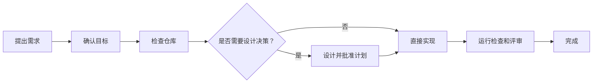

# AI 编程项目模板：Claude Code 入门套件

*其他语言版本：[English](README.md) | [日本語](README.ja.md)*

[](https://www.typescriptlang.org/)
[](https://nodejs.org/)
[](https://claude.ai/code)
[](https://opensource.org/licenses/MIT)

为 TypeScript 仓库配置基于 Claude Code 的结构化开发环境。`create-ai-project` 会添加项目级 `CLAUDE.md`、可直接使用的命令、专用智能体和技能，让 Claude 按照与代码一同存储的规则，完成从设计、实现到验证的整个过程。

它既可以用于创建新项目，也可以持续更新项目中的 Claude Code 配置。你无需自行组装提示词和智能体定义，即可获得一套位于仓库内、可由团队进行版本管理、共享和调整的开发环境。

## 这个入门套件可以帮助你

- 使用 `CLAUDE.md` 定义项目级规则、Claude Code 可以自行决定的事项以及需要询问你的情况
- 通过 `/implement` 完成一次变更，包括澄清需求、实现和验证
- 让简单变更保持轻量，仅在变更确实需要时添加设计文档和评审
- 评审已完成的实现，确认其符合约定的目标和仓库标准，没有不必要的改动，也没有功能、可靠性或安全方面的严重问题
- 在工作流中运行仓库适用的测试、类型检查、lint 和构建检查
- 记录项目特有的上下文，并将团队反复使用的知识整理为可复用技能
- 使用同一套配置的英文、日文或简体中文版本

## 它会向仓库添加什么

| 路径 | 用途 |
|---|---|
| `CLAUDE.md` | 项目级规则，包括 Claude Code 可以自行决定的事项以及需要询问你的情况 |
| `.claude/commands/` | 实现、设计、规划、评审、诊断和项目配置的入口 |
| `.claude/agents/` | 负责仓库分析、设计、实现、测试和评审的专用智能体 |
| `.claude/skills/` | Claude 在与当前工作相关时加载的开发指导 |
| `docs/guides/` | 面向项目使用者的配置、命令和技能编辑指南 |

套件还包含 `/create-skill`、`/refine-skill` 和 `/sync-skills`，因此你可以添加项目特有的指导，而无需手动维护技能结构。

## 快速开始

### 创建新项目

```bash
npx create-ai-project my-project --lang=zh-CN
cd my-project
pnpm install
claude
```

### 更新由这个入门套件创建的项目

在项目根目录运行：

```bash
npx create-ai-project update --dry-run
npx create-ai-project update
claude
```

更新程序会刷新受管理的 `CLAUDE.md`、命令、智能体和技能，不会替换源代码或现有的 `package.json` 设置。

启动 Claude Code 后，运行：

```text
/project-inject
/implement 为 API 添加速率限制
```

`/project-inject` 会记录 Claude 所需的仓库特有信息，包括领域约束、质量标准、目录约定，以及外部 schema 或 API 契约的位置。之后，你可以使用 `/implement` 端到端地完成一次变更。

完整的配置和首次运行步骤请参阅[快速开始指南](docs/guides/zh-CN/quickstart.md)。

## 开发流程



Claude Code 会先确认变更要实现的目标，并检查现有实现。路径明确的简单变更可以直接实现；需要产品或技术决策的变更，则会先生成必要的设计和规划文档。在批准设计前，Claude 会通过仓库内容或实际行为确认可能影响方案选择的事实。需要额外验证时，也只检查做出该决定所需的范围。之后，工作流会运行仓库中适用的检查，并报告所有未能验证的事项。

有关文档创建条件、测试选择方式和各工作流范围，请参阅[使用场景和命令](docs/guides/zh-CN/use-cases.md)。

## 常用入口

| 命令 | 用途 |
|---|---|
| `/implement` | 从需求确认推进至实现和验证完成 |
| `/design`、`/front-design` | 在实现前设计变更 |
| `/plan`、`/front-plan` | 将已批准的设计转化为可执行计划 |
| `/build`、`/front-build` | 从已批准的计划继续实现 |
| `/review`、`/front-review` | 评审已完成的实现，确认其符合约定的目标、仓库标准和安全要求 |
| `/diagnose` | 调查问题并比较有调查结果支持的解决方案，但不修改代码 |
| `/project-inject` | 记录供后续 Claude Code 会话使用的项目特有上下文和质量标准 |
| `/create-skill`、`/refine-skill` | 添加或改进可复用的项目指导 |

有关示例和完整命令参考，请参阅[使用场景和命令](docs/guides/zh-CN/use-cases.md)。

## 根据项目进行调整

使用 `/project-inject` 记录适用于整个仓库的事实、约束和质量标准。这样 Claude 就能了解项目目标、约定和外部资料，而无需在每次请求中重复提供这些信息。

如果团队中的某项指导只适用于特定类型的工作，请创建或改进相应技能。套件内置的技能编辑工作流可帮助你确定信息所属位置、评审变更并同步技能元数据。有关示例和验证方法，请参阅[技能编辑指南](docs/guides/zh-CN/skills-editing-guide.md)。

## 语言和项目配置

通过以下命令切换 Claude Code 当前使用的语言环境：

```bash
pnpm lang:en
pnpm lang:ja
pnpm lang:zh-CN
pnpm lang:status
```

工作流会从仓库配置中发现包管理器和质量检查命令。如果生成的项目使用其他命令，请修改 `package.json` 中的 `packageManager` 和相应 scripts。

## 指南

- [快速开始指南](docs/guides/zh-CN/quickstart.md)
- [使用场景和命令](docs/guides/zh-CN/use-cases.md)
- [技能编辑指南](docs/guides/zh-CN/skills-editing-guide.md)

## 许可证

[MIT](LICENSE)
