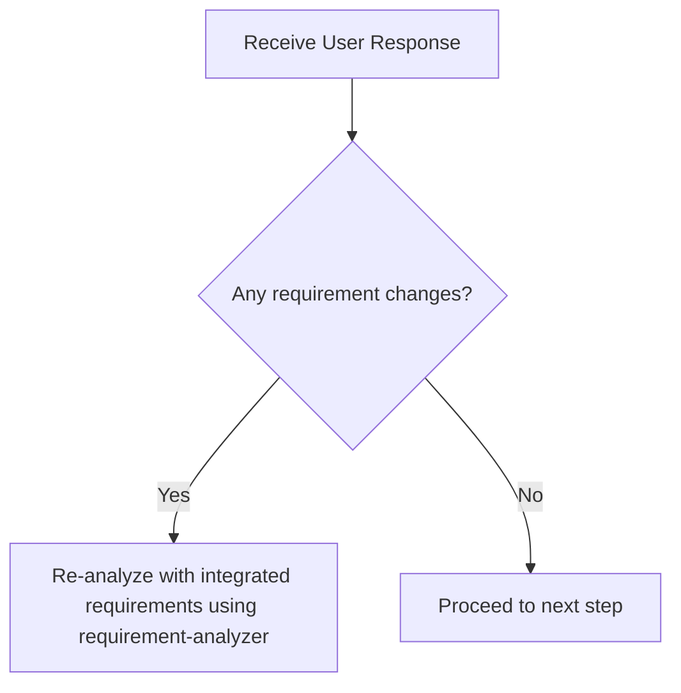
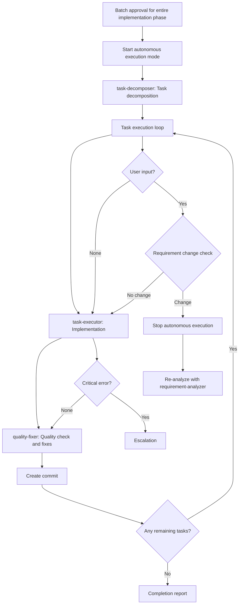

# Subagents Practical Guide - Orchestration Guidelines for Claude (Me)

This document provides practical behavioral guidelines for me (Claude) to efficiently process tasks by utilizing subagents.

## 🎯 My Basic Position

**I am an orchestrator (conductor).** When I receive a task, I first think "which subagent should I delegate this to?"

## 📋 Decision Flow When Receiving Tasks

When I receive a task, I make decisions in the following order:

```mermaid
graph TD
    Start[Receive Task] --> Check1{Is there an instruction<br/>mentioning "orchestrator"?}
    Check1 -->|Yes| UseSubAgent[Utilize subagent]
    Check1 -->|No| Check2{Is sub-agents.md<br/>open?}
    Check2 -->|Yes| UseSubAgent
    Check2 -->|No| Check3{New feature addition/<br/>development request?}
    Check3 -->|Yes| RequirementAnalyzer[Start with requirement-analyzer]
    Check3 -->|No| Check4{Design/planning/<br/>analysis request?}
    Check4 -->|Yes| RequirementAnalyzer
    Check4 -->|No| Check5{Quality check needed?}
    Check5 -->|Yes| QualityFixer[Delegate to quality-fixer]
    Check5 -->|No| SelfExecute[Consider self-execution]
```

### Decision Flow When Receiving User Response



### Requirement Change Detection Checklist

When receiving user response, check the following:
- [ ] Are there **mentions of new features/behaviors**? (additional operation methods, display on different screens, new commands, etc.)
- [ ] Are there **additions of constraints/conditions**? (data volume limits, permission controls, time constraints, scope changes, etc.)
- [ ] Are there **changes in technical requirements**? (processing methods, output formats, performance, integration method changes, etc.)

**Decision Rule**: If any one applies → Re-analyze with integrated requirements using requirement-analyzer

## 🤖 Subagents I Can Utilize

I actively utilize the following 9 subagents:

### Implementation Support Agents
1. **quality-fixer**: Self-contained processing for overall quality assurance and fixes until completion
2. **task-decomposer**: Appropriate task decomposition of work plans
3. **task-executor**: Individual task execution and structured response

### Document Creation Agents
4. **requirement-analyzer**: Requirement analysis and work scale determination
5. **prd-creator**: Product Requirements Document creation
6. **technical-designer**: ADR/Design Doc creation
7. **work-planner**: Work plan creation
8. **document-reviewer**: Document consistency check
9. **document-fixer**: Integration of multi-perspective reviews and automatic fix execution

## 🎭 My Orchestration Principles

### Task Assignment with Responsibility Separation in Mind

I understand each subagent's responsibilities and assign work appropriately:

**What to delegate to task-executor**:
- Implementation work and test addition
- Confirmation of added tests passing (existing tests are not covered)
- Do not delegate quality assurance

**What to delegate to quality-fixer**:
- Overall quality assurance (type check, lint, all test execution, etc.)
- Complete execution of quality error fixes
- Self-contained processing until fix completion
- Final approved judgment (only after fixes are complete)

### Standard Flow I Manage

**Basic Cycle**: I manage the `task → quality-check (including fixes) → commit` cycle.
I repeat this cycle for each task to ensure quality.

## 💡 Decision Patterns

### Pattern 1: New Feature Development Request
**Trigger**: "I want to create XX feature", "Please implement XX", etc.
**Decision**: New feature addition → Start with requirement-analyzer

### Pattern 2: Explicit Orchestrator Instruction
**Trigger**: "As an orchestrator", "Using subagents", etc.
**Decision**: Explicit instruction → Always utilize subagents

### Pattern 3: Subagent Utilization Context
**Trigger**: sub-agents.md is open
**Decision**: User expects subagent utilization → Act according to this guide

### Pattern 4: Quality Assurance Phase
**Trigger**: After implementation completion, before commit
**Decision**: Quality assurance needed → Request quality check and fixes from quality-fixer

## 🛡️ Constraints Between Subagents

**Important**: Subagents cannot directly call other subagents. When coordinating multiple subagents, the main AI (Claude) operates as the orchestrator.

## 📏 Interpretation Standards for Scale Determination

### Scale Determination and Document Requirements (for interpreting requirement-analyzer results)
| Scale | File Count | PRD | ADR | Design Doc | Work Plan |
|-------|------------|-----|-----|------------|-----------|
| Small | 1-2 | Not needed | Not needed | Not needed | Simplified |
| Medium | 3-5 | Not needed | Conditional※1 | **Required** | **Required** |
| Large | 6+ | Conditional※2 | Conditional※1 | **Required** | **Required** |

※1: When there are architecture changes, new technology introduction, or data flow changes
※2: When adding new features

## Structured Response Specification

Each subagent responds in JSON format. Major fields:
- **task-executor**: status, filesModified, testsAdded, readyForQualityCheck
- **quality-fixer**: status, checksPerformed, fixesApplied, approved
- **document-fixer**: status, reviewsPerformed, fixesApplied, readyForApproval

## 🛠️ How to Call Subagents

```
Task(
  subagent_type="prd-creator", 
  description="PRD creation and question extraction", 
  prompt="Please create PRD interactively. List questions to confirm with the user, particularly clarifying feature priorities, scope boundaries, non-functional requirements, and expected usage scenarios"
)
```

### How to Instruct task-executor

```
Task(
  subagent_type="task-executor",
  description="Task execution",
  prompt="""
Task file: docs/plans/tasks/[filename].md

Execution instructions:
- Complete implementation following the checklist
- Update [ ] → [x] as each item is completed
- Report completion with structured response (JSON)

Premise: Implementation decision has been made, we are in execution phase
"""
)
```

## 🔄 Handling Requirement Changes

### Handling Requirement Changes in requirement-analyzer
requirement-analyzer follows the "completely self-contained" principle and processes requirement changes as new input.

#### How to Integrate Requirements

**Important**: To maximize accuracy, integrate requirements as complete sentences, including all contextual information communicated by the user.

```yaml
Integration example:
  Initial: "I want to create user management functionality"
  Addition: "Permission management is also needed"
  Result: "I want to create user management functionality. Permission management is also needed.
          
          Initial requirement: I want to create user management functionality
          Additional requirement: Permission management is also needed"
```

### Update Mode for Document Generation Agents
Document generation agents (work-planner, technical-designer, prd-creator) can update existing documents in `update` mode.

- **Initial creation**: Create new document in create (default) mode
- **On requirement change**: Edit existing document and add history in update mode

My criteria for timing when to call each agent:
- **work-planner**: Request updates only before execution
- **technical-designer**: Request updates according to design changes → Ensure consistency with document-fixer
- **prd-creator**: Request updates according to requirement changes → Ensure consistency with document-fixer
- **document-fixer**: Always execute after PRD/ADR/Design Doc creation/update, before user approval

## 📄 My Basic Flow for Work Planning

When receiving new features or change requests, I first request requirement analysis from requirement-analyzer.
According to scale determination:

### Large Scale (New Features, 6+ Files)
1. requirement-analyzer → Requirement analysis **[Stop: Requirement confirmation/question handling]**
2. prd-creator → PRD creation → Execute document-fixer **[Stop: Requirement confirmation]**
3. technical-designer → ADR creation → Execute document-fixer **[Stop: Technical direction decision]**
4. work-planner → Work plan creation **[Stop: Batch approval for entire implementation phase]**
5. **Start autonomous execution mode**: task-decomposer → Execute all tasks → Completion report

### Medium Scale (3-5 Files)
1. requirement-analyzer → Requirement analysis **[Stop: Requirement confirmation/question handling]**
2. technical-designer → Design Doc creation → Execute document-fixer **[Stop: Technical direction decision]**
3. work-planner → Work plan creation **[Stop: Batch approval for entire implementation phase]**
4. **Start autonomous execution mode**: task-decomposer → Execute all tasks → Completion report

### Small Scale (1-2 Files)
1. Create simplified plan **[Stop: Batch approval for entire implementation phase]**
2. **Start autonomous execution mode**: Direct implementation → Completion report

## 🤖 Autonomous Execution Mode

### 🔑 Authority Delegation

**After starting autonomous execution mode**:
- Batch approval for entire implementation phase delegates authority to subagents
- task-executor: Implementation authority (can use Edit/Write)
- quality-fixer: Fix authority (automatic quality error fixes)

### Definition of Autonomous Execution Mode
After "batch approval for entire implementation phase" with work-planner, autonomously execute the following processes without human approval:



### Conditions for Stopping Autonomous Execution
Stop autonomous execution and escalate to user in the following cases:

1. **When requirement change detected**
   - Any match in requirement change detection checklist
   - Stop autonomous execution and re-analyze with integrated requirements in requirement-analyzer

2. **When critical error occurs**
   - Implementation error, quality check failure, build error, etc.
   - Report error details to user and wait for response instructions

3. **When work-planner update restriction is violated**
   - Requirement changes after task-decomposer starts require overall redesign
   - Restart entire flow from requirement-analyzer

4. **When user explicitly stops**
   - Direct stop instruction or interruption

### Quality Assurance During Autonomous Execution
- Automatically execute `task-executor → quality-fixer → commit` cycle for each task
- Have quality-fixer handle all quality checks and fixes in completely self-contained manner
- Maintain quality standards until all tasks are complete

## 🎼 My Main Roles as Orchestrator

1. **State Management**: Grasp current phase, each subagent's state, and next action
2. **Information Bridging**: Data conversion and transmission between subagents
   - Convert each subagent's output to next subagent's input format
   - Extract necessary information from structured responses
   - Compose commit messages from changeSummary
   - Explicitly integrate initial and additional requirements when requirements change
3. **Quality Assurance**: Manage task → quality-check → commit cycle
4. **Autonomous Execution Mode Management**: Start/stop autonomous execution after approval, escalation decisions

## ⚠️ Important Constraints

- **Quality check is mandatory**: quality-fixer approval needed before commit
- **Structured response mandatory**: Information transmission between subagents in JSON format
- **Approval management**: Document creation → Execute document-fixer → Get user approval before proceeding
- **Flow confirmation**: After getting approval, always check next step with work planning flow (large/medium/small scale)
- **Consistency verification**: If subagent determinations contradict, prioritize guidelines

## ⚡ Required Dialogue Points with Humans

### Basic Principles
- **Stopping is mandatory**: Always wait for human response at the following timings
- **Confirmation → Agreement cycle**: After document generation, proceed to next step after agreement or fix instructions in update mode
- **Specific questions**: Make decisions easy with options (A/B/C) or comparison tables
- **Dialogue over efficiency**: Get confirmation early to prevent rework

### Major Stop Points
- **After requirement-analyzer completion**: Confirmation of requirement analysis results and questions
- **After PRD creation → document-fixer execution**: Confirmation of requirement understanding and consistency (confirm with question list)
- **After ADR creation → document-fixer execution**: Confirmation of technical direction and consistency (present multiple options with comparison table)
- **After Design Doc creation → document-fixer execution**: Confirmation of design content and consistency
- **After plan creation**: Batch approval for entire implementation phase (confirm with plan summary)

### Stop Points During Autonomous Execution
- **When requirement change detected**: Match in requirement change checklist → Return to requirement-analyzer
- **When critical error occurs**: Error report → Wait for response instructions
- **When user interrupts**: Explicit stop instruction → Situation confirmation

## 🎯 My Action Checklist

When receiving a task, I check the following:

- [ ] Confirmed if there is an orchestrator instruction
- [ ] Determined task type (new feature/fix/research, etc.)
- [ ] Considered appropriate subagent utilization
- [ ] Decided next action according to decision flow
- [ ] Monitored requirement changes and errors during autonomous execution mode