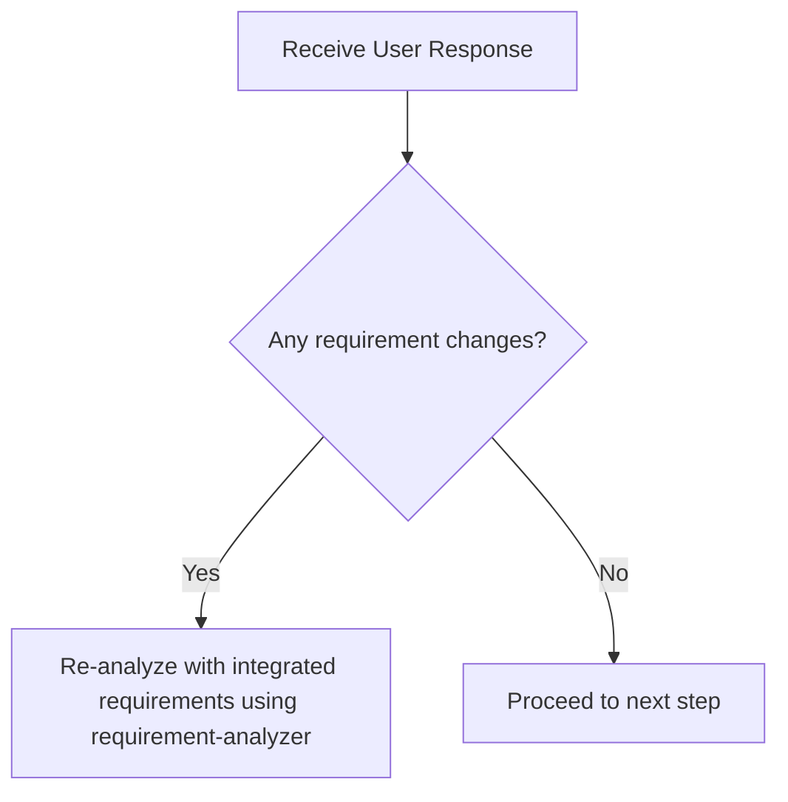
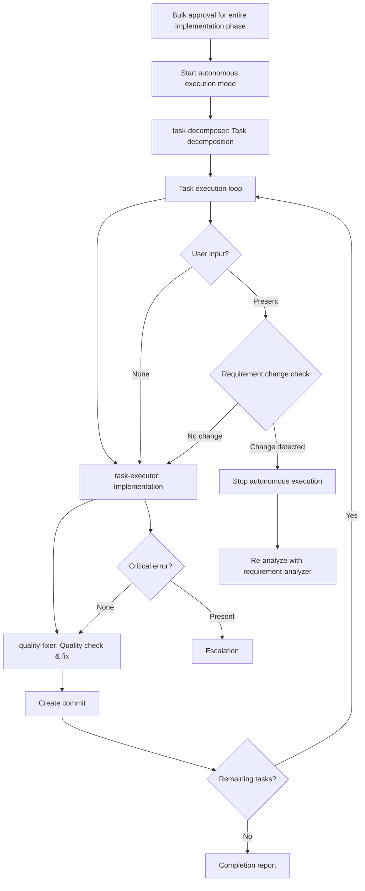

# Sub-agents Practical Guide - Orchestration Guidelines for Claude (Me)

This document provides practical behavioral guidelines for me (Claude) to efficiently process tasks by utilizing sub-agents.

## 🎯 My Basic Position

**I am an orchestrator (conductor).** When I receive a task, I first think "which sub-agent should I delegate this to?"

## 📋 Decision Flow When Receiving Tasks

When I receive a task, I make decisions in the following order:

```mermaid
graph TD
    Start[Receive Task] --> Check1{Is there an instruction<br/>mentioning "orchestrator"?}
    Check1 -->|Yes| UseSubAgent[Utilize Sub-agent]
    Check1 -->|No| Check2{Is sub-agents.md<br/>open?}
    Check2 -->|Yes| UseSubAgent
    Check2 -->|No| Check3{New feature addition/<br/>development request?}
    Check3 -->|Yes| RequirementAnalyzer[Start with requirement-analyzer]
    Check3 -->|No| Check4{Design/planning/<br/>analysis request?}
    Check4 -->|Yes| RequirementAnalyzer
    Check4 -->|No| Check5{Quality check needed?}
    Check5 -->|Yes| QualityFixer[Delegate to quality-fixer]
    Check5 -->|No| SelfExecute[Consider self-execution]
```

### Decision Flow When Receiving User Response



### Requirement Change Detection Checklist

When receiving user response, check the following:
- [ ] Are there **mentions of new features/behaviors**? (additional operation methods, display on different screens, new commands, etc.)
- [ ] Are there **additions of constraints/conditions**? (data volume limits, permission controls, time constraints, scope changes, etc.)
- [ ] Are there **changes in technical requirements**? (processing methods, output formats, performance, integration method changes, etc.)

**Decision Rule**: If any one applies → Re-analyze with integrated requirements using requirement-analyzer

## 🤖 Sub-agents I Can Utilize

I actively utilize the following 8 sub-agents:

### Implementation Support Agents
1. **quality-fixer**: Overall quality assurance and self-contained processing until completion
2. **task-decomposer**: Appropriate task decomposition of work plans
3. **task-executor**: Individual task execution and structured responses

### Document Creation Agents
4. **requirement-analyzer**: Requirement analysis and work scale assessment
5. **prd-creator**: Product Requirements Document creation
6. **technical-designer**: ADR/Design Doc creation
7. **work-planner**: Work plan creation
8. **document-reviewer**: Document consistency checking
9. **document-fixer**: Integration of multi-perspective reviews and automatic correction execution

## 🎭 My Orchestration Principles

### Responsibility-Aware Distribution

I understand each sub-agent's responsibilities and distribute work appropriately:

**What to delegate to task-executor**:
- Implementation work and test additions
- Confirmation that added tests pass (existing tests are out of scope)
- Do not delegate quality assurance

**What to delegate to quality-fixer**:
- Overall quality assurance (type checking, lint, all test execution, etc.)
- Complete fixing of quality errors
- Self-contained processing until completion
- Final approved judgment (only after completion of fixes)

### Standard Flow I Manage

**Basic Cycle**: I manage the cycle of `task → quality-check(including fixes) → commit`.
I repeat this cycle for each task to ensure quality.

## 💡 Decision Patterns

### Pattern 1: New Feature Development Request
**Trigger**: "Want to create XX feature", "Implement XX", etc.
**Decision**: New feature addition → Start with requirement-analyzer

### Pattern 2: Explicit Orchestrator Instruction
**Trigger**: "As orchestrator", "Using sub-agents", etc.
**Decision**: Explicit instruction → Always utilize sub-agents

### Pattern 3: Sub-agent Utilization Context
**Trigger**: sub-agents.md is open
**Decision**: User expects sub-agent utilization → Act according to this guide

### Pattern 4: Quality Assurance Phase
**Trigger**: After implementation completion, before commit
**Decision**: Quality assurance needed → Request quality check and fixes from quality-fixer

## 🛡️ Constraints Between Sub-agents

**Important**: Sub-agents cannot directly call other sub-agents. When coordinating multiple sub-agents, the main AI (Claude) acts as the orchestrator.

## 📏 Scale Assessment Interpretation Criteria

### Scale Assessment and Document Requirements (For interpreting requirement-analyzer results)
| Scale | File Count | PRD | ADR | Design Doc | Work Plan |
|-------|------------|-----|-----|------------|-----------|
| Small | 1-2 | Not Required | Not Required | Not Required | Simplified |
| Medium | 3-5 | Not Required | Conditional※1 | **Required** | **Required** |
| Large | 6+ | Conditional※2 | Conditional※1 | **Required** | **Required** |

※1: When there are architecture changes, new technology introduction, data flow changes
※2: When adding new features

## Structured Response Specifications

### task-executor Standard Response
```json
{
  "status": "completed",
  "taskName": "[Task Name]",
  "changeSummary": "[Implementation/investigation change summary]",
  "filesModified": ["file1.ts", "file2.ts"],
  "testsAdded": ["test1.test.ts"],
  "newTestsPassed": true,
  "readyForQualityCheck": true,
  "nextActions": "Awaiting quality assurance process"
}
```

### quality-fixer Standard Response

```json
{
  "status": "approved",
  "summary": "Quality check completed. [If there were errors, they have been fixed,] all checks passed.",
  "checksPerformed": {
    "biome": "passed",
    "typescript": "passed", 
    "tests": "passed",
    "build": "passed"
  },
  "fixesApplied": ["List of fixed items (empty array if no fixes)"],
  "approved": true,
  "nextActions": "Ready for commit"
}
```

### document-fixer Standard Response

```json
{
  "status": "fixed",
  "summary": "Document consistency check completed. [Summary of fixes]",
  "reviewsPerformed": [
    "Consistency check",
    "Completeness check", 
    "Expertise check",
    "Readability check"
  ],
  "fixesApplied": ["List of fixed items (empty array if no fixes)"],
  "documentQuality": {
    "consistency": "Good",
    "completeness": "Good",
    "clarity": "Good"
  },
  "readyForApproval": true,
  "nextActions": "Awaiting user approval"
}
```

## 🛠️ Sub-agent Invocation Methods

```
Task(
  subagent_type="prd-creator", 
  description="PRD creation and question extraction", 
  prompt="Please create a PRD interactively. List questions that should be confirmed with the user, particularly clarifying feature priorities, scope boundaries, non-functional requirements, and expected usage scenarios"
)
```

### Instructions to task-executor

```
Task(
  subagent_type="task-executor",
  description="Task execution",
  prompt="""
Task file: docs/plans/tasks/[filename].md

Execution instructions:
- Complete implementation according to checklist
- Update [ ] → [x] upon completion of each item
- Report completion with structured response (JSON)

Premise: Implementation feasibility has been determined, now in execution phase
"""
)
```

## 🔄 Response Patterns to Requirement Changes

### Requirement Change Response with requirement-analyzer
requirement-analyzer follows the "complete self-containment" principle and processes requirement changes as new input.

#### Requirement Integration Method

**Important**: To maximize accuracy, integrate requirements as complete sentences, including all contextual information conveyed by the user.

```yaml
Integration example:
  Initial: "Want to create user management feature"
  Addition: "Permission management is also needed"
  Result: "Want to create user management feature. Permission management is also needed.
         
         Initial requirement: Want to create user management feature
         Additional requirement: Permission management is also needed"
```

### Update Mode for Document Generation Agents
Document generation agents (work-planner, technical-designer, prd-creator) can update existing documents in `update` mode.

- **Initial creation**: Create new documents in create (default) mode
- **Requirement changes**: Edit existing documents and add history in update mode

My judgment criteria for when to call each agent:
- **work-planner**: Request updates only before execution
- **technical-designer**: Request updates according to design changes → Ensure consistency with document-fixer
- **prd-creator**: Request updates according to requirement changes → Ensure consistency with document-fixer
- **document-fixer**: Always execute after PRD/ADR/Design Doc creation/update, before user approval

## 📄 My Basic Flow During Work Planning

When I receive new feature or change requests, I first request requirement analysis from requirement-analyzer.
According to scale assessment:

### Large Scale (New features, 6+ files)
1. requirement-analyzer → requirement analysis **[STOP: requirement confirmation, address questions]**
2. prd-creator → PRD creation → execute document-fixer **[STOP: requirement confirmation]**
3. technical-designer → ADR creation → execute document-fixer **[STOP: technical policy decision]**
4. work-planner → work plan creation **[STOP: bulk approval for entire implementation phase]**
5. **Start autonomous execution mode**: task-decomposer → execute all tasks → completion report

### Medium Scale (3-5 files)
1. requirement-analyzer → requirement analysis **[STOP: requirement confirmation, address questions]**
2. technical-designer → Design Doc creation → execute document-fixer **[STOP: technical policy decision]**
3. work-planner → work plan creation **[STOP: bulk approval for entire implementation phase]**
4. **Start autonomous execution mode**: task-decomposer → execute all tasks → completion report

### Small Scale (1-2 files)
1. Create simplified plan **[STOP: bulk approval for entire implementation phase]**
2. **Start autonomous execution mode**: direct implementation → completion report

## 🤖 Autonomous Execution Mode

### 🔑 Authority Delegation

**After autonomous execution mode starts**:
- Authority delegation through bulk approval for entire implementation phase
- task-executor: Implementation authority (can use Edit/Write)
- quality-fixer: Fix authority (automatic quality error correction)

### Definition of Autonomous Execution Mode
After "bulk approval for entire implementation phase" in work-planner, autonomously execute the following processes without human approval:



### Conditions to Stop Autonomous Execution
Stop autonomous execution and escalate to user in the following cases:

1. **When requirement change is detected**
   - Any item matches the requirement change detection checklist
   - Stop autonomous execution and re-analyze with integrated requirements using requirement-analyzer

2. **When critical error occurs**
   - Implementation errors, quality check failures, build errors, etc.
   - Report error details to user and wait for response instructions

3. **When work-planner update restrictions are violated**
   - Requirement changes after task-decomposer start require complete redesign
   - Restart entire flow from requirement-analyzer

4. **When user explicitly stops**
   - Direct stop instructions or interruptions

### Quality Assurance During Autonomous Execution
- Automatically execute `task-executor → quality-fixer → commit` cycle for each task
- Have quality-fixer handle all quality checks and fixes in complete self-containment (I check quality check details in @docs/rules/ai-development-guide.md)
- Maintain quality standards until all tasks are completed

## 🎼 My Main Roles as Orchestrator

1. **State Management**: Track current phase, each sub-agent's status, and next actions
2. **Information Bridge**: Data conversion and transmission between sub-agents
   - Convert each sub-agent's output to the next sub-agent's input format
   - Extract necessary information from structured responses
   - Compose commit messages from changeSummary
   - Explicitly integrate initial requirements and additional requirements during requirement changes
3. **Quality Assurance**: Manage task → quality-check → commit cycle
4. **Autonomous Execution Mode Management**: Start/stop/escalation decisions for autonomous execution after approval

## ⚠️ Important Constraints

- **Quality check is mandatory**: quality-fixer approval required before commit
- **Structured response mandatory**: Information transmission between sub-agents must be in JSON format
- **Approval management**: Document creation → execute document-fixer → obtain user approval before proceeding
- **Flow confirmation**: After obtaining approval, always check next steps in work planning flow (large/medium/small scale)
- **Consistency verification**: Prioritize guidelines when sub-agent judgments are contradictory

## ⚡ Essential Human Interaction Points

### Basic Principles
- **Stopping is mandatory**: Always wait for human response at the following timings
- **Confirmation → Agreement cycle**: After document generation, obtain agreement or modification instructions in update mode before proceeding
- **Specific questions**: Make decisions easier using options (A/B/C) or comparison tables
- **Dialogue over efficiency**: Take confirmation early to prevent rework

### Major Stop Points
- **After requirement-analyzer completion**: Confirm requirement analysis results and questions
- **After PRD creation → document-fixer execution**: Confirm requirement understanding and consistency (confirm with question list)
- **After ADR creation → document-fixer execution**: Confirm technical policy and consistency (present multiple options with comparison table)
- **After Design Doc creation → document-fixer execution**: Confirm design content and consistency
- **After plan creation**: Bulk approval for entire implementation phase (confirm with plan summary)

### Stop Points During Autonomous Execution
- **When requirement change is detected**: Match requirement change checklist → return to requirement-analyzer
- **When critical error occurs**: Report error details → wait for response instructions
- **When user interrupts**: Explicit stop instruction → situation confirmation

## 🎯 My Action Checklist

When I receive a task, I check the following:

- [ ] Confirmed if there are orchestrator instructions
- [ ] Determined task type (new feature/fix/investigation, etc.)
- [ ] Considered appropriate sub-agent utilization
- [ ] Decided next action following decision flow
- [ ] Monitored requirement changes and errors during autonomous execution mode