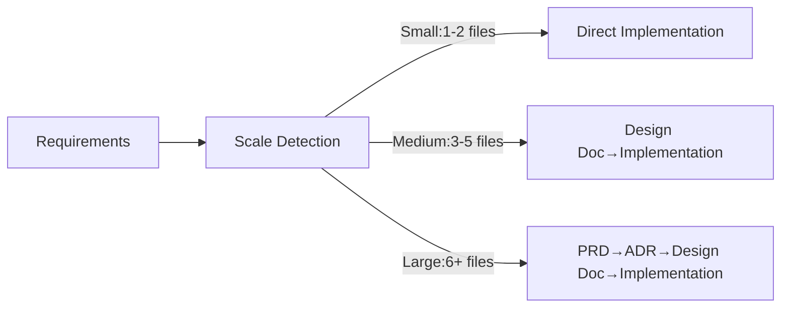

# Use Cases Quick Reference

New to this? Start with the [Quick Start Guide](./quickstart.md). This is your daily development cheatsheet.

## Top 5 Commands (Learn These First)

| Command | Purpose | Example |
|---------|---------|---------|
| `/implement` | Full feature implementation (requirements to completion) | `/implement Add rate limiting to API` |
| `/task` | Single task with rule-based precision | `/task Fix bug` |
| `/design` | Design docs only (no implementation) | `/design Design payment system` |
| `/review` | Code review and auto-fix | `/review auth-system` |
| `/build` | Execute implementation from plan | `/build` |

## Overall Flow



## Inside /implement Command

```mermaid
graph TD
    Start[/implement requirements] --> RA["requirement-analyzer scale detection"]
    RA -->|Small| Direct[Direct implementation]
    RA -->|Medium| TD["technical-designer Design Doc"]
    RA -->|Large| PRD["prd-creator PRD"]
    
    PRD --> ADR["technical-designer ADR"]
    ADR --> TD
    TD --> WP["work-planner Work plan"]
    WP --> TE["task-executor Execute tasks"]
    Direct --> QF["quality-fixer Quality checks"]
    TE --> QF
    QF --> End[Complete]
    
    style Start fill:#e1f5fe
    style End fill:#c8e6c9
```

---

# Detailed Use Cases

## Want to add a feature?

```bash
/implement Add webhook API with retry logic and signature verification
```

Claude Code auto-detects scale, creates necessary docs, then implements.

## Want to fix a bug?

```bash
/task Fix email validation bug with "+" character
```

Clarifies rules, fixes the bug, adds tests, and commits.

## Want design only?

```bash
/design Design large-scale batch processing system
```

Creates design docs for team review (no implementation).

## Want to work step by step?

Design → Plan → Build separately:

```bash
/design    # Create design docs
/plan      # Create work plan
/build     # Execute implementation
```

## Want to resume work?

```bash
# Check progress
ls docs/plans/tasks/*.md | head -5
git log --oneline -5

# Resume with the build command
/build auth-implementation
# Or simply continue where you left off
/build
```

## Want code review?

```bash
/review  # Check Design Doc compliance
```

Auto-fix is suggested if compliance is below 70%.

## Want to customize project settings?

```bash
/project-inject  # Set project context
/refine-rule     # Adjust rules
/sync-rules      # Sync metadata
```

---

# Command Reference

## Scale Detection Criteria

| Scale | Files | Examples | Generated Docs |
|-------|-------|----------|----------------|
| Small | 1-2 | Bug fixes, refactoring | None |
| Medium | 3-5 | API additions, rate limiting | Design Doc + Work plan |
| Large | 6+ | Auth system, payment system | PRD + ADR + Design Doc + Work plan |

## Command Details

### /implement
**Purpose**: Full automation from requirements to implementation
**Args**: Requirements description
**Process**:
1. requirement-analyzer detects scale
2. Generate docs based on scale
3. task-executor implements
4. quality-fixer ensures quality
5. Commit per task

### /task
**Purpose**: High-precision single task execution
**Args**: Task description
**Process**:
1. Clarify applicable rules
2. Determine initial action
3. Confirm restrictions
4. Execute task

### /design
**Purpose**: Design docs only (no implementation)
**Args**: What to design
**Process**:
1. Requirements analysis (requirement-analyzer)
2. PRD creation (if large scale)
3. ADR creation (if tech choices needed)
4. Design Doc creation
5. End with approval

### /plan
**Purpose**: Create work plan
**Args**: [design doc name] (optional)
**Prerequisite**: Design doc must exist
**Process**:
1. Select design doc
2. Confirm E2E test generation
3. work-planner creates plan
4. Get approval

### /build
**Purpose**: Automatically execute implementation
**Args**: [plan name] (optional)
**Prerequisite**: Work plan must exist
**Process**:
1. Check task files
2. Generate with task-decomposer if missing
3. Execute with task-executor
4. quality-fixer checks quality
5. Commit per task

### /review
**Purpose**: Verify Design Doc compliance
**Args**: [Design Doc name] (optional)
**Process**:
1. code-reviewer calculates compliance
2. List unmet items
3. Suggest auto-fixes
4. Execute fixes after approval

### /refine-rule
**Purpose**: Improve rules
**Args**: What to change
**Process**:
1. Select rule file
2. Create change proposal
3. 3-pass review process
4. Apply

### /sync-rules
**Purpose**: Sync rule metadata
**Args**: None
**When**: Required after rule edits

### /project-inject
**Purpose**: Set project context
**Args**: None
**Process**: Interactive project information collection

### /onboard
**Purpose**: Load all rules
**Args**: None
**Warning**: High context consumption

---

# Troubleshooting

| Issue | Check Command | Solution |
|-------|---------------|----------|
| Repeating same error | `npm run check:all` | Check environment, fix with `/task` |
| Code differs from design | `/review` | Check compliance, auto-fix |
| Task stuck | `ls docs/plans/tasks/` | Identify blocker, check task file |
| Command not recognized | `ls .claude/commands-en/` | Check typo, reset with `/onboard` |

---

# Examples

## Webhook Feature (Medium - 4 files)
```bash
/implement External system webhook API
```
**Generated files**:
- docs/design/webhook-system.md
- src/services/webhook.service.ts
- src/services/retry.service.ts
- src/controllers/webhook.controller.ts

## Auth System (Large - 10+ files)
```bash
/implement JWT auth with RBAC system
```
**Generated files**:
- docs/prd/auth-system.md
- docs/adr/auth-architecture.md
- docs/design/auth-system.md
- src/auth/ (implementation files)

---

See command definitions in `.claude/commands-en/` for details.
Having issues? Check [GitHub Issues](https://github.com/shinpr/ai-coding-project-boilerplate/issues).