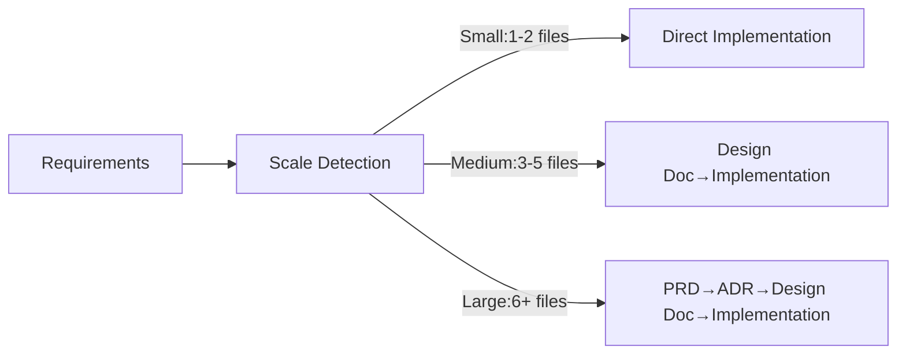
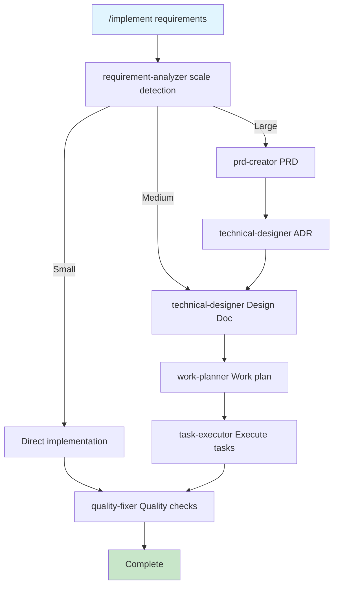

# Use Cases Quick Reference

New here? Start with the [Quick Start Guide](./quickstart.md). This page serves as your daily development cheatsheet.

## Top 5 Commands (Learn These First)

| Command | Purpose | Example |
|---------|---------|---------|
| `/implement` | End-to-end feature implementation (from requirements to completion) | `/implement Add rate limiting to API` |
| `/task` | Single task with skill-based precision | `/task Fix bug` |
| `/design` | Design docs only (no implementation) | `/design Design payment system` |
| `/review` | Code review and auto-fix | `/review auth-system` |
| `/build` | Execute implementation from plan | `/build` |

## Overall Flow



## Inside /implement Command



---

# Detailed Use Cases

## Want to add a feature?

```bash
/implement Add webhook API with retry logic and signature verification
```

The LLM automatically detects scale, creates necessary documentation, and completes the implementation.

## Want to fix a bug?

```bash
/task Fix email validation bug with "+" character
```

Clarifies applicable skills before fixing the issue.
`/task` triggers a process of metacognition (self-reflection on reasoning). It helps the LLM clarify the situation, retrieve relevant skills, build task lists, and understand the work context—improving execution accuracy.

## Want design only?

```bash
/design Design large-scale batch processing system
```

Creates design documents, conducts LLM self-review, requests user review as needed, and finalizes the design docs. Does not implement.

## Want to work step by step?

Execute Design → Plan → Build individually. You can work more incrementally by specifying phases directly in the command arguments.

```bash
/design                    # Create design docs
/plan                      # Create work plan
/build implement phase 1   # Execute implementation (with phase specification)
```

## Want to resume work?

```bash
# Check progress
ls docs/plans/tasks/*.md | head -5
git log --oneline -5

# Resume with the build command
/build auth-implementation
# Or simply continue where you left off
/build
```

Tasks are marked complete with checkmarks (- [x]) in Markdown format.
Some Claude Code models may not automatically mark tasks as completed. In that case, you can instruct: "Please mark completed tasks by reviewing the commit history."

## Want code review?

```bash
/review  # Check Design Doc compliance
```

Auto-fix is suggested if compliance is below 70%.
Fixes are created as task files under `docs/plans/tasks` and executed by sub-agents.

## Want to initialize or customize project settings?

```bash
/project-inject  # Set project context
/sync-skills      # Sync skill metadata
```

## Want AI to reference specific library docs?

Where to place library docs (like `llms.txt` URLs) depends on your project. Think about **when AI needs the information** and **what it relates to**:

- If a related skill already exists (e.g., a frontend skill covering React), **add the URL there** to keep context together
- If only needed during a specific phase (e.g., design), **add to that phase's skill or Design Doc**
- If used broadly across the project, **create a dedicated skill** via `/create-skill` or manually (e.g., `.claude/skills/my-library-docs/SKILL.md`)

After adding or creating a skill, run `/sync-skills` to register it. See the [Skills Editing Guide](./skills-editing-guide.md) for details on [where to document what](./skills-editing-guide.md#determining-where-to-document).

## Want to add team-specific rules?

Use `/create-skill` to create a custom skill through interactive dialog:

```bash
/create-skill team coding conventions and naming rules
```

Or create one manually:

1. Create `.claude/skills/my-team-rules/SKILL.md`
2. Define your coding standards, naming conventions, architectural constraints, etc.
3. Run `/sync-skills` to register the new skill

Any information you want AI to know about your project can be added as a skill.

---

# Command Reference

## Scale Detection Criteria

| Scale | Files | Examples | Generated Docs |
|-------|-------|----------|----------------|
| Small | 1-2 | Bug fixes, refactoring | None |
| Medium | 3-5 | API additions, rate limiting | Design Doc + Work plan |
| Large | 6+ | Auth system, payment system | PRD + ADR + Design Doc + Work plan |

## Command Details

### /implement
**Purpose**: Full automation from requirements to implementation
**Args**: Requirements description
**Process**:
1. requirement-analyzer detects scale
2. Generate docs based on scale
3. task-executor implements
4. quality-fixer ensures quality
5. Commit per task

Helps clarify requirements and creates design documents. Creates work plans and task files from design docs, then completes implementation according to the plan.
Aimed at completing Agentic Coding (LLMs autonomously making decisions and executing implementation tasks), performing automatic execution following the flow with minimal human intervention except for design clarification and handling issues beyond LLM judgment.

### /task
**Purpose**: Skill-based high-precision task execution
**Args**: Task description
**Process**:
1. Clarify task essence
2. Determine applicable skills
3. Determine initial action
4. Confirm scope boundary

Encourages metacognition (self-reflection on reasoning), understands task essence and applicable skills, then refines the specified task. Uses the `rule-advisor` sub-agent to retrieve and utilize appropriate skills from `.claude/skills/`.

### /design
**Purpose**: Design docs creation (no implementation)
**Args**: What to design
**Process**:
1. Requirements analysis (requirement-analyzer)
2. PRD creation (if large scale)
3. ADR creation (if tech choices needed)
4. Design Doc creation
5. End with approval

Interacts with users to organize requirements and create various design documents. Determines necessary documents based on implementation scale, finalizes design docs through creation, self-review, and user review reflection.
Use when not adopting the full design-to-implementation process via `/implement`.

### /plan
**Purpose**: Create work plan
**Args**: [design doc name] (optional)
**Prerequisite**: Design Doc must exist
**Process**:
1. Select design doc
2. Confirm E2E test generation
3. work-planner creates plan
4. Get approval

Creates work plan from Design Doc. Also creates integration/E2E tests required for implementation.
Use when not adopting the full design-to-implementation process via `/implement`.

### /build
**Purpose**: Automated implementation execution
**Args**: [task file name] (optional)
**Prerequisite**: Task files or work plan must exist
**Process**:
1. Check task files
2. Generate with task-decomposer if missing
3. Execute with task-executor
4. quality-fixer checks quality
5. Commit per task

Executes implementation tasks described in specified task files. If only work plan exists without task files, uses `task-decomposer` to break down tasks before executing.
Use when not adopting the full design-to-implementation process via `/implement`.

Unless specified otherwise, automatically executes until completing the implementation described in the plan. If you want work done in phases or task units, clearly communicate the desired phase in arguments. Be careful as explicitly interrupting implementation midway may leave code in an unexecutable state.

**Example for phase-based implementation**
```bash
/build Refer to docs/plans/tasks and complete phase 1 tasks
```

### /review
**Purpose**: Design Doc compliance, code quality verification
**Args**: [Design Doc name] (optional)
**Process**:
1. code-reviewer calculates compliance
2. List unmet items
3. Suggest auto-fixes
4. Execute fixes with task-executor after approval

Conducts code review. Primarily reviews whether implementation complies with Design Doc and meets rule-based code quality standards, providing feedback. Creates task files and uses sub-agents like `task-executor` to fix issues upon user instruction.
Use when not adopting the full design-to-implementation process via `/implement`.

### /refine-skill
**Purpose**: Skill improvement
**Args**: What to change
**Process**:
1. Select skill file
2. Create change proposal against skill-optimization editing principles
3. Quality review by skill-reviewer agent (grade A/B to proceed)
4. Apply after user approval

Assists with skill file editing. Uses the skill-reviewer agent for quality evaluation. Since skills must be optimized for LLMs to maintain execution accuracy, creating optimal skills with this command alone is difficult. Refer to the [Skills Editing Guide](./skills-editing-guide.md) and refine skills through command usage or direct dialogue with LLMs.

### /sync-skills
**Purpose**: Sync skill metadata
**Args**: None
**When**: After skill file edits

Updates metadata files used by the `rule-advisor` sub-agent to find skills to reference. Must be executed after changing skills. Not needed if skills haven't changed.

Common behavior patterns:
- "9 files checked, all synchronized, no updates needed" → This is normal
- "3 improvement suggestions: [specific suggestions]" → Approve as needed
- Forcing changes every time → This is inappropriate behavior, please report

### /project-inject
**Purpose**: Set project-specific prerequisites for AI execution accuracy
**Args**: None
**Process**: Interactive collection via AskUserQuestion (3 rounds)

**When to use**:
- Initial setup (required — AI reads project-context every session)
- When project domain or constraints change significantly

Collects project-specific prerequisites through interactive dialog and saves them to `.claude/skills/project-context/SKILL.md`. This context is loaded at the start of every AI session, directly affecting execution accuracy across all tasks.


---

# Troubleshooting

## Task Files

Task files exist under `docs/plans/tasks`. Implementation is performed in units of these task files, with completed tasks marked with Markdown checkmarks (- [x]) upon completion.
Some Claude Code models may not automatically mark tasks as completed. In that case, you can instruct: "Please mark completed tasks by reviewing the commit history."

## When implementation is interrupted

Use the `/implement` or `/build` commands to resume work.
```bash
/implement Resume from task 3 and complete the work
/build Search for incomplete tasks from docs/plans/tasks and resume implementation
```

| Issue | Check Command | Solution |
|-------|---------------|----------|
| Repeating same error | `npm run check:all` | Check environment, fix with `/task` |
| Code differs from design | `/review` | Check compliance, auto-fix |
| Task stuck | `ls docs/plans/tasks/` | Identify blocker, check task file |
| Command not recognized | `ls .claude/commands/` | Check typo |

---

# Examples

## Webhook Feature (Medium scale – about 4 files)
```bash
/implement External system webhook API
```
**Generated files**:
- docs/design/webhook-system.md
- src/services/webhook.service.ts
- src/services/retry.service.ts
- src/controllers/webhook.controller.ts

## Auth System (Large scale – 10+ files)
```bash
/implement JWT auth with RBAC system
```
**Generated files**:
- docs/prd/auth-system.md
- docs/adr/auth-architecture.md
- docs/design/auth-system.md
- src/auth/ (implementation files)

---

## Next Steps

Once you understand the basics, start applying them in practice. As you gain experience and feel the need to improve, try customizing the skills.

→ **[Skills Editing Guide](./skills-editing-guide.md)** - How to understand LLM characteristics and create effective skills

See command definitions in `.claude/commands/` for details.
Having issues? Check [GitHub Issues](https://github.com/shinpr/ai-coding-project-boilerplate/issues).