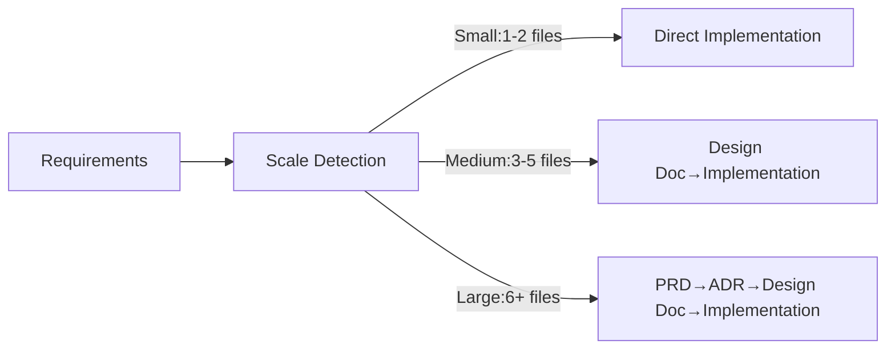
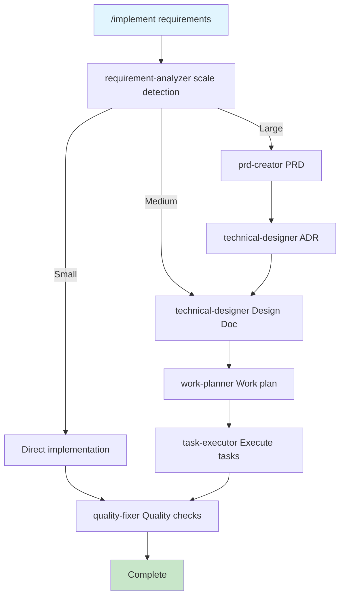

# Use Cases Quick Reference

New to this? Start with the [Quick Start Guide](./quickstart.md). This is your daily development cheatsheet.

## Top 5 Commands (Learn These First)

| Command | Purpose | Example |
|---------|---------|---------|
| `/implement` | Full feature implementation (requirements to completion) | `/implement Add rate limiting to API` |
| `/task` | Single task with rule-based precision | `/task Fix bug` |
| `/design` | Design docs only (no implementation) | `/design Design payment system` |
| `/review` | Code review and auto-fix | `/review auth-system` |
| `/build` | Execute implementation from plan | `/build` |

## Overall Flow



## Inside /implement Command



---

# Detailed Use Cases

## Want to add a feature?

```bash
/implement Add webhook API with retry logic and signature verification
```

The LLM automatically detects scale, creates necessary documentation, and completes the implementation.

## Want to fix a bug?

```bash
/task Fix email validation bug with "+" character
```

Clarifies rules before fixing the issue.
`/task` is a command that triggers "metacognition" (objectively understanding one's own thinking and learning processes). It prompts the LLM to understand the situation, retrieve rules, create internal task lists, and understand work context, improving execution accuracy.

## Want design only?

```bash
/design Design large-scale batch processing system
```

Creates design documents, conducts LLM self-review, requests user review as needed, and finalizes the design docs. Does not implement.

## Want to work step by step?

Execute Design → Plan → Build individually. You can work more incrementally by specifying detailed phases in command arguments.

```bash
/design                    # Create design docs
/plan                      # Create work plan
/build implement phase 1   # Execute implementation (with phase specification)
```

## Want to resume work?

```bash
# Check progress
ls docs/plans/tasks/*.md | head -5
git log --oneline -5

# Resume with the build command
/build auth-implementation
# Or simply continue where you left off
/build
```

Tasks are marked complete with checkmarks (- [x]) in Markdown format.
Some Claude Code models may not automatically check completed tasks. In that case, instruct: "Please check completed tasks by reviewing commit history."

## Want code review?

```bash
/review  # Check Design Doc compliance
```

Auto-fix is suggested if compliance is below 70%.
Fixes are created as task files under `docs/plans/tasks` and executed by sub-agents.

## Want to initialize or customize project settings?

```bash
/project-inject  # Set project context
/sync-rules      # Sync metadata
```

---

# Command Reference

## Scale Detection Criteria

| Scale | Files | Examples | Generated Docs |
|-------|-------|----------|----------------|
| Small | 1-2 | Bug fixes, refactoring | None |
| Medium | 3-5 | API additions, rate limiting | Design Doc + Work plan |
| Large | 6+ | Auth system, payment system | PRD + ADR + Design Doc + Work plan |

## Command Details

### /implement
**Purpose**: Full automation from requirements to implementation
**Args**: Requirements description
**Process**:
1. requirement-analyzer detects scale
2. Generate docs based on scale
3. task-executor implements
4. quality-fixer ensures quality
5. Commit per task

Clarifies requirements and creates design documents. Creates work plans and task files from design docs, then completes implementation according to the plan.
Aimed at completing Agentic Coding (LLMs autonomously making decisions and executing implementation tasks), performing autonomous execution following the flow with minimal human intervention except for design clarification and handling issues beyond LLM judgment.

### /task
**Purpose**: Rule-based high-precision task execution
**Args**: Task description
**Process**:
1. Clarify applicable rules
2. Determine initial action
3. Confirm restrictions
4. Execute task

Promotes metacognition (objectively understanding one's own thinking and learning processes), understands task essence and rules to be understood, then refines the specified task. Uses the `rule-advisor` sub-agent to retrieve and utilize appropriate rules from rule files under `docs/rules`.

### /design
**Purpose**: Design docs creation (no implementation)
**Args**: What to design
**Process**:
1. Requirements analysis (requirement-analyzer)
2. PRD creation (if large scale)
3. ADR creation (if tech choices needed)
4. Design Doc creation
5. End with approval

Interacts with users to organize requirements and create various design documents. Determines necessary documents based on implementation scale, finalizes design docs through creation, self-review, and user review reflection.
Use when not adopting the full design-to-implementation process via `/implement`.

### /plan
**Purpose**: Create work plan
**Args**: [design doc name] (optional)
**Prerequisite**: Design Doc must exist
**Process**:
1. Select design doc
2. Confirm E2E test generation
3. work-planner creates plan
4. Get approval

Creates work plan from Design Doc. Also creates integration/E2E tests required for implementation.
Use when not adopting the full design-to-implementation process via `/implement`.

### /build
**Purpose**: Automated implementation execution
**Args**: [task file name] (optional)
**Prerequisite**: Task files or work plan must exist
**Process**:
1. Check task files
2. Generate with task-decomposer if missing
3. Execute with task-executor
4. quality-fixer checks quality
5. Commit per task

Executes implementation tasks described in specified task files. If only work plan exists without task files, uses `task-decomposer` to break down tasks before executing.
Use when not adopting the full design-to-implementation process via `/implement`.

Unless specified otherwise, autonomously executes until completing the implementation described in the plan. If you want work done in phases or task units, clearly communicate the desired phase in arguments. Be careful as explicitly interrupting implementation midway may leave code in an unexecutable state.

**Example for phase-based implementation**
```bash
/build Refer to docs/plans/tasks and complete phase 1 tasks
```

### /review
**Purpose**: Design Doc compliance, code quality verification
**Args**: [Design Doc name] (optional)
**Process**:
1. code-reviewer calculates compliance
2. List unmet items
3. Suggest auto-fixes
4. Execute fixes with task-executor after approval

Conducts code review. Primarily reviews whether implementation complies with Design Doc and meets rule-based code quality standards, providing feedback. Creates task files and uses sub-agents like `task-executor` to fix issues upon user instruction.
Use when not adopting the full design-to-implementation process via `/implement`.

### /refine-rule
**Purpose**: Rule improvement
**Args**: What to change
**Process**:
1. Select rule file
2. Create change proposal
3. 3-pass review process
4. Apply

Assists with rule file editing. Since rules must be optimized for LLMs to maintain execution accuracy, creating optimal rules with this command alone is difficult. Refer to the [Rule Editing Guide](./rule-editing-guide.md) and refine rules through command usage or direct dialogue with LLMs.

### /sync-rules
**Purpose**: Sync rule metadata
**Args**: None
**When**: After rule file edits

Updates metadata files used by the `rule-advisor` sub-agent to find rules to reference. Must be executed after changing rules. Not needed if rules haven't changed.

Common behavior patterns:
- "9 files checked, all synchronized, no updates needed" → This is normal
- "3 improvement suggestions: [specific suggestions]" → Approve as needed
- Forcing changes every time → This is inappropriate behavior, please report

### /project-inject
**Purpose**: Set project context
**Args**: None
**Process**: Interactive project information collection

**When to use**:
- Initial setup (required)
- When project direction changes significantly
- When target users change
- When business requirements change significantly

This command sets project background information as rule files to maximize the probability of work being done with understanding of context. Therefore, it doesn't need to be run daily. Use only at initial setup and when fundamental project assumptions change.


---

# Troubleshooting

## Task Files

Task files exist under `docs/plans/tasks`. Implementation is performed in units of these task files, with completed tasks marked with Markdown checkmarks (- [x]) upon completion.
Some Claude Code models may not automatically check completed tasks. In that case, instruct: "Please check completed tasks by reviewing commit history."

## When implementation is interrupted

Use `/implement` or `/build` commands to instruct work resumption.
```bash
/implement Resume from task 3 and complete the work
/build Search for incomplete tasks from docs/plans/tasks and resume implementation
```

| Issue | Check Command | Solution |
|-------|---------------|----------|
| Repeating same error | `npm run check:all` | Check environment, fix with `/task` |
| Code differs from design | `/review` | Check compliance, auto-fix |
| Task stuck | `ls docs/plans/tasks/` | Identify blocker, check task file |
| Command not recognized | `ls .claude/commands-en/` | Check typo |

---

# Examples

## Webhook Feature (Medium - 4 files)
```bash
/implement External system webhook API
```
**Generated files**:
- docs/design/webhook-system.md
- src/services/webhook.service.ts
- src/services/retry.service.ts
- src/controllers/webhook.controller.ts

## Auth System (Large - 10+ files)
```bash
/implement JWT auth with RBAC system
```
**Generated files**:
- docs/prd/auth-system.md
- docs/adr/auth-architecture.md
- docs/design/auth-system.md
- src/auth/ (implementation files)

---

## Next Steps

Once you understand the basics, try using them in practice. As you use them and develop motivation to improve rules, try customizing the rules.

→ **[Rule Editing Guide](./rule-editing-guide.md)** - How to understand LLM characteristics and create effective rules

See command definitions in `.claude/commands-en/` for details.
Having issues? Check [GitHub Issues](https://github.com/shinpr/ai-coding-project-boilerplate/issues).