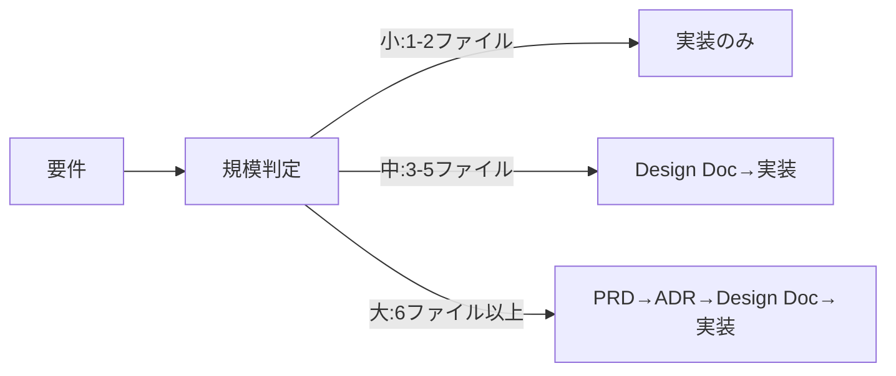

# ユースケース別クイックリファレンス

初めての方は[クイックスタートガイド](./quickstart.md)から。このガイドは日常的な開発作業で参照するチートシートです。

## よく使うコマンド TOP5（まずはこれだけ覚えればOK）

| コマンド | 用途 | 例 |
|---------|------|-----|
| `/implement` | 新機能の実装（要件分析から完了まで全自動） | `/implement APIにレート制限を追加してください` |
| `/task` | ルールに基づく高精度な単一タスク実行 | `/task バグを修正してください` |
| `/design` | 設計書作成（実装はしない） | `/design 決済システムを設計してください` |
| `/review` | コードレビューと自動修正 | `/review docs/design/xxxx.md` |
| `/build` | 作業計画から実装を実行 | `/build` |

## 全体の流れ



## /implementコマンドの裏側

```mermaid
graph TD
    Start[/implement 要件] --> RA["requirement-analyzer 規模判定"]
    RA -->|小規模| Direct[直接実装]
    RA -->|中規模| TD["technical-designer Design Doc作成"]
    RA -->|大規模| PRD["prd-creator PRD作成"]
    
    PRD --> ADR["technical-designer ADR作成"]
    ADR --> TD
    TD --> WP["work-planner 作業計画書"]
    WP --> TE["task-executor タスク実行"]
    Direct --> QF["quality-fixer 品質チェック"]
    TE --> QF
    QF --> End[完了]
    
    style Start fill:#e1f5fe
    style End fill:#c8e6c9
```

---

# ユースケース別ガイド

## 新機能を追加したいときは？

```bash
/implement Webhook APIを実装（リトライ機能、署名検証付き）
```

AIが規模を自動判定して、必要なドキュメントを作成してから実装します。

## バグを修正したいときは？

```bash
/task メールアドレスに「+」記号が含まれるとエラーになるバグを修正
```

ルールを明確化してから修正作業を実行します。
`/task`は「メタ認知」を誘発させるコマンドです。AIが状況を把握するように促し、ルールの取得や内部的なタスクリストの作成、作業の背景理解などを行いようになり、実行精度が向上する。

## 設計だけしたいときは？

```bash
/design 大規模バッチ処理システムを設計したい
```

設計書を作成し、AIによるセルフレビュー後に必要に応じてユーザーにレビューを依頼し、設計書を完成させます。実装はしません。

## 作業を段階的に進めたいときは？

設計 → 計画 → 実装を個別に実行：

```bash
/design    # 設計書作成
/plan      # 作業計画作成
/build     # 実装実行
```

## 途中から実装を再開したいときは？

```bash
/implement タスク3まで完了しています。続きから実装を再開し、作業を完遂させてください。
```

## コードレビューをしてほしいときは？

```bash
/review docs/design/xxxx.md  # Design Doc準拠やコード品質をチェック
```

準拠率70%未満なら自動修正を提案します。
修正はタスクファイルを`docs/plans/tasks`配下につくり、サブエージェントが実行します。

## プロジェクト設定をカスタマイズしたいときは？

```bash
/project-inject  # プロジェクトコンテキスト設定
/refine-rule     # ルール調整
/sync-rules      # メタデータ同期
```

---

# コマンドリファレンス

## 規模判定の基準

| 規模 | ファイル数 | 例 | 生成ドキュメント |
|------|-----------|-----|-----------------|
| 小 | 1-2 | バグ修正、リファクタリング | なし |
| 中 | 3-5 | API追加、レート制限 | Design Doc + 作業計画書 |
| 大 | 6+ | 認証システム、決済システム | PRD + ADR + Design Doc + 作業計画書 |

## 各コマンドの詳細

### /implement
**用途**: 要件から実装まで全自動
**引数**: 要件の説明
**実行内容**:
1. requirement-analyzerが規模判定
2. 規模に応じてドキュメント生成
3. task-executorが実装
4. quality-fixerが品質保証
5. 各タスクごとにコミット

### /task
**用途**: ルールベースの高精度タスク実行
**引数**: タスクの説明
**実行内容**:
1. 適用ルール明確化
2. 初動アクション決定
3. 禁止事項確認
4. タスク実行

### /design
**用途**: 設計書作成（実装なし）
**引数**: 設計したい内容
**実行内容**:
1. requirement-analyzerが要件分析
2. PRD作成（大規模時）
3. ADR作成（技術選択が必要な時）
4. Design Doc作成
5. 承認取得で終了

### /plan
**用途**: 作業計画書作成
**引数**: [設計書名]（省略可）
**前提**: 設計書が存在すること
**実行内容**:
1. 設計書選択
2. E2Eテスト生成確認
3. work-plannerで計画作成
4. 承認取得

### /build
**用途**: 実装の自動実行
**引数**: [計画書名]（省略可）
**前提**: 作業計画書が存在すること
**実行内容**:
1. タスクファイル確認
2. なければtask-decomposerで生成
3. task-executorで順次実行
4. quality-fixerで品質チェック
5. タスクごとにコミット

### /review
**用途**: Design Doc準拠、コード品質検証
**引数**: [Design Doc名]（省略可）
**実行内容**:
1. code-reviewerで準拠率計算
2. 未充足項目リスト化
3. 自動修正提案
4. 承認後task-executorが修正実行

### /refine-rule
**用途**: ルール改善
**引数**: 変更したい内容
**実行内容**:
1. ルールファイル選択
2. 変更設計案作成
3. 3回見直しプロセス
4. 適用

### /sync-rules
**用途**: ルールメタデータ同期
**引数**: なし
**実行タイミング**: ルールファイル編集後必須実行

### /project-inject
**用途**: プロジェクトコンテキスト設定。初回セットアップ時実行推奨
**引数**: なし
**実行内容**: 対話形式でプロジェクト情報収集

### /onboard
**用途**: 全ルールファイルの一括読み込み
**引数**: なし
**注意**: コンテキストを大量消費するので、全てのルールを理解して作業をしてほしい場合以外の利用は非推奨

---

# トラブルシューティング

うまくいかないときは、以下を確認してください。

## タスクファイルにチェックが付いていない場合
タスクファイルは `docs/plans/tasks`配下に存在します。実装はこのタスクファイルの単位で行われ、実装完了した際にMarkdown形式で完了のチェックマーク（- [x]）を付けます。
Claude Codeのモデルによっては、完了したタスクに自動でチェックを付けてくれないことがあります。その場合は「コミット履歴を見て、完了したタスクにチェックを入れてください」と指示してください。

---

# 実例

## Webhook機能（中規模・4ファイル）
```bash
/implement 外部システム連携用Webhook API
```
**生成物**:
- docs/design/webhook-system.md
- src/services/webhook.service.ts
- src/services/retry.service.ts
- src/controllers/webhook.controller.ts

## 認証システム（大規模・10ファイル以上）
```bash
/implement JWT認証とRBACシステム
```
**生成物**:
- docs/prd/auth-system.md
- docs/adr/auth-architecture.md
- docs/design/auth-system.md
- src/auth/以下の実装ファイル群

---

詳細は各コマンドの定義ファイル（`.claude/commands/`）を参照してください。
問題が解決しない場合は[Issues](https://github.com/shinpr/ai-coding-project-boilerplate/issues)を起票ください。