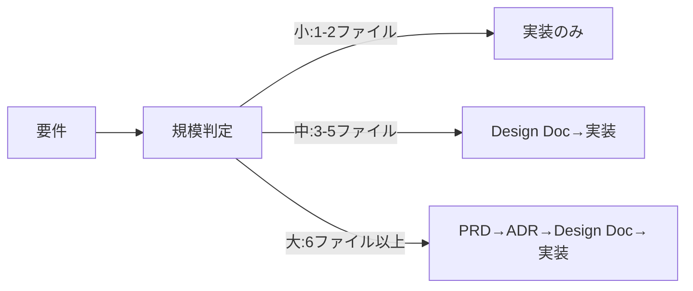
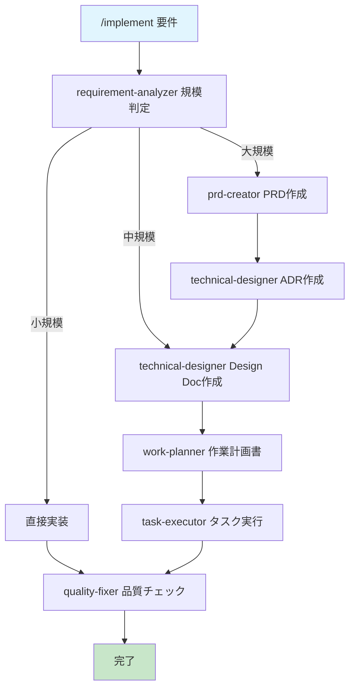

# ユースケース別クイックリファレンス

初めての方は[クイックスタートガイド](./quickstart.md)から。このガイドは日常的な開発作業で参照するチートシートです。

## よく使うコマンド TOP5（まずはこれだけ覚えればOK）

| コマンド | 用途 | 例 |
|---------|------|-----|
| `/implement` | 新機能の実装（要件分析から完了まで全自動） | `/implement APIにレート制限を追加してください` |
| `/task` | スキルに基づく高精度な単一タスク実行 | `/task バグを修正してください` |
| `/design` | 設計書作成（実装はしない） | `/design 決済システムを設計してください` |
| `/review` | コードレビューと自動修正 | `/review docs/design/xxxx.md` |
| `/build` | 作業計画から実装を実行 | `/build` |

## 全体の流れ



## /implementコマンドの裏側



---

# ユースケース別ガイド

## 新機能を追加したいときは？

```bash
/implement Webhook APIを実装（リトライ機能、署名検証付き）
```

LLMが規模を自動判定して、必要なドキュメントを作成してから実装を完遂します。

## バグを修正したいときは？

```bash
/task メールアドレスに「+」記号が含まれるとエラーになるバグを修正
```

適用スキルを明確化してから修正作業を実行します。
`/task`は「メタ認知（自分の思考や学習プロセスを客観的に把握すること）」を誘発させるコマンドです。LLMが状況を把握するように促し、スキルの取得や内部的なタスクリストの作成、作業の背景理解などを行うようになり、実行精度が向上します。

## 設計だけしたいときは？

```bash
/design 大規模バッチ処理システムを設計したい
```

設計書を作成し、LLMによるセルフレビュー後に必要に応じてユーザーにレビューを依頼し、設計書を完成させます。実装は行いません。

## 作業を段階的に進めたいときは？

設計 → 計画 → 実装を個別に実行してください。コマンド引数でさらに詳細なフェーズを指定することで、より段階的な作業が可能になります。

```bash
/design                    # 設計書作成
/plan                      # 作業計画作成
/build フェーズ1まで実装して  # 実装実行（フェーズ指定）
```

## 途中から実装を再開したいときは？

```bash
/implement タスク3まで完了しています。続きから実装を再開し、作業を完遂させてください。
```

## コードレビューをしてほしいときは？

```bash
/review docs/design/xxxx.md  # Design Doc準拠やコード品質をチェック
```

準拠率70%未満なら自動修正を提案します。
修正はタスクファイルを`docs/plans/tasks`配下につくり、サブエージェントが実行します。

## プロジェクト設定を初期設定・カスタマイズしたいときは？

```bash
/project-inject  # プロジェクトコンテキスト設定
/sync-skills      # スキルメタデータ同期
```

---

# コマンドリファレンス

## 規模判定の基準

| 規模 | ファイル数 | 例 | 生成ドキュメント |
|------|-----------|-----|-----------------|
| 小 | 1-2 | バグ修正、リファクタリング | なし |
| 中 | 3-5 | API追加、レート制限 | Design Doc + 作業計画書 |
| 大 | 6+ | 認証システム、決済システム | PRD + ADR + Design Doc + 作業計画書 |

## 各コマンドの詳細

### /implement
**用途**: 要件から実装まで全自動
**引数**: 要件の説明
**実行内容**:
1. requirement-analyzerが規模判定
2. 規模に応じてドキュメント生成
3. task-executorが実装
4. quality-fixerが品質保証
5. 各タスクごとにコミット

要件を明確化し、設計書を作成します。設計書から作業計画書やタスクファイルを作り、計画に沿って実装を完遂させます。
Agentic Coding（LLMが自律的に判断し、実装タスクを遂行する）を完遂させることを目的としており、設計の詰めやLLMでは判断不能な課題の発生以外の場面で、可能な限り人間の介入なくフローに沿った自律的な実行を行います。

### /task
**用途**: スキルベースの高精度タスク実行
**引数**: タスクの説明
**実行内容**:
1. タスクの本質を明確化
2. 適用スキルの決定
3. 初動アクション決定
4. スコープ境界の確認

メタ認知（自分の思考や学習プロセスを客観的に把握すること）を促し、タスクの本質や適用すべきスキルを把握した上で、指定されたタスクを推敲します。`rule-advisor`サブエージェントを用いて、`.claude/skills/`配下から適切なスキルを取得し活用します。

### /design
**用途**: 設計書作成（実装なし）
**引数**: 設計したい内容
**実行内容**:
1. requirement-analyzerが要件分析
2. PRD作成（大規模時）
3. ADR作成（技術選択が必要な時）
4. Design Doc作成
5. 承認取得で終了

ユーザーと対話し、要件を整理し、各種設計書を作成します。実装規模に応じて必要な設計書を決定し、作成・自己レビュー・ユーザーレビュー結果の反映を経て設計書を完成させます。
`/implement`による設計〜実装の一連のプロセスを採用しない場合に、活用してください。

### /plan
**用途**: 作業計画書作成
**引数**: [設計書名]（省略可）
**前提**: Design Docが存在すること
**実行内容**:
1. 設計書選択
2. E2Eテスト生成確認
3. work-plannerで計画作成
4. 承認取得

Design Docから作業計画書を作成します。また、実装に必要な結合/E2Eテストも同時に作成します。
`/implement`による設計〜実装の一連のプロセスを採用しない場合に、活用してください。

### /build
**用途**: 実装の自動実行
**引数**: [タスクファイル名]（省略可）
**前提**: タスクファイルもしくは作業計画書が存在すること
**実行内容**:
1. タスクファイル確認
2. なければtask-decomposerで生成
3. task-executorで順次実行
4. quality-fixerで品質チェック
5. タスクごとにコミット

指定されたタスクファイルに記載された実装タスクを実行します。タスクファイルが無く、作業計画書だけがある場合は、`task-decomposer`を用いてタスク分解を行なった上で、実装タスクを実行します。
`/implement`による設計〜実装の一連のプロセスを採用しない場合に、活用してください。

特に指定がなければ、計画書に書かれた実装を完遂するまで自律的に実行を行います。もし各フェーズや各タスクの単位で作業を行なってほしい場合は、引数に実行してほしいフェーズを明確に伝えてください。実装中にユーザーが明示的に作業を中断させてしまうと、実行不可能な状態のコードが残る可能性があるため、注意が必要です。

**フェーズ単位に実装をさせたいときの例**
```bash
/build docs/plans/tasksを参照し、フェーズ1のタスクを完遂させてください
```

### /review
**用途**: Design Doc準拠、コード品質検証
**引数**: [Design Doc名]（省略可）
**実行内容**:
1. code-reviewerで準拠率計算
2. 未充足項目リスト化
3. 自動修正提案
4. 承認後task-executorが修正実行

コードレビューを行います。主にDesign Docに準拠した実装が行われているか、ルールに沿ったコード品質を満たしているかの観点でレビューし、フィードバックを行います。ユーザーからの指示があれば、タスクファイルを作り、`task-executor`サブエージェント等を活用し、問題点の修正を行います。
`/implement`による設計〜実装の一連のプロセスを採用しない場合に、活用してください。

### /refine-skill
**用途**: スキル改善
**引数**: 変更したい内容
**実行内容**:
1. スキルファイル選択
2. 変更設計案作成
3. 3回見直しプロセス
4. 適用

スキルファイルの編集を支援します。スキルはLLMに最適化された文章にしなければ実行精度が落ちてしまうため、本コマンドだけで最良のスキルを作成することは困難です。[スキル編集ガイド](./skills-editing-guide.md)を参照し、コマンド活用もしくはLLMと直接対話しながら、スキルの整備を行なってください。

### /sync-skills
**用途**: スキルメタデータの同期
**引数**: なし
**実行タイミング**: スキルファイル編集後

`rule-advisor`サブエージェントがスキルを検索する際に使用するメタデータファイルを更新します。スキルを変更した後は必ず実行してください。スキルが変更されていない状態であれば実行は不要です。

実際によくある動作パターン：
- 「9ファイル確認完了、すべて同期済み、更新不要」→ これは正常です
- 「3つの改善提案があります: [具体的な提案内容]」→ 必要に応じて承認
- 毎回強制的に何かを変更する → これは不適切な動作なので報告してください

### /project-inject
**用途**: AIの実行精度に必要なプロジェクト固有の前提情報を設定
**引数**: なし
**実行内容**: AskUserQuestionによる対話形式で段階的に収集（3ラウンド）

**使用タイミング**:
- 初回セットアップ時（必須 — AIは毎セッションproject-contextを読み込む）
- プロジェクトのドメインや制約が大きく変わったとき

対話形式でプロジェクト固有の前提情報を収集し、`.claude/skills/project-context/SKILL.md`に保存します。このコンテキストは毎セッション開始時にAIが読み込み、全タスクの実行精度に直接影響します。

---

# トラブルシューティング

うまくいかないときは、以下を確認してください。

## タスクファイルにチェックが付いていない場合
タスクファイルは `docs/plans/tasks`配下に存在します。実装はこのタスクファイルの単位で行われ、実装完了した際にMarkdown形式で完了のチェックマーク（- [x]）を付けます。
Claude Codeのモデルによっては、完了したタスクに自動でチェックを付けてくれないことがあります。その場合は「コミット履歴を見て、完了したタスクにチェックを入れてください」と指示してください。

## 実装タスクが途中で終了してしまった場合
`/implement`および`/build`コマンドを用い、作業の再開を指示してください。
```bash
/implement タスク3から再開し、作業を完遂させてください
/build docs/plans/tasksから未完了のタスクを探し、実装作業を再開してください
```

---

# 実例

## Webhook機能（中規模・4ファイル）
```bash
/implement 外部システム連携用Webhook API
```
**生成物**:
- docs/design/webhook-system.md
- src/services/webhook.service.ts
- src/services/retry.service.ts
- src/controllers/webhook.controller.ts

## 認証システム（大規模・10ファイル以上）
```bash
/implement JWT認証とRBACシステム
```
**生成物**:
- docs/prd/auth-system.md
- docs/adr/auth-architecture.md
- docs/design/auth-system.md
- src/auth/以下の実装ファイル群

---

## 次のステップ

基本的な使い方を理解したら、実際に活用してみてください。活用していく中でスキルを改善したいモチベーションが生まれたら、スキルをカスタマイズしてみましょう。

→ **[スキル編集ガイド](./skills-editing-guide.md)** - LLMの特性を理解して効果的なスキルを作成する方法

詳細は各コマンドの定義ファイル（`.claude/commands/`）を参照してください。
問題が解決しない場合は[Issues](https://github.com/shinpr/ai-coding-project-boilerplate/issues)を起票ください。