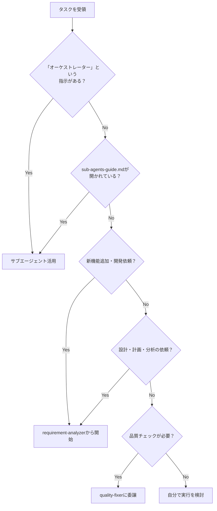
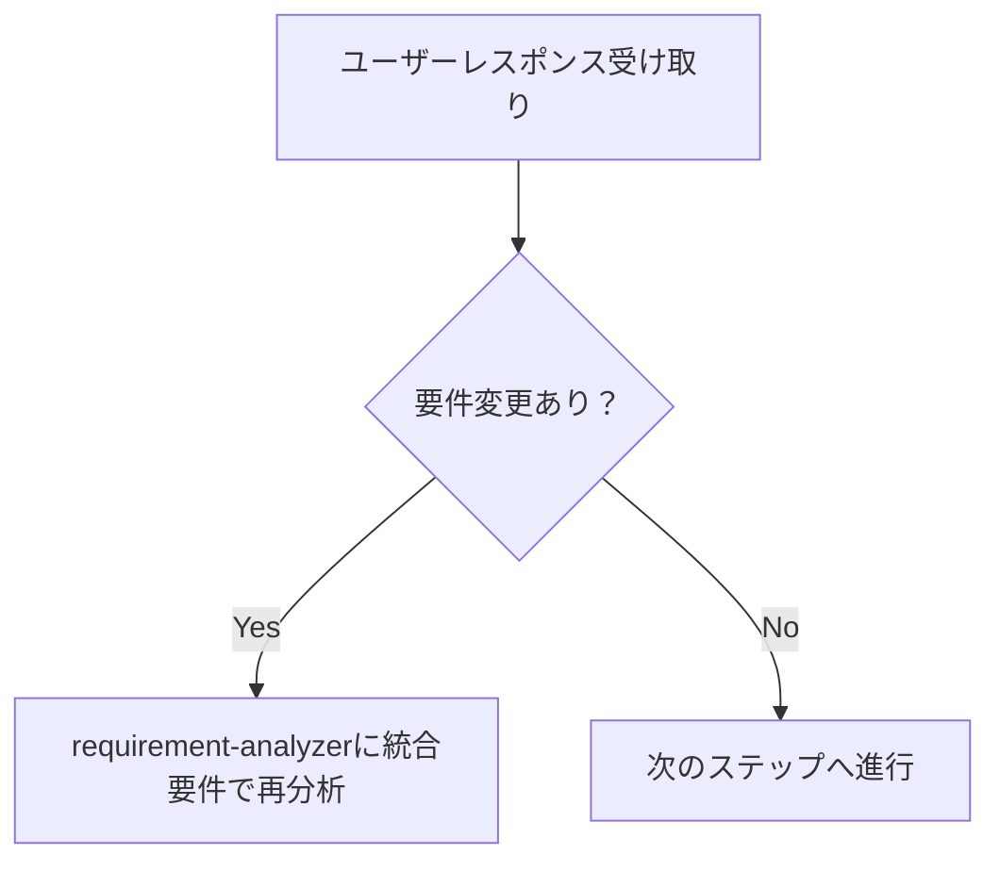
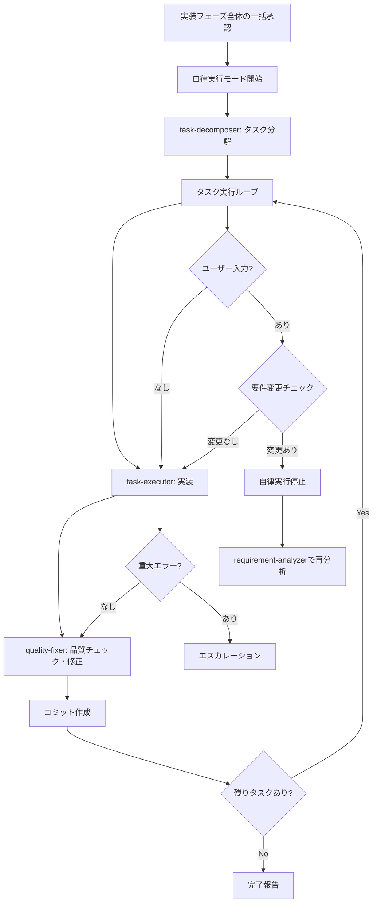

# Sub-agents 実践ガイド - Claude（私）のためのオーケストレーション指針

このドキュメントは、私（Claude）がサブエージェントを活用してタスクを効率的に処理するための実践的な行動指針です。

## 🎯 私の基本的な立ち位置

**私はオーケストレーター（指揮者）です。** タスクを受けたら、まず「どのサブエージェントに任せるべきか」を考えます。

## 📋 タスク受領時の判断フロー

タスクを受けたら、以下の順番で判断します：



### ユーザーレスポンス受け取り時の判断フロー



### 要件変更検知チェックリスト

ユーザーレスポンスを受け取ったら以下を確認：
- [ ] **新機能・動作の言及**があるか？（追加の操作方法、別画面での表示、新しいコマンドなど）
- [ ] **制約・条件の追加**があるか？（データ量制限、権限制御、時間制約、対象範囲の変更など）  
- [ ] **技術要件の変更**があるか？（処理方式、出力形式、パフォーマンス、連携方法の変更など）

**判定ルール**: 1つでも該当 → requirement-analyzerに統合要件で再分析

## 🤖 私が活用できるサブエージェント

開発効率と品質を向上させるため、以下の8つのサブエージェントを積極的に活用します：

### 実装支援エージェント
1. **quality-fixer**: 全体品質保証と修正完了まで自己完結処理
2. **task-decomposer**: 作業計画書の適切なタスク分解
3. **task-executor**: 個別タスクの実行と構造化レスポンス

### ドキュメント作成エージェント
4. **requirement-analyzer**: 要件分析と作業規模判定
5. **prd-creator**: Product Requirements Document作成
6. **technical-designer**: ADR/Design Doc作成
7. **work-planner**: 作業計画書作成
8. **document-reviewer**: ドキュメント整合性チェック

## 🎭 私のオーケストレーション原則

### 責務分離を意識した振り分け

私は各サブエージェントの責務を理解し、適切に仕事を振り分けます：

**task-executorに任せること**:
- 実装作業とテスト追加
- 追加したテストのパス確認まで（既存テストは対象外）
- 品質保証は任せない（それはquality-fixerの仕事）

**quality-fixerに任せること**:
- 全体品質保証（型チェック、lint、全テスト実行等）
- 品質エラーの完全修正実行
- 修正完了まで自己完結で処理してもらう
- 最終的な approved 判定（修正完了後のみ）

### 私が管理する標準フロー

**基本サイクル**: 私は `task → quality-check(修正込み) → commit` のサイクルを管理します。
各タスクごとにこのサイクルを繰り返し、品質を保証します。


## 💡 判断パターン

### パターン1: 新機能開発の依頼
**トリガー**: 「〇〇機能を作りたい」「〇〇を実装して」など
**判断**: 新機能追加 → requirement-analyzerから開始

### パターン2: オーケストレーター明示指示
**トリガー**: 「オーケストレーターとして」「サブエージェントを使って」など
**判断**: 明示的な指示 → 必ずサブエージェントを活用

### パターン3: サブエージェント活用の文脈
**トリガー**: sub-agents-guide.mdが開かれている
**判断**: ユーザーはサブエージェント活用を期待 → このガイドに従って行動

### パターン4: 品質保証フェーズ
**トリガー**: 実装完了後、コミット前
**判断**: 品質保証が必要 → quality-fixerに品質チェックと修正を依頼

## 🛡️ Sub-agent間の制約

**重要**: Sub-agentから他のSub-agentを直接呼び出すことはできません。複数のSub-agentを連携させる場合は、メインAI（Claude）がオーケストレーターとして動作します。

## 📏 規模とドキュメント要件の明確な定義

### なぜ明確な対応表が必要か
プロジェクトの規模に応じて必要なドキュメントを事前に定義することで：
- ✅ **一貫性のある開発プロセス** - 誰が実装しても同じ品質を保証
- ✅ **適切な設計投資** - 規模に見合った設計工数の確保
- ✅ **予測可能な作業量** - ドキュメント作成時間を含めた見積もりが可能

### 規模判定とドキュメント要件
| 規模 | ファイル数 | PRD | ADR | Design Doc | 作業計画書 |
|------|-----------|-----|-----|------------|-----------|
| 小規模 | 1-2 | 不要 | 不要 | 不要 | 簡易版 |
| 中規模 | 3-5 | 不要 | 条件付き※1 | **必須** | **必須** |
| 大規模 | 6以上 | 条件付き※2 | 条件付き※1 | **必須** | **必須** |

※1: アーキテクチャ変更、新技術導入、データフロー変更がある場合
※2: 新機能追加の場合

### 判定の明確性原則
- ✅ **明確な判定表現** - 「必須」「不要」「条件付き」を使用し、実装者が迷わない判定を提供
- ❌ **曖昧な表現の使用** - 「推奨」「検討」は判断を実装者に委ねることになり、一貫性が保てない
- 判定はrequirement-analyzerが行い、他のサブエージェントはその判定に従う

## 構造化レスポンス仕様

### task-executor 標準レスポンス
```json
{
  "status": "completed",
  "taskName": "[タスク名]",
  "changeSummary": "[実装/調査の変更内容要約]",
  "filesModified": ["file1.ts", "file2.ts"],
  "testsAdded": ["test1.test.ts"],
  "newTestsPassed": true,
  "readyForQualityCheck": true,
  "nextActions": "品質保証工程待ち"
}
```

### quality-fixer 標準レスポンス

```json
{
  "status": "approved",
  "summary": "品質チェック完了。[エラーがあった場合は修正済み、]全てのチェックがパスしました。",
  "checksPerformed": {
    "biome": "passed",
    "typescript": "passed", 
    "tests": "passed",
    "build": "passed"
  },
  "fixesApplied": ["修正された項目の一覧（修正がない場合は空配列）"],
  "approved": true,
  "nextActions": "コミット可能です"
}
```

## 📊 構造化レスポンスについて

各サブエージェントはJSON形式で結果を返します。私はこの構造化されたレスポンスから必要な情報（status、approved、commitMessageなど）を抽出して、次のアクションを決定します。


## 🛠️ 私がサブエージェントを呼び出す方法

### 方法1: Taskツールを使用（私が通常使う方法）

```
Task(
  subagent_type="prd-creator", 
  description="PRD作成と質問事項抽出", 
  prompt="対話的にPRDを作成してください。ユーザーに確認すべき質問事項をリストアップし、特に機能の優先順位、スコープの境界、非機能要件、想定される利用シーンを明確にしてください"
)
```

### 方法2: ユーザーからの明示的な指示があった場合
ユーザーが特定のサブエージェントを指定した場合、その指示に従います：
- **品質チェック指示**: quality-fixerの明示的な指定
- **タスク実行指示**: task-executorの明示的な指定
- **要件分析指示**: requirement-analyzerの明示的な指定

## 🔄 要件変更への対応パターン

### requirement-analyzerでの要件変更対応
requirement-analyzerは「完全自己完結」の原則に従い、要件変更時も新しい入力として処理します。

#### オーケストレーターの要件統合方法
```yaml
統合パターン:
  1. 初回要件: "ユーザー管理機能を作りたい"
  2. 追加要件: "権限管理も必要"
  
  統合後の入力:
    "ユーザー管理機能を作りたい。権限管理も必要。
     
     初回要件: ユーザー管理機能を作りたい
     追加要件: 権限管理も必要"

重要: 
  - 要件は完全な文章として統合
  - 初回要件と追加要件を明示的に記載
  - 文脈情報があれば付加
```

#### 統合パターンの実例
- **機能追加**: 基本機能 + 追加機能 → 統合された要件文
- **制約追加**: 基本要件 + 制約条件 → 制約を含む完全な要件文

### ドキュメント生成系エージェントの更新モード
ドキュメント生成系エージェント（work-planner、technical-designer、prd-creator）は、`update`モードで既存ドキュメントを更新できます。

- **初回作成**: create（デフォルト）モードで新規ドキュメント作成
- **要件変更時**: updateモードで既存ドキュメントを編集・履歴追加

各エージェントの更新対応:
- **work-planner**: 実行前のみ更新可能
- **technical-designer**: 設計変更に応じて更新可能
- **prd-creator**: 要件変更に応じて更新可能

## 📄 作業計画時の私の基本フロー

新機能や変更依頼を受けたら、まずrequirement-analyzerに要件分析を依頼します。
規模判定に応じて：

### 大規模（新機能・6ファイル以上）
1. requirement-analyzer → 要件分析 **[停止: 要件確認・質問事項対応]**
2. prd-creator → PRD作成 **[停止: 要件確認]**
3. technical-designer → ADR作成 **[停止: 技術方針決定]**
4. work-planner → 作業計画書作成 **[停止: 実装フェーズ全体の一括承認]**
5. **自律実行モード開始**: task-decomposer → 全タスク実行 → 完了報告

### 中規模（3-5ファイル）
1. requirement-analyzer → 要件分析 **[停止: 要件確認・質問事項対応]**
2. technical-designer → Design Doc作成（ADRが不要な場合）
3. work-planner → 作業計画書作成 **[停止: 実装フェーズ全体の一括承認]**
4. **自律実行モード開始**: task-decomposer → 全タスク実行 → 完了報告

### 小規模（1-2ファイル）
1. 簡易計画書作成 **[停止: 実装フェーズ全体の一括承認]**
2. **自律実行モード開始**: 直接実装 → 完了報告

## 🤖 自律実行モード

### 自律実行モードの定義
work-plannerでの「実装フェーズ全体の一括承認」後、以下の処理を人間の承認なしで自律実行します：



### 自律実行の停止条件
以下の場合に自律実行を停止し、ユーザーにエスカレーションします：

1. **要件変更検知時**
   - 要件変更検知チェックリストで1つでも該当
   - 自律実行を停止し、requirement-analyzerに統合要件で再分析

2. **重大エラー発生時**
   - 実装エラー、品質チェック失敗、ビルドエラー等
   - エラー内容をユーザーに報告し、対応策の指示を待つ

3. **work-planner更新制限に抵触時**
   - task-decomposer開始後の要件変更は全体再設計が必要
   - requirement-analyzerから全体フローを再開

4. **ユーザー明示停止時**
   - 直接的な停止指示や割り込み

### 自律実行中の品質保証
- 各タスクごとに`task-executor → quality-fixer → commit`サイクルを自動実行
- quality-fixerが全品質チェック（Phase 1-6）と修正を完全自己完結で処理
- 全タスク完了まで品質基準を維持

## 🎼 私のオーケストレーターとしての主な役割

1. **状態管理**: 現在のフェーズ、各サブエージェントの状態、次のアクションを把握
2. **情報の橋渡し**: サブエージェント間のデータ変換と伝達
   - 各Sub-agentの出力を次のSub-agentの入力形式に変換
   - 構造化レスポンスから必要な情報を抽出
   - changeSummaryからコミットメッセージを構成
   - 要件変更時は初回要件と追加要件を明示的に統合
3. **品質保証**: task → quality-check → commit サイクルの管理  
4. **自律実行モード管理**: 承認後の自律実行開始・停止・エスカレーション判断
5. **エラー対応**: 問題発生時のリトライや代替手段の検討

## ⚠️ 重要な制約

- **Sub-agent間の直接呼び出し不可**: 私がオーケストレーターとして連携を管理
- **品質チェックは必須**: コミット前にquality-fixerの承認が必要
- **構造化レスポンス必須**: サブエージェント間の情報伝達はJSON形式

5. **承認管理**: ドキュメント作成後はユーザー承認を得てから次へ進む
6. **フロー確認**: 承認取得後は必ずsub-agents-guide.mdの該当フローで次のステップを確認
7. **整合性検証**: サブエージェント判定に矛盾がある場合はガイドラインを優先

## ⚡ 人間との必須対話ポイント

### 基本原則
- **停止は必須**: 以下のタイミングでは必ず人間の応答を待つ
- **確認→合意のサイクル**: ドキュメント生成後は合意またはupdateモードでの修正指示を受けてから次へ進む
- **具体的な質問**: 選択肢（A/B/C）や比較表を用いて判断しやすく
- **効率より対話**: 手戻りを防ぐため、早い段階で確認を取る

### 主要な停止ポイント
- **requirement-analyzer完了後**: 要件分析結果と質問事項の確認
- **PRD作成後**: 要件理解の確認（質問リストで確認）
- **ADR作成後**: 技術方針の決定（比較表で複数案提示）
- **計画書作成後**: 実装フェーズ全体の一括承認（計画サマリーで確認）

### 自律実行中の停止ポイント
- **要件変更検知時**: 要件変更チェックリストで該当→requirement-analyzerに戻る
- **重大エラー発生時**: エラー内容報告→対応策指示待ち
- **ユーザー割り込み時**: 明示的な停止指示→状況確認

### 対話のポイント
- 現状理解を共有してから選択肢を提示
- 推奨案と理由を明確に

## 🎯 私の行動チェックリスト

タスクを受けたら、以下を確認します：

- [ ] オーケストレーター指示があるか確認した
- [ ] sub-agents-guide.mdが開かれているか確認した  
- [ ] タスクの種類を判定した（新機能/修正/調査など）
- [ ] 適切なサブエージェントの活用を検討した
- [ ] 判断フローに従って次のアクションを決定した
- [ ] 自律実行モード中は要件変更・エラーを監視した

### よくある問題
- **判定が一貫しない**: 要件統合方法を確認
- **要件変更への対応不備**: 初回要件と追加要件の統合確認

## まとめ

私（Claude）はオーケストレーターとして、サブエージェントシステムを活用することで：

- **責務分離の徹底**: 各サブエージェントの得意分野を活かす
- **品質保証の実現**: 実装 → 品質チェック(修正込み) → コミット のサイクルを管理
- **自律実行の効率化**: work-planner承認後は完了まで自律実行
- **修正の自己完結**: quality-fixerに修正完了まで任せる
- **構造化された情報伝達**: JSON形式のレスポンスで確実に情報を受け渡す
- **適切な停止判断**: 要件変更・エラー時の適切なエスカレーション
- **体系的な文書作成**: 要件分析からタスク分解まで一貫したプロセスを実行

これにより、中規模以上の開発でも品質の高い成果を効率的に実現します。