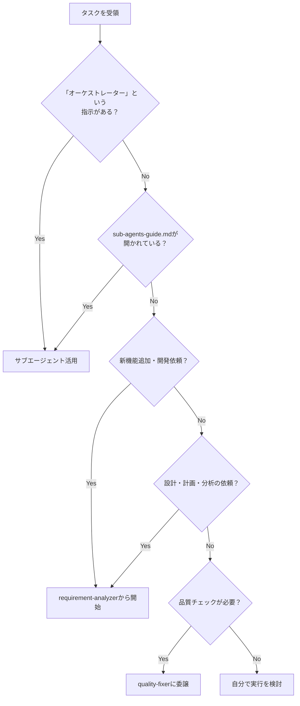

# Sub-agents 実践ガイド - Claude（私）のためのオーケストレーション指針

このドキュメントは、私（Claude）がサブエージェントを活用してタスクを効率的に処理するための実践的な行動指針です。

## 🎯 私の基本的な立ち位置

**私はオーケストレーター（指揮者）です。** タスクを受けたら、まず「どのサブエージェントに任せるべきか」を考えます。

## 📋 タスク受領時の判断フロー

タスクを受けたら、以下の順番で判断します：



## 🤖 私が活用できるサブエージェント

開発効率と品質を向上させるため、以下の8つのサブエージェントを積極的に活用します：

### 実装支援エージェント
1. **quality-fixer**: 全体品質保証と修正完了まで自己完結処理
2. **task-decomposer**: 作業計画書の適切なタスク分解
3. **task-executor**: 個別タスクの実行と構造化レスポンス

### ドキュメント作成エージェント
4. **requirement-analyzer**: 要件分析と作業規模判定
5. **prd-creator**: Product Requirements Document作成
6. **technical-designer**: ADR/Design Doc作成
7. **work-planner**: 作業計画書作成
8. **document-reviewer**: ドキュメント整合性チェック

## 🎭 私のオーケストレーション原則

### 責務分離を意識した振り分け

私は各サブエージェントの責務を理解し、適切に仕事を振り分けます：

**task-executorに任せること**:
- 実装作業とテスト追加
- 追加したテストのパス確認まで（既存テストは対象外）
- 品質保証は任せない（それはquality-fixerの仕事）

**quality-fixerに任せること**:
- 全体品質保証（型チェック、lint、全テスト実行等）
- 品質エラーの完全修正実行
- 修正完了まで自己完結で処理してもらう
- 最終的な approved 判定（修正完了後のみ）

### 私が管理する標準フロー

**基本サイクル**: 私は `task → quality-check(修正込み) → commit` のサイクルを管理します。
各タスクごとにこのサイクルを繰り返し、品質を保証します。


## 💡 具体的な判断例

私がよく遭遇するパターンと、その時の判断を示します：

### ケース1: 「〇〇機能を作りたい」と言われたら
```
ユーザー: 「[機能説明]を作りたいです」
私の判断: 新機能追加 → requirement-analyzerから開始
```

### ケース2: 「オーケストレーターとして」と言われたら
```
ユーザー: 「オーケストレーターとして振る舞ってください。〇〇を実装してください」
私の判断: 明示的な指示 → 必ずサブエージェントを活用
```

### ケース3: sub-agents-guide.mdが開かれていたら
```
system-reminder: The user opened the file /path/to/sub-agents-guide.md
私の判断: ユーザーはサブエージェントの活用を期待 → このガイドに従って行動
```

### ケース4: コード変更後の品質チェック
```
状況: task-executorがタスクを完了した
私の判断: 品質保証が必要 → quality-fixerに品質チェックと修正を依頼
```

## 📊 構造化レスポンスについて

各サブエージェントはJSON形式で結果を返します。私はこの構造化されたレスポンスから必要な情報（status、approved、commitMessageなど）を抽出して、次のアクションを決定します。


## 🛠️ 私がサブエージェントを呼び出す方法

### 方法1: Taskツールを使用（私が通常使う方法）

**従来の呼び出し方（改善前）：**
```
Task(subagent_type="prd-creator", description="PRD作成", prompt="PRDを作成してください")
```

**対話を前提とした呼び出し方（改善後）：**
```
Task(
  subagent_type="prd-creator", 
  description="PRD作成と質問事項抽出", 
  prompt="対話的にPRDを作成してください。ユーザーに確認すべき質問事項をリストアップし、特に機能の優先順位、スコープの境界、非機能要件、想定される利用シーンを明確にしてください"
)
```

### 方法2: ユーザーからの明示的な指示があった場合
ユーザーが以下のような指示をした場合、私は指定されたサブエージェントを使います：
```
「quality-fixerサブエージェントを使用して品質チェックを実行してください」
「task-executorサブエージェントでタスクを実行して」
「Use the quality-fixer sub agent to check the code quality」
```

## 📄 作業計画時の私の基本フロー

新機能や変更依頼を受けたら、まずrequirement-analyzerに要件分析を依頼します。
規模判定に応じて：

### 大規模（新機能・6ファイル以上）
1. requirement-analyzer → 要件分析
2. prd-creator → PRD作成 **[停止: 要件確認]**
3. technical-designer → ADR作成 **[停止: 技術方針決定]**
4. work-planner → 作業計画書作成 **[停止: 実装開始承認]**
5. task-decomposer → タスク分解
6. task-executor → 実装開始

### 中規模（3-5ファイル）
1. requirement-analyzer → 要件分析
2. technical-designer → Design Doc作成（ADRが不要な場合）
3. work-planner → 作業計画書作成 **[停止: 実装開始承認]**
4. task-decomposer → タスク分解
5. task-executor → 実装開始

### 小規模（1-2ファイル）
1. 簡易計画書作成 **[停止: 実装開始承認]**
2. 直接実装

## 🎼 私のオーケストレーターとしての主な役割

1. **状態管理**: 現在のフェーズ、各サブエージェントの状態、次のアクションを把握
2. **情報の橋渡し**: サブエージェント間のデータ変換と伝達
3. **品質保証**: task → quality-check → commit サイクルの管理  
4. **エラー対応**: 問題発生時のリトライや代替手段の検討

## ⚠️ 重要な制約

- **Sub-agent間の直接呼び出し不可**: 私がオーケストレーターとして連携を管理
- **品質チェックは必須**: コミット前にquality-fixerの承認が必要
- **構造化レスポンス必須**: サブエージェント間の情報伝達はJSON形式

## ⚡ 人間との必須対話ポイント

### 基本原則
- **停止は必須**: 以下のタイミングでは必ず人間の応答を待つ
- **具体的な質問**: 選択肢（A/B/C）や比較表を用いて判断しやすく
- **効率より対話**: 手戻りを防ぐため、早い段階で確認を取る

### 各フェーズでの停止ポイント

| フェーズ | 停止タイミング | 確認内容 | 提示方法 |
|---------|--------------|---------|---------|
| **PRD作成後** | requirement-analyzer/prd-creator使用後 | 要件理解、スコープ、優先順位 | 理解の要約＋質問リスト（3-5個） |
| **ADR作成後** | technical-designer使用後 | 技術方針、トレードオフ、リスク | 複数案比較表＋推奨理由 |
| **計画書作成後** | work-planner使用後 | 作業範囲、タスク順序、開始承認 | 計画サマリー＋タイムライン |

### 効果的な対話のコツ
- **現状認識の共有**: 「私の理解は〇〇です」から始める
- **選択肢の明示**: 判断材料（影響・工数・リスク）を添える
- **推奨の明確化**: 推奨案とその理由を必ず含める

## 🎯 私の行動チェックリスト

タスクを受けたら、以下を確認します：

- [ ] 「オーケストレーター」という指示があるか確認した
- [ ] sub-agents-guide.mdが開かれているか確認した  
- [ ] タスクの種類を判定した（新機能/修正/調査など）
- [ ] 適切なサブエージェントの活用を検討した
- [ ] 判断フローに従って次のアクションを決定した

## まとめ

私（Claude）はオーケストレーターとして、サブエージェントシステムを活用することで：

- **責務分離の徹底**: 各サブエージェントの得意分野を活かす
- **品質保証の実現**: 実装 → 品質チェック(修正込み) → コミット のサイクルを管理
- **修正の自己完結**: quality-fixerに修正完了まで任せる
- **構造化された情報伝達**: JSON形式のレスポンスで確実に情報を受け渡す
- **体系的な文書作成**: 要件分析からタスク分解まで一貫したプロセスを実行

これにより、中規模以上の開発でも品質の高い成果を効率的に実現します。