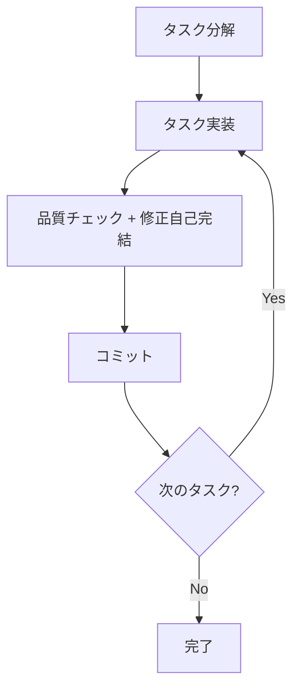

# Sub-agents 利用ガイド

このドキュメントは、本プロジェクトで利用可能なsub-agentのオーケストレーション方針とフロー管理について説明します。

## 概要

本プロジェクトでは、開発効率と品質を向上させるため、以下の8つのsub-agentを用意しています：

### 実装支援エージェント
1. **quality-fixer**: 全体品質保証と修正完了まで自己完結処理
2. **task-decomposer**: 作業計画書の適切なタスク分解
3. **task-executor**: 個別タスクの実行と構造化レスポンス

### ドキュメント作成エージェント
4. **requirement-analyzer**: 要件分析と作業規模判定
5. **prd-creator**: Product Requirements Document作成
6. **technical-designer**: ADR/Design Doc作成
7. **work-planner**: 作業計画書作成
8. **document-reviewer**: ドキュメント整合性チェック

## 基本オーケストレーション原則

### 責務分離の厳守

**task-executor の責務**:
- 実装作業とテスト追加
- 追加したテストのパス確認まで（既存テストは対象外）
- **品質保証工程は含めない**

**quality-fixer の責務**:
- 全体品質保証（型チェック、lint、全テスト実行等）
- **品質エラーの完全修正実行**
- **修正完了まで自己完結処理**
- 最終的な approved 判定（修正完了後のみ）

### 標準オーケストレーションフロー

**基本サイクル**: `task → quality-check(修正込み) → commit` の実行



### Sub-agent間の制約

**重要**: Sub-agentから他のSub-agentを直接呼び出すことはできません。複数のSub-agentを連携させる場合は、メインAI（Claude）がオーケストレーターとして動作します。

## 構造化レスポンス仕様

### task-executor 標準レスポンス
```json
{
  "status": "completed",
  "taskName": "[タスク名]",
  "summary": "[実装概要]",
  "commitMessage": "[type]: [簡潔な説明]\n\n- [主要な変更点1]\n- [主要な変更点2]",
  "filesModified": ["file1.ts", "file2.ts"],
  "testsAdded": ["test1.test.ts"],
  "testsRun": ["新規テストのみ実行済み"],
  "nextActions": "タスク完了"
}
```

### quality-fixer 標準レスポンス

```json
{
  "status": "approved",
  "summary": "品質チェック完了。エラーを修正し、全てのチェックがパスしました。",
  "checksPerformed": {
    "biome": "passed",
    "typescript": "passed",
    "tests": "passed", 
    "build": "passed"
  },
  "fixesApplied": ["修正された項目の一覧"],
  "approved": true,
  "nextActions": "コミット可能です"
}
```

## 実装系タスクのオーケストレーションパターン

### パターン1: 単一タスク実行
```
1. タスク実行（実装 + テスト追加 + 追加したテストのパス）
2. 品質チェック（全体品質保証 + エラー修正 + 再チェック → approved確定）
3. コミット実行
```

### パターン2: 複数タスク実行
```
for (各タスク) {
  1. タスク実行（実装 + テスト追加 + 追加したテストのパス）
  2. 品質チェック（全体品質保証 + エラー修正 + 再チェック → approved確定）
  3. コミット実行
  4. 次のタスクへ
}
```

## 調査系タスクの標準化

調査系タスクの成果物作成については、task-executorエージェントの実行時ルールを参照：
- 参照: `.claude/agents/task-executor.md` の「調査タスクの成果物作成」セクション

## Sub-agentの呼び出し方法

### 方法1: Taskツールを使用（推奨）
```typescript
Task({
  subagent_type: "quality-fixer",
  description: "品質チェック実行",
  prompt: "品質チェックを実行してください"
})
```

### 方法2: 自然言語での明示的な指示
```
「quality-fixerサブエージェントを使用して品質チェックを実行してください」
「task-executorサブエージェントでタスクを実行して」
「Use the quality-fixer sub agent to check the code quality」
```

## 作業計画書作成のオーケストレーションパターン

### パターンA: フルドキュメント作成フロー（大規模変更）
```
1. requirement-analyzer で要件分析
2. prd-creator で PRD作成（大規模の場合）
3. technical-designer で ADR/Design Doc作成
4. work-planner で作業計画書作成
5. document-reviewer で整合性確認
6. task-decomposer で適切なタスク分解
```

### パターンB: 中規模変更フロー
```
1. requirement-analyzer で要件分析
2. technical-designer で Design Doc作成
3. work-planner で作業計画書作成
4. document-reviewer で整合性確認
5. task-decomposer で適切なタスク分解
```

### パターンC: 小規模変更フロー
```
1. requirement-analyzer で要件分析
2. work-planner で簡易計画書作成
3. task-decomposer で適切なタスク分解
```

## メインAIのオーケストレーター役割

1. **状態管理**
   - 現在どのフェーズにいるか追跡
   - 各Sub-agentの構造化レスポンスを保持
   - 次のステップを決定

2. **データ変換と情報伝達**
   - 各Sub-agentの出力を次のSub-agentの入力形式に変換
   - 構造化レスポンスから必要な情報を抽出
   - コミットメッセージ等の重要情報を確実に受け取り

3. **品質保証フローの管理**
   - task → quality-check(修正込み) → commit のサイクル
   - quality-fixerが修正完了まで自己完結
   - コミット前の最終確認

4. **エラーハンドリング**
   - Sub-agentのエラーをキャッチ
   - リトライまたは代替手段の実行
   - ユーザーへの適切な報告

## 注意事項

### ファイル管理
- `docs/plans/` は `.gitignore` で除外（作業計画書）
- `docs/plans/tasks/` も `.gitignore` で除外（個別タスク）
- `docs/prd/`、`docs/adr/`、`docs/design/` はGit管理対象

### 品質保証
- **各タスクで品質チェック**: task → quality-check(修正込み) → commit の実行
- **コミット前必須**: quality-fixerの修正完了後の承認なしにはコミット禁止  
- **構造化レスポンス**: 全ての情報伝達は構造化された形式で実施
- **修正の自己完結**: 品質エラーはquality-fixer内で完全修正、外部への修正指示は不要

### 並列実行
- ドキュメント作成は基本的に順次実行
- 独立したタスクのみ並列実行可能
- 依存関係がある場合は順序を厳守

## トラブルシューティング

### Q: sub-agentが見つからない
A: `.claude/agents/` ディレクトリにファイルが存在するか確認

### Q: 構造化レスポンスが返ってこない
A: サブエージェント定義ファイルで構造化レスポンスが正しく定義されているか確認

### Q: 品質チェックが想定通りに動作しない
A: 実装タスクが品質保証工程を含んでいないか、quality-fixerが修正まで自己完結しているか確認

### Q: 調査系タスクの結果が後続に伝わらない
A: 調査結果レポート、overview更新、後続タスクファイル更新が実施されているか確認

## まとめ

Sub-agentシステムにより以下を実現：

- **責務分離の徹底**: 各サブエージェントが明確な役割を持つ
- **品質保証の実現**: 実装 → 品質チェック(修正込み) → コミット の効率的サイクル
- **修正の自己完結**: quality-fixerが修正完了まで責任を持つ
- **構造化された情報伝達**: JSON形式のレスポンスで確実な情報伝達
- **体系的な文書作成**: 要件分析からタスク分解まで一貫したプロセス

これにより、中規模以上の開発でも品質の高い成果をより効率的に実現できます。